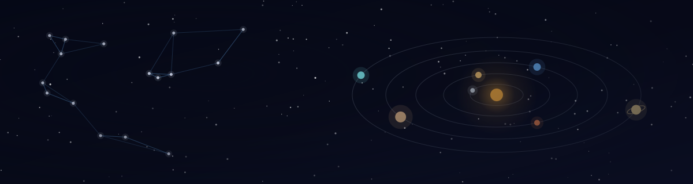
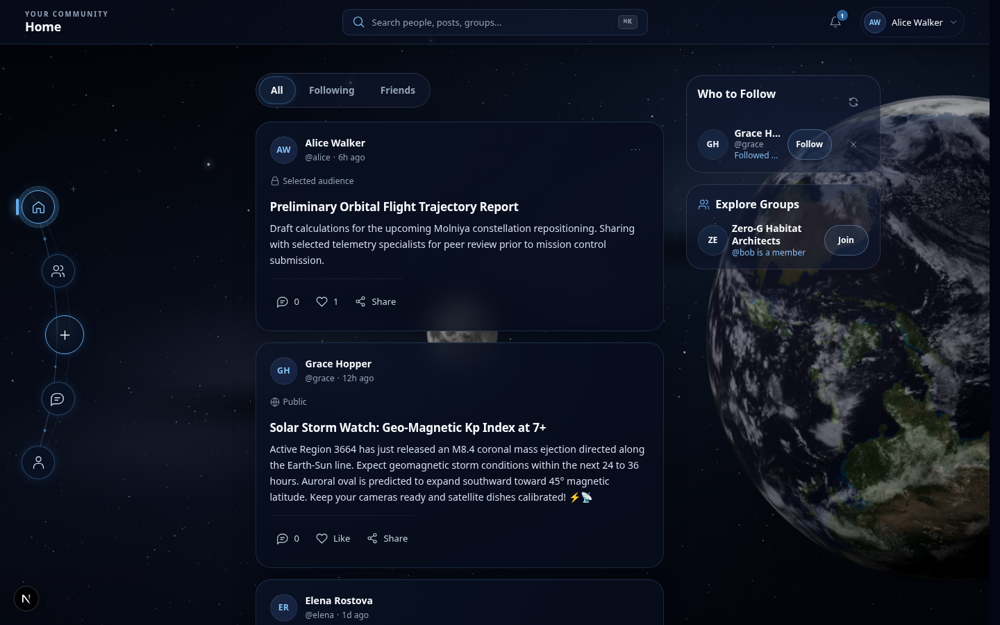
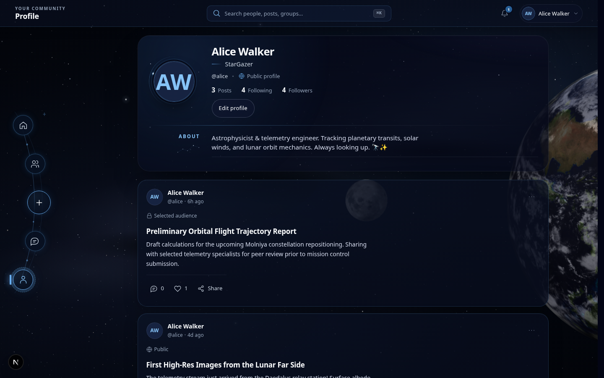
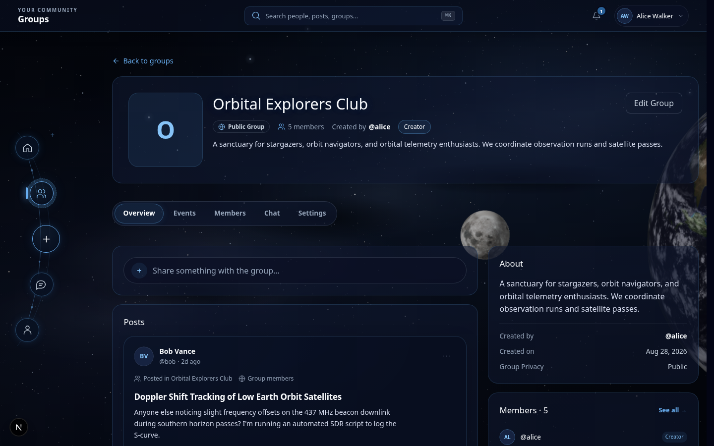
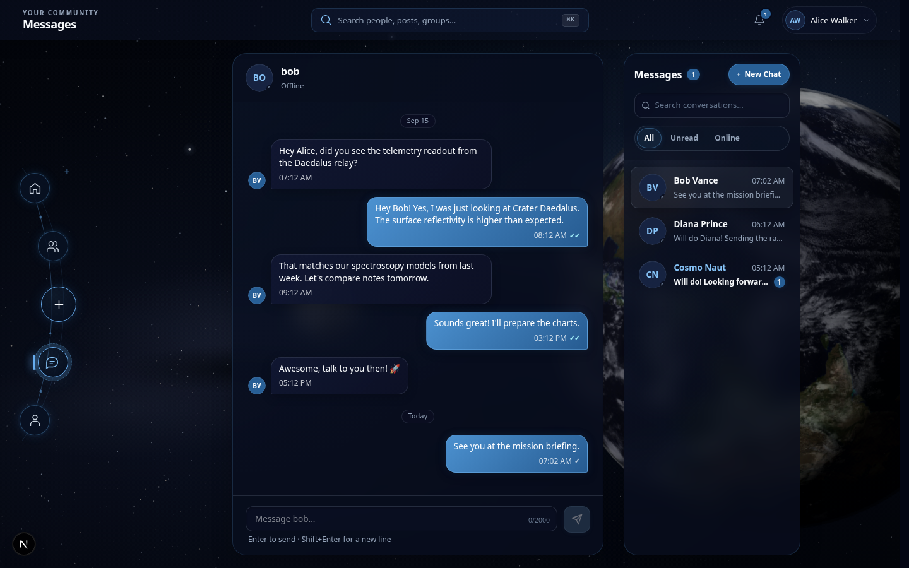
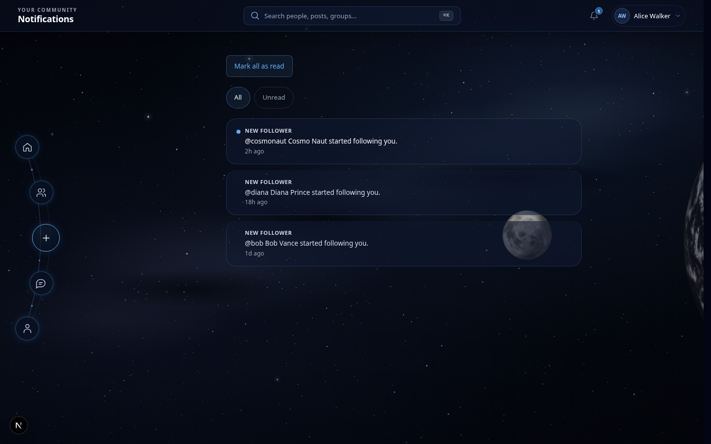
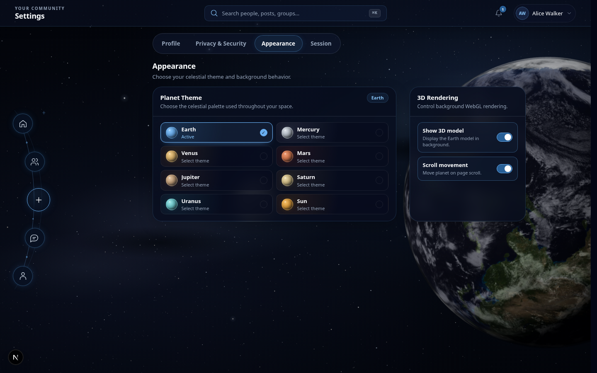
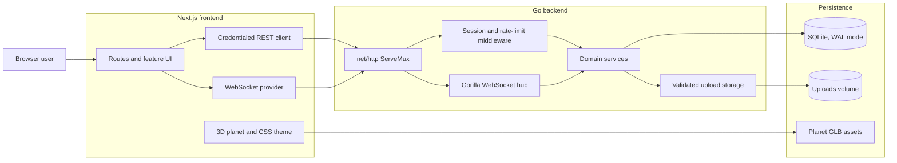
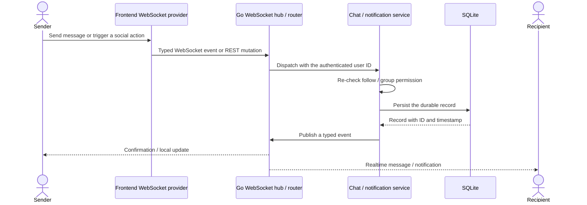
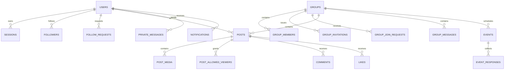

<div align="center">
  

  # Social Network

  ### A full-stack social network with a solar system built in.

  Follow, post, and message in realtime behind privacy rules enforced on the backend. Join groups, RSVP to events,
  and get notified the moment something happens — all rendered over a WebGL planet that also drives the app's live color theme.

  [](frontend/package.json)
  [](frontend/package.json)
  [](frontend/package.json)
  [](backend/go.mod)
  [](docs/database/database-migration-guide.md)
  [](#realtime-system)
  [](frontend/src/components/space)
  [](compose.yaml)
</div>

<br />

## Contents

- [Overview](#overview)
- [Visual Tour](#visual-tour)
- [Core Features](#core-features)
- [Space Experience](#space-experience)
- [Architecture](#architecture)
- [Privacy Model](#privacy-model)
- [Realtime System](#realtime-system)
- [Database and Migrations](#database-and-migrations)
- [Technology Stack](#technology-stack)
- [Project Journey](#project-journey)
- [Engineering Highlights](#engineering-highlights)
- [Repository Structure](#repository-structure)
- [Getting Started](#getting-started)
- [Testing](#testing)
- [Documentation](#documentation)
- [Team Workflow and Conventional Commits](#team-workflow-and-conventional-commits)

## Overview

Social Network is a privacy-aware social platform: profiles and follow relationships, posts and comments with
tiered visibility, public and private groups with events, private and group chat, and realtime notifications —
all wrapped in an ambient 3D presentation of the solar system that themes the interface.

The frontend is a Next.js 16 / React 19 / TypeScript application. The backend is a Go service built directly on
`net/http` and Gorilla WebSocket, persisting to SQLite through embedded, transactional migrations. REST handles
durable operations; a single multiplexed WebSocket connection carries chat, presence, typing, read receipts,
notifications, and a handful of other live updates. Every visible planet — Earth, Mercury, Venus, Mars, Jupiter,
Saturn, Uranus, or the Sun — is a selectable theme that also recolors the interface's accent palette.

## Visual Tour

<table>
<tr>
<td width="50%">
  
  <br /><sub><b>Home feed</b> — All / Following / Friends filters, audience badges, and recommendations</sub>
</td>
<td width="50%">
  
  <br /><sub><b>Profile</b> — bio, follower/following counts, and public/private state</sub>
</td>
</tr>
<tr>
<td width="50%">
  
  <br /><sub><b>Groups</b> — overview, events, members, and chat tabs</sub>
</td>
<td width="50%">
  
  <br /><sub><b>Private chat</b> — conversation list, read receipts, and history</sub>
</td>
</tr>
<tr>
<td width="50%">
  
  <br /><sub><b>Notifications</b> — persisted, realtime, with unread state</sub>
</td>
<td width="50%">
  
  <br /><sub><b>Appearance settings</b> — planet picker and 3D toggles</sub>
</td>
</tr>
</table>

## Core Features

### Identity and Privacy
- Multi-step registration with required identity fields and an optional avatar, nickname, and biography.
- Username-or-email login backed by bcrypt password hashing and cookie-based sessions with a 24-hour sliding expiry.
- Editable profiles with a public/private toggle; private profiles limit biography and social-list visibility to
  approved followers.
- Direct follows for public profiles; approval-based follow requests for private ones.

### Social Feed
- Text and image posts (up to four images per post) with public, followers-only, and selected-follower visibility.
- Comments with optional image/GIF attachments that inherit the parent post's access rules.
- Likes, cursor-based feed pagination, and `All` / `Following` / `Friends` filters.
- Universal search and personalized follow/group recommendations.
- In-app post sharing into eligible private or group conversations, rendered as a preview card in the chat thread.

### Communities
- Public groups (discoverable, join-by-request) and private groups (hidden from discovery, invite-only).
- Creator-managed invitations, join-request review, member-only posts/comments, and member removal.
- Group events with future-date validation and changeable `going` / `not_going` RSVPs.

### Realtime
- One authenticated WebSocket connection multiplexes private chat, group chat, typing indicators, and read receipts.
- Persisted, realtime-pushed notifications with unread counts and toasts.
- Online/offline presence and immediate authorization changes (for example, a removed group member stops
  receiving that group's messages right away).

### Ambient Space Theme
- Eight selectable celestial themes plus Earth's Moon, each with its own accent color that reskins the interface.
- A lightweight starfield for unauthenticated pages and a persistent WebGL scene across the authenticated app.
- A full off switch, reduced-motion support, and preferences that sync across browser tabs. See [Space Experience](#space-experience) below.

## Space Experience

The interface's visual identity is not a static background — it's a small, self-contained rendering system living
under [`frontend/src/components/space`](frontend/src/components/space).

`SpaceBackground` mounts once in the root layout for every page (including login and registration): batched SVG
stars and CSS gradients, no WebGL context. Once a user is authenticated, `PlanetBackground` mounts a single
persistent `<canvas>` inside the shared app shell, so the scene survives client-side navigation instead of
remounting per route:

```text
SpaceBackground (root layout, all pages)
      │
AppShell (authenticated layout)
      └── PlanetPreferenceProvider
            ├── PlanetBackground (unmounted entirely when the 3D toggle is off)
            │     └── one persistent <canvas>
            │           └── PlanetSystem (the selected body)
            │                 ├── PlanetModel      — GLB renderer
            │                 └── Moon orbit       — Earth only
            ├── navbar and orbital navigation
            └── route content / the Settings picker
```

`modelsRegistry.ts` is the single source of truth for the eight selectable bodies — Earth, Mercury, Venus, Mars,
Jupiter, Saturn, Uranus, and the Sun — each declaring its GLB path, scale, spin speed, lighting, and accent theme.
Earth is the only body with a Moon companion. Selecting a planet writes its accent color, border, and glow tokens
as CSS variables, so the same choice reskins buttons, links, and focus rings across the whole app — not just the
3D scene:

| Body | Accent |
|---|---|
| Earth (default) | `#69aef0` |
| Mercury | `#b7c0ca` |
| Venus | `#dfb46a` |
| Mars | `#d8794e` |
| Jupiter | `#c7a27c` |
| Saturn | `#d8c188` |
| Uranus | `#6fcfd3` |
| Sun | `#e5a13c` |

Preferences (selected planet, model on/off, scroll-follow) persist in `localStorage` and synchronize across tabs;
the app waits for stored preferences before ever mounting the 3D layer, so a disabled model never triggers a GLB
request. In reduced-motion mode every body settles immediately and the canvas switches to demand rendering instead
of a continuous animation loop.

The nine shipped GLB assets (eight bodies plus the Moon) were optimized with lossless container operations —
deduplication, pruning, welding, and node reordering — deliberately avoiding lossy texture recompression or the
heavier WASM decoders that Draco/Meshopt geometry compression would have pulled into the client bundle.

## Architecture



**Backend.** Every feature package under `backend/internal/` — `auth`, `users`, `followers`, `posts`, `comments`,
`likes`, `groups`, `chat`, `notifications`, `search`, `upload`, and more — follows the same
`Handler → Service → Repository` layering: repositories hold SQL, services hold business rules and authorization,
and handlers only translate HTTP in and out. Cross-feature calls don't reach into another feature's repository;
instead a feature declares a small local interface (for example, something that can `Notify(...)`) and the
dependency's real service satisfies it directly. Everything is wired once, at startup, in
`internal/router/dependencies.go`.

**Frontend.** Routes live under three App Router groups — `(auth)`, `(main)`, and `(group-settings)` — while
`src/features/` holds one folder per domain (`auth`, `posts`, `comments`, `groups`, `group-chat`, `chat`,
`notifications`, `profile`, `recommendations`, `search`, `settings`), each typically owning its own `api/`,
`components/`, `hooks/`, and `context/`. Authenticated pages are wrapped by `AuthenticatedProviders`, which composes
an `AuthGuard` around `NotificationProvider`, `ActionFeedbackProvider`, and `SearchProvider`; a single
`WebSocketProvider` is mounted once at the application root and shared by every feature that needs realtime data.

**Authentication flow.**

```text
register (multipart form + optional avatar)
      → validate + bcrypt hash → store user
login (username or email + password)
      → bcrypt verify → create session row → HttpOnly, SameSite=Lax cookie
authenticated request
      → session middleware validates the cookie, refreshes its 24h expiry, injects the user ID
logout
      → session revoked server-side, cookie cleared
```

## Privacy Model

| Area | Rule |
|---|---|
| Profiles | Private profiles limit biography and social lists to the owner and approved followers. Email, date of birth, age, and internal ID are never exposed to other users. |
| Posts | `public` posts are visible to any authenticated user; `followers` posts require an approved follow; `custom` posts are limited to selected, already-approved followers. |
| Comments | Access is derived from the parent post's visibility, including group membership where the post belongs to a group. |
| Public groups | Discoverable; joining goes through a request the creator approves or rejects. |
| Private groups | Hidden from group discovery and outsider reads; entry is by creator-issued invitation only. |
| Group content | Posts, comments, events, RSVPs, and chat history all require current group membership. |
| Private chat | Available when either participant follows the other; the server rechecks this on every message. |
| Group chat | Current membership is checked when loading history, sending, and resolving who receives a broadcast. |

Privacy rules are enforced on the backend — at the query and service layer, not just hidden in the UI.

## Realtime System

A single authenticated connection at `/api/ws` multiplexes every live feature the app needs:

- private and group chat messages, with typing indicators and read receipts;
- online/offline presence;
- in-app notifications, using the same payload shape the REST notifications endpoint returns, so the two
  transports can't drift apart;
- group-event RSVP updates and group-invitation search results;
- follow-removal and rate-limit/error signals.



Permissions are re-derived from the database at the moment of each send, history load, or broadcast — not cached
on the socket — so a change in membership or follow status takes effect immediately, even on an already-open
connection. Chat and notifications are written to SQLite before delivery, so messages sent while a recipient is
offline are waiting in their history the next time they connect.

## Database and Migrations

SQLite runs with foreign keys enabled and WAL mode. The connection pool is intentionally limited to a single open
connection, trading unbounded concurrency for predictable, lock-free behavior on an embedded database.



The schema is built from 30 timestamped migration pairs, compiled directly into the backend binary with `embed.FS`.
Each pair's version is a 14-digit UTC timestamp rather than a sequential number, specifically so migrations
authored on parallel feature branches never collide. Every up or down migration runs inside its own transaction —
the schema change and its tracking-table entry commit together or not at all. Pending migrations apply
automatically every time the server starts; a separate CLI covers the rest:

```bash
cd backend
go run ./cmd/migrate up
go run ./cmd/migrate down
go run ./cmd/migrate down-all
go run ./cmd/migrate version
go run ./cmd/migrate create <name>
```

A repeat-safe seeder (`go run ./cmd/seed`) populates a full space-themed demo dataset — see
[Seed data](#seed-data) below.

## Technology Stack

| Layer | Technology | Role |
|---|---|---|
| Frontend framework | Next.js 16, App Router | Routing and application shell |
| UI runtime | React 19 | Component rendering and client state |
| Frontend language | TypeScript 5.9 | Typed frontend implementation |
| Styling | Tailwind CSS 4 + scoped/global CSS | Layout, responsive UI, theme variables |
| 3D rendering | Three.js, React Three Fiber, Drei | GLB planet rendering and scene composition |
| Backend language | Go 1.26 | HTTP, domain services, concurrency, CLIs |
| HTTP stack | Go standard library `net/http` | Routing and middleware, no web framework |
| Realtime transport | Gorilla WebSocket | One multiplexed connection at `/api/ws` |
| Database | SQLite (`mattn/go-sqlite3`) | Relational persistence, foreign keys, WAL |
| Auth crypto | `golang.org/x/crypto` bcrypt | Password hashing and verification |
| Identifiers | `google/uuid` | Upload filenames and public identifiers |
| Containers | Docker + Docker Compose | Local two-service development topology |

## Project Journey

Built over roughly four weeks by a four-person team working in domain-owned feature branches, integrated through
more than 70 reviewed pull requests into `main`.

| Phase | What changed |
|---|---|
| Foundations | Go/SQLite backend, migration runner, authentication, sessions, and the Next.js scaffold |
| Realtime primitives | A multiplexed WebSocket hub, plus initial private-message and group persistence |
| Parallel feature development | Posts, comments, notifications, followers, group membership, and events |
| Privacy convergence | Private profiles, follow requests, three-tier post visibility, unified group posts |
| Hardening and simplification | Token-bucket rate limiting, group privacy, 3D asset work, and a major visual-architecture simplification |
| Integration and polish | Likes, post sharing through chat, recommendations, infinite feed, notification toasts, eight-planet theming |

The most consequential turning point was the 3D redesign. An early concept let a solar-system canvas intercept
page navigation itself — clicking a nav item triggered a camera fly-through that blocked normal rendering until it
finished. It complicated deep links and degraded badly on mobile, so the team removed it, deleting more than 60
files from that architecture, and rebuilt the 3D layer as the ambient, non-blocking background described in
[Space Experience](#space-experience) — ordinary Next.js routing stayed in full control, and the visuals became
something the app wears rather than something it depends on. A separate black-hole visual was explored during the
same period and set aside for not fitting the rest of the theme.

## Engineering Highlights

**Making 3D support the app instead of controlling it.** The route-intercepting solar-system concept coupled
camera animation to navigation and made routing fragile. Removing it and rebuilding 3D as a separate visual layer
— standard routing untouched, the scene just along for the ride — is the clearest lesson of the project: immersive
visuals hold up best when they can't block the interaction underneath them.

**One `posts` table, not four.** Group posts were originally planned as their own tables — `group_posts`,
`group_comments`, and matching media tables. They shipped instead as a nullable `group_id` column on the existing
`posts` table, so feed queries, likes, comments, and media all work identically whether a post belongs to a
personal feed or a group.

**Coordinating four people through embedded migrations.** With four contributors adding related schema in
parallel, migrations are timestamped (not sequentially numbered), embedded in the binary, and applied inside
individual transactions — a discipline that let independent feature branches add tables and columns without
fighting over migration ordering.

**One realtime channel for many product concerns.** Chat, presence, typing, receipts, notifications, and
group-event updates all needed low-latency delivery. Rather than one connection per feature, a single per-client
WebSocket connection multiplexes typed events through a central router, and notification events reuse the exact
payload shape the REST endpoint returns so the two can't drift.

**Authorization re-checked at the door, not cached on the socket.** Long-lived connections can outlast a follow or
membership change. Permissions are re-derived from the database at the moment of each send or history load, so
removing a group member takes effect immediately, even against a socket that's already open.

**A homegrown, weighted rate limiter.** Every request passes two independent token buckets — a global per-user cap
and a per-endpoint cap — with a deliberate timeout penalty once either empties, separate from normal bucket
refill. Cheap, high-frequency reads (like and comment counts) cost a fraction of a token so ordinary feed
scrolling doesn't trip the limiter meant for abuse.

## Repository Structure

```text
social-network/
├── backend/
│   ├── cmd/
│   │   ├── server/        # HTTP + WebSocket entrypoint
│   │   ├── migrate/       # migration CLI (up / down / down-all / version / create)
│   │   └── seed/          # demo-data seeder
│   ├── internal/
│   │   ├── auth/ users/ followers/           # identity and social graph
│   │   ├── posts/ comments/ likes/ share/    # feed and interactions
│   │   ├── groups/                           # groups, invitations, join requests, events
│   │   ├── chat/ websocket/ notifications/   # realtime layer
│   │   ├── search/ upload/                   # search and media
│   │   ├── middleware/ ratelimit/ router/    # cross-cutting concerns and wiring
│   │   └── config/ validation/ requestctx/
│   ├── pkg/db/migrations/sqlite/  # 30 embedded .up.sql / .down.sql pairs
│   ├── tests/                     # black-box integration suites, one package per feature
│   └── Dockerfile
├── frontend/
│   ├── src/app/                 # App Router: (auth), (main), (group-settings)
│   ├── src/components/          # layout shell, feedback, space/3D, page transitions
│   ├── src/features/            # one folder per domain (see Architecture)
│   ├── src/providers/           # WebSocketProvider
│   ├── src/lib/                 # REST client, WebSocket types, uploads, utils
│   └── public/models/planets/   # 9 shipped GLB assets (8 planets + Moon)
├── docs/                        # architecture, database, and git-workflow documentation
├── 3d/                          # source/optimization tooling for the GLB assets (not web-served)
├── compose.yaml
└── Makefile
```

## Getting Started

### Prerequisites

- Git
- Docker and Docker Compose — for the containerized workflow
- Go 1.26 or newer — for running the backend natively
- Node.js 20 or newer and npm — for running the frontend natively
- Make — optional, wraps the commands below

### Clone

```bash
git clone <this-repository-url>
cd social-network
```

### Quickstart with Docker

From the repository root:

```bash
docker compose up --build
```

Open `http://localhost:3000`. The backend API is at `http://localhost:8080/api` and the WebSocket endpoint is at
`ws://localhost:8080/api/ws`. The SQLite database and uploaded files persist in the `backend-data` named volume.

```bash
docker compose down       # stop, keep the data volume
docker compose down -v    # stop and delete the database/uploads volume
```

### Local development with Make

```bash
make server     # go run ./cmd/server        — backend on :8080
make frontend   # npm run dev                — frontend on :3000
make migrate    # go run ./cmd/migrate up    — apply pending migrations
make seed       # go run ./cmd/seed          — seed demo data
make test       # go test ./...              — backend test suite
```

### Manual setup (two terminals)

**Terminal 1 — backend**

```bash
cd backend
go run ./cmd/server
```

The server applies any pending migrations automatically on startup. Override the port if needed:

```bash
SERVER_PORT=8081 go run ./cmd/server
```

**Terminal 2 — frontend**

```bash
cd frontend
npm install
npm run dev
```

### Seed data

```bash
cd backend
go run ./cmd/seed             # full demo dataset
go run ./cmd/seed --bulk 100  # add 100 additional repeat-safe feed posts, without touching existing data
```

The seeder is repeat-safe and populates eight space-themed demo users (an astrophysicist, a quantum engineer, an
astrophotographer, and others), mutual follows and pending follow requests, five groups (four public, one
private) with memberships and pending invitations/join requests, four upcoming events with RSVPs, eleven posts
across public/followers/custom visibility, comments, direct-message threads, group chat messages, and
notifications. Sample login credentials are printed to the terminal when seeding finishes.

### Ports

| Service | Port | Notes |
|---|---:|---|
| Frontend (Next.js) | 3000 | `http://localhost:3000` |
| Backend REST API | 8080 | `http://localhost:8080/api` |
| WebSocket | 8080 | `ws://localhost:8080/api/ws` — same backend process |

`SERVER_PORT` is the backend's only environment override; both the native and Docker workflows otherwise use the
default `localhost:3000` ↔ `localhost:8080` pairing shown above.

## Testing

**Backend** (from `backend/`):

```bash
go build ./...
go vet ./...
go test -count=1 ./...
go test -race -count=1 ./...
```

Sixteen black-box integration packages (`auth`, `chat`, `comments`, `followers`, `groups`, `likes`, `notifications`,
`posts`, `profile`, `search`, `share`, `upload`, and more) exercise real SQLite and real HTTP handlers, including
dedicated WebSocket hub concurrency coverage.

**Frontend** (from `frontend/`):

```bash
npm run lint
npx tsc --noEmit --incremental false
npm run build -- --webpack
```

Frontend verification today is lint, type-checking, and a production build rather than an automated component or
end-to-end suite.

## Documentation

Deeper reference material lives alongside the code it describes:

- [Database migration guide](docs/database/database-migration-guide.md) and [schema reference](docs/database/schema.dbml)
- [Branching strategy](docs/git-docs/BRANCHING_STRATEGY.md) and [Conventional Commits guide](docs/git-docs/CONVENTIONAL_COMMITS.md)
- [Space/3D rendering system](frontend/src/components/space/README.md)
- [Rate limiting design](backend/internal/ratelimit/README.md)

## Team Workflow and Conventional Commits

The project was built by a four-person team using domain ownership, short-lived feature branches, and regular
pull-request integration checkpoints — no direct pushes to `main`.

Branches follow `type/scope-description` (`feat/groups-events`, `fix/auth-cookie`,
`refactor/database-migrations`); a branch is cut fresh from an up-to-date `main`, opened as a pull request once
ready, reviewed by a teammate, and merged after conflicts are resolved and the change is confirmed working — not
just reviewed by eye. A later bug fix always gets its own `fix/` branch rather than reopening the original `feat/`
branch.

Commits follow [Conventional Commits](docs/git-docs/CONVENTIONAL_COMMITS.md): `type(scope): short description`,
lowercase, imperative mood, no trailing period. Real examples from the project's history:

```text
feat(groups): add group invitation system
feat(chat): add private messaging
fix(auth): fix session cookie expiration
fix(groups): prevent duplicate join requests
refactor(database): simplify migration setup
docs(cors): explain frontend backend CORS flow
```
