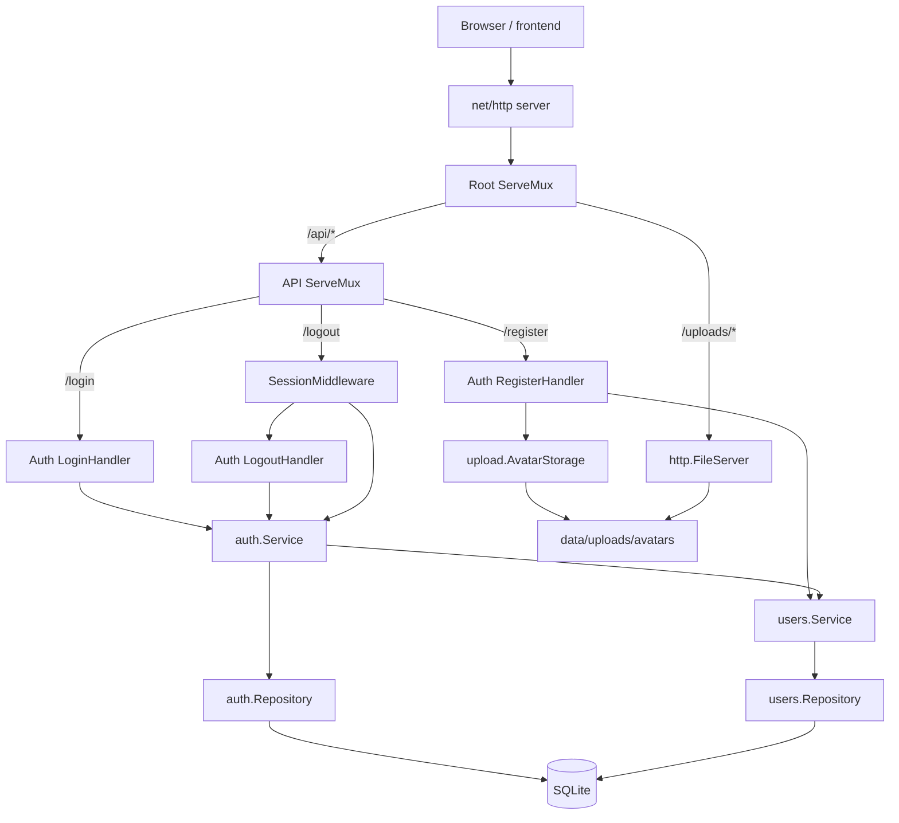
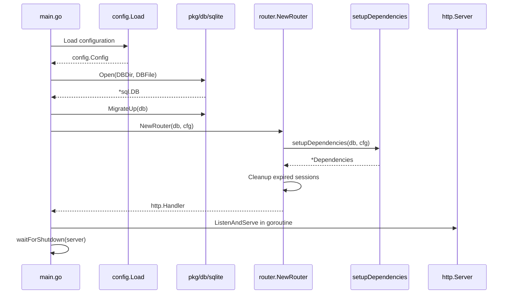
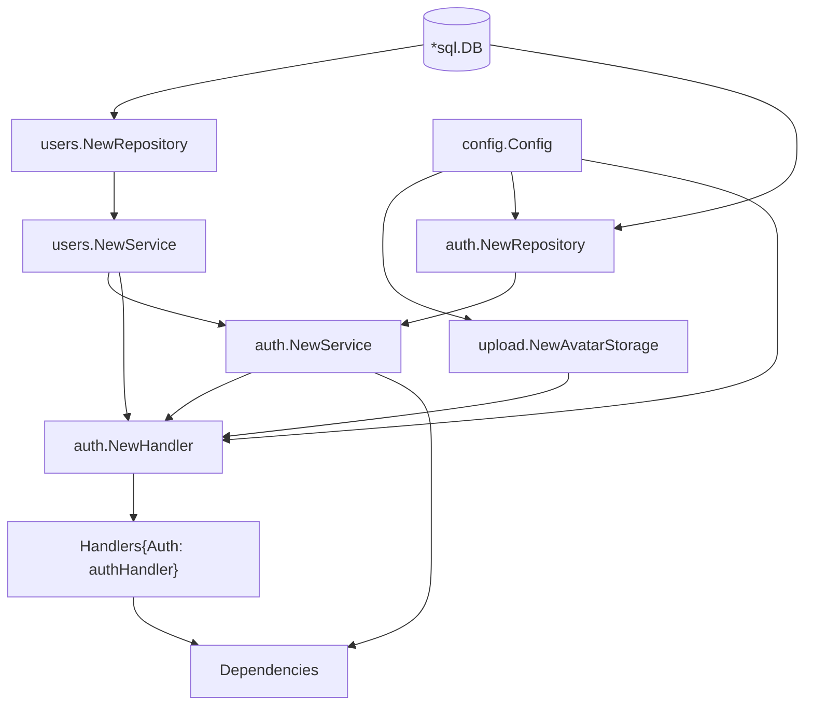
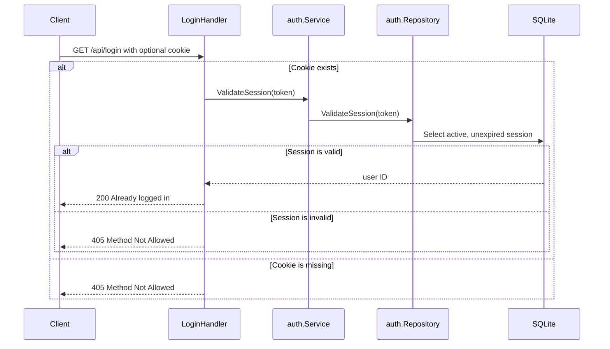
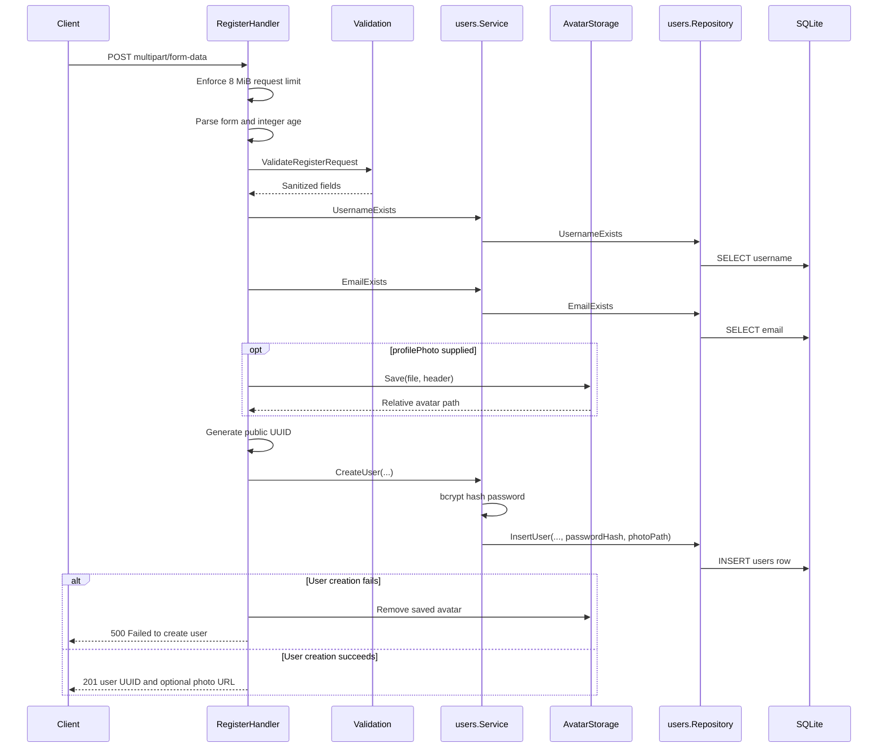
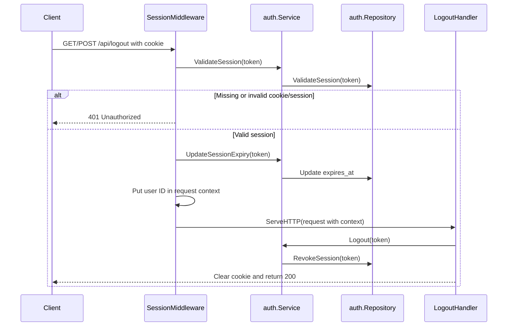

# Complete Backend Flow

This document describes the complete Go backend as it is currently
implemented. It covers application startup, dependency construction, routing,
authentication, users, sessions, uploads, validation, SQLite migrations,
shutdown, and the intended extension points for future social-network
features.

## 1. Current Scope

The backend currently implements:

- User registration, with an optional profile photo.
- Login by username or email.
- Database-backed sessions.
- Protected logout.
- Static serving of uploaded files.
- SQLite schema migrations.
- Graceful HTTP server shutdown.

Posts, Comments, Followers, Groups, Chat, and Notifications are not implemented
yet. Their dependency and route locations exist only as comments.

## 2. High-Level Architecture



The direction of dependency is:

```text
HTTP handlers and middleware
            |
            v
         Services
            |
            v
       Repositories
            |
            v
          SQLite
```

Handlers deal with HTTP. Services coordinate application behavior.
Repositories own SQL queries. Upload storage owns filesystem operations.

## 3. Backend Directory Map

```text
backend/
|-- cmd/
|   |-- server/
|   |   |-- main.go                 Application entry point
|   |   `-- shutdown.go             Signal handling and graceful shutdown
|   `-- migrate/
|       `-- main.go                 Migration command-line entry point
|-- internal/
|   |-- auth/
|   |   |-- handler.go              Login, register, and logout HTTP handlers
|   |   |-- service.go              Authentication and session orchestration
|   |   |-- repository.go           Session SQL operations
|   |   |-- validation.go           Login and registration validation
|   |   `-- errors.go               Authentication errors
|   |-- config/
|   |   `-- config.go               Runtime configuration
|   |-- middleware/
|   |   `-- auth.go                 Session-protected route middleware
|   |-- router/
|   |   |-- dependencies.go         Application dependency construction
|   |   `-- router.go               HTTP route registration
|   |-- upload/
|   |   `-- avatar.go               Avatar validation and disk storage
|   |-- users/
|   |   |-- model.go                User database model
|   |   |-- service.go              Password and user operations
|   |   |-- repository.go           User SQL operations
|   |   |-- validation.go           User field validation
|   |   `-- errors.go               User errors
|   `-- validation/
|       `-- validation.go           Shared text sanitization
`-- pkg/
    |-- db/
    |   |-- migrations/sqlite/      Embedded up/down SQL migration files
    |   `-- sqlite/                  Connection and migration runner
    |-- response/json.go             General JSON response helper
    `-- session/session.go           Secure session token helper
```

## 4. Application Startup Flow

The server starts in `cmd/server/main.go`.



Detailed startup sequence:

1. `config.Load()` creates the runtime configuration.
2. `sqlite.Open()` creates the database directory if needed, opens SQLite,
   enables foreign keys, restricts the pool to one connection, and pings the
   database.
3. `sqlite.MigrateUp()` applies any embedded migrations that are not already
   recorded in `schema_migrations`.
4. `router.NewRouter(db, cfg)` constructs dependencies and registers routes.
5. Expired and sufficiently old revoked sessions are cleaned up. Cleanup
   failure is logged but does not stop startup.
6. `http.Server` is created with the configured port and root handler.
7. `ListenAndServe()` runs in a goroutine.
8. The main goroutine waits for `SIGINT` or `SIGTERM`.

Any configuration-independent database, migration, dependency, or router error
is fatal in `main.go` and prevents the server from starting.

## 5. Configuration

`config.Load()` currently produces these values:

| Field | Default | Purpose |
|---|---:|---|
| `ServerPort` | `8080` | HTTP listen port |
| `DBDir` | `data` | SQLite directory, relative to the current working directory |
| `DBFile` | `social-network.db` | Server database filename |
| `SessionCookieName` | `session_token` | Browser cookie name |
| `SessionLifetime` | `30 minutes` | Database session and cookie expiration interval |
| `CookieSecure` | `false` | Whether the session cookie requires HTTPS |
| `UploadsDir` | `data/uploads` | Upload root, relative to the current working directory |
| `MaxAvatarSize` | `5 MiB` | Maximum stored avatar size |

Only the server port currently supports an environment override:

```bash
SERVER_PORT=8081 go run ./cmd/server
```

Because database and upload paths are relative, the recommended working
directory is `backend/`. Starting from a different directory creates or uses a
different relative `data/` directory.

## 6. Database Connection

`sqlite.Open(dirPath, fileName)` performs the following work:

1. Creates `dirPath` with mode `0755` if it does not exist.
2. Builds a SQLite DSN from the directory and filename.
3. Adds `?_foreign_keys=on` so SQLite enforces foreign keys.
4. Opens the database using `github.com/mattn/go-sqlite3`.
5. Sets both maximum open and idle connections to `1`.
6. Pings the database and closes it if the ping fails.

`main.go` defers `db.Close()`, so the connection closes when the process exits.

## 7. Migration System

Migration SQL files are compiled into the binary with `embed.FS`. Runtime
migration loading therefore does not depend on the process working directory
or on source SQL files being present beside a built executable.

Up migrations must match:

```text
NNNNNN_name.up.sql
```

The loader:

1. Reads embedded migration entries.
2. Keeps files matching the up-migration pattern.
3. parses their numeric versions.
4. Rejects duplicate versions.
5. Sorts migrations by ascending version.

The migration runner creates this tracking table:

| `schema_migrations` column | Meaning |
|---|---|
| `version` | Migration version and primary key |
| `name` | Migration name |
| `applied_at` | Time the migration was applied |

Each up or down migration runs in its own transaction. The schema change and
the matching `schema_migrations` update commit together.

### Current Migrations

| Version | Up operation | Down operation |
|---:|---|---|
| `1` | Create `users` | Drop `users` |
| `2` | Create `sessions` | Drop `sessions` |
| `3` | Add `users.profile_photo` | Drop `users.profile_photo` |

### Migration API

| Function | Behavior |
|---|---|
| `MigrateUp` | Applies all unapplied migrations in ascending order |
| `MigrateDown` | Rolls back the latest applied migration |
| `MigrateDownAll` | Repeatedly rolls back until no migrations remain |
| `MigrationVersion` | Returns the highest applied version, or `0` |

### Migration CLI

From `backend/`:

```bash
go run ./cmd/migrate up
go run ./cmd/migrate down
go run ./cmd/migrate down-all
go run ./cmd/migrate version
```

Important: the migration CLI currently opens `data/social.db`, while the HTTP
server opens `data/social-network.db`. They are different database files unless
the CLI is updated to use the server configuration.

## 8. Database Schema

### `users`

| Column | Rules |
|---|---|
| `id` | Integer primary key, auto-incremented |
| `uuid` | Required, unique, public user identifier |
| `username` | Required and unique |
| `age` | Required, database check from `0` through `120` |
| `gender` | Required, either `male` or `female` |
| `first_name` | Required |
| `last_name` | Required |
| `email` | Required and unique |
| `password_hash` | Required bcrypt hash; plaintext is not stored |
| `created_at` | Defaults to current timestamp |
| `updated_at` | Defaults to current timestamp |
| `profile_photo` | Nullable relative upload path |

Application validation is stricter than the database age check: registration
requires age to be greater than `0` and no greater than `120`.

### `sessions`

| Column | Rules |
|---|---|
| `id` | Integer primary key, auto-incremented |
| `user_id` | Required foreign key to `users.id` |
| `session_token` | Required and unique |
| `created_at` | Defaults to current timestamp |
| `expires_at` | Required expiration timestamp |
| `revoked_at` | Nullable; `NULL` means not revoked |

Deleting a user cascades to that user's sessions.

## 9. Dependency Construction

`router.setupDependencies(db, cfg)` is the composition root for current
application dependencies.



Construction order:

1. `users.Repository` receives `*sql.DB`.
2. `users.Service` receives the users repository.
3. `upload.AvatarStorage` receives the upload root and maximum avatar size. Its
   constructor creates `data/uploads/avatars` if necessary.
4. `auth.Repository` receives `*sql.DB` and the session lifetime.
5. `auth.Service` receives the auth repository and users service.
6. `auth.Handler` receives the auth service, users service, avatar storage,
   cookie name, secure-cookie setting, and session lifetime.
7. The auth handler is stored in `Dependencies.Handlers.Auth`.
8. The auth service is stored in `Dependencies.AuthService` because session
   middleware needs the service without going through an HTTP handler.

If avatar storage cannot create its directory, dependency construction returns
an error and server startup stops.

## 10. Router and Endpoint Map

The router uses two `http.ServeMux` instances:

- The root mux handles `/api/` and `/uploads/`.
- The API mux handles paths after `/api` has been stripped.

| External path | Methods accepted by handler | Protection | Destination |
|---|---|---|---|
| `/api/login` | `GET`, `POST` | Public | `Auth.LoginHandler` |
| `/api/register` | `POST` | Public | `Auth.RegisterHandler` |
| `/api/logout` | `GET`, `POST` | Session middleware | `Auth.LogoutHandler` |
| `/uploads/*` | File-server behavior | Public | `cfg.UploadsDir` |

`http.StripPrefix("/api", apiMux)` transforms `/api/login` into `/login`
before the API mux resolves the route.

No CORS middleware, request logging middleware, recovery middleware, or global
JSON content-type middleware is currently registered.

## 11. Public Login Flow

### `GET /api/login`

This request checks whether a caller is already logged in.



Current behavior is unusual but intentional in the existing code: an
unauthenticated or invalid-session GET falls through to the non-POST method
check and returns `405` with no JSON body.

### `POST /api/login`

Request body:

```json
{
  "username": "username-or-email",
  "password": "password"
}
```

Detailed flow:

1. Decode the JSON body into `LoginRequest`.
2. Sanitize and validate the identifier.
3. If the identifier contains `@`, validate it as a lowercased email.
4. Otherwise validate it as a username.
5. Sanitize and validate the password.
6. `auth.Service.Login()` asks `users.Service.CheckCredentials()` to load the
   user ID and stored bcrypt hash.
7. `bcrypt.CompareHashAndPassword()` verifies the submitted password.
8. Generate 32 cryptographically random bytes and hex-encode them into a
   64-character session token.
9. Create or replace the user's session record.
10. Set the session cookie and return success.

### Login Cookie

| Property | Value |
|---|---|
| Name | `cfg.SessionCookieName`, default `session_token` |
| Value | Random session token |
| Path | `/` |
| Expires | Current time plus the session lifetime |
| HttpOnly | `true` |
| Secure | `cfg.CookieSecure`, default `false` |
| SameSite | `Lax` |

### Login Responses

| Condition | Status | Body |
|---|---:|---|
| Valid GET session | `200` | `{"message":"Already logged in"}` |
| Unsupported method | `405` | Empty |
| Invalid JSON | `400` | `{"error":"Invalid request"}` |
| Validation error | `400` | Error text from validation |
| Wrong identifier/password | `401` | `{"error":"Invalid username/email or password"}` |
| Internal failure | `500` | `{"error":"Server error"}` |
| Successful login | `200` | `{"message":"Login successful"}` |

The login handler currently writes JSON directly and does not explicitly set a
JSON `Content-Type` header.

## 12. Registration Flow

### Request

`POST /api/register` expects `multipart/form-data`, not JSON.

| Form field | Required | Meaning |
|---|---|---|
| `username` | Yes | Unique login name |
| `firstName` | Yes | First name |
| `lastName` | Yes | Last name |
| `email` | Yes | Unique email address |
| `password` | Yes | Plaintext password to hash |
| `gender` | Yes | `male` or `female` |
| `age` | Yes | Base-10 integer from `1` through `120` |
| `profilePhoto` | No | JPEG, PNG, or GIF avatar |

The complete multipart request is capped at `8 MiB`. The avatar itself is
capped separately at the configured `5 MiB` default.

### End-to-End Registration Sequence



### Registration Validation

Shared text sanitization first trims surrounding whitespace. It can lowercase
selected fields and rejects unsafe control characters. Text length is normally
measured in Unicode runes.

| Field | Rules |
|---|---|
| Username | Required, 3 through 20 runes |
| Password | Required, minimum 8 runes, maximum 72 bytes after sanitization |
| First name | Required, maximum 500 runes |
| Last name | Required, maximum 500 runes |
| Email | Required, lowercased, maximum 500 runes, must match email pattern |
| Gender | Required, lowercased, exactly `male` or `female` |
| Age | Greater than `0`, no greater than `120` |

Multiline input is not enabled for any current registration field, so newline,
carriage-return, tab, other ASCII control characters, and DEL are rejected.

### Uniqueness Checks

Before saving a photo or creating a user, the handler checks:

1. Whether the username already exists.
2. Whether the email already exists.

The database also enforces unique constraints for UUID, username, and email.

### Registration Responses

| Condition | Status | Message |
|---|---:|---|
| Unsupported method | `405` | `Method not allowed` |
| Invalid/oversized multipart body | `400` | `Invalid request payload or body` |
| Non-numeric age | `400` | `age must be a number` |
| Field validation error | `400` | Specific validation message |
| Username exists | `409` | `Username already exists` |
| Email exists | `409` | `Email already exists` |
| Uniqueness lookup failure | `500` | `Database error` |
| Invalid photo form part | `400` | `Invalid profile photo upload` |
| Invalid photo type or size | `400` | Upload validation error |
| Unexpected upload failure | `500` | Upload error text |
| User creation failure | `500` | `Failed to create user` |
| Success | `201` | `User registered successfully` |

Successful response without an avatar:

```json
{
  "success": true,
  "message": "User registered successfully",
  "user_id": "generated-uuid"
}
```

Successful response with an avatar also includes:

```json
{
  "profile_photo_url": "/uploads/avatars/generated-file.jpg"
}
```

## 13. Avatar Upload Flow

`upload.AvatarStorage` owns avatar filesystem behavior.

Constructor behavior:

1. Join `cfg.UploadsDir` with the `avatars` subdirectory.
2. Create the directory with mode `0755`.
3. Store the upload root and maximum size.

Save behavior:

1. Reject a multipart header size above the configured maximum.
2. Read up to the first 512 bytes.
3. Detect content with `http.DetectContentType`; the filename extension from
   the client is not trusted.
4. Accept only JPEG, PNG, or GIF.
5. Seek back to the beginning of the uploaded file.
6. Generate a UUID filename and choose the extension from detected MIME type.
7. Create the destination with `O_EXCL` so an existing file is never
   overwritten.
8. Copy through a `maxSize + 1` limit as a second size check.
9. Remove a partially written file on copy failure or actual oversize content.
10. Return a slash-separated relative path such as
    `avatars/uuid-value.png`.

Stored files use mode `0644`. If the later database insert fails, the
registration handler attempts to remove the newly stored avatar.

## 14. Users Layer

### `users.Service`

| Method | Responsibility |
|---|---|
| `UsernameExists` | Forward username existence check to repository |
| `EmailExists` | Forward email existence check to repository |
| `CreateUser` | Hash plaintext password, then insert user |
| `CheckCredentials` | Load credentials and compare bcrypt password |
| `GetUsernameByID` | Retrieve username for internal integer ID |
| `GetUserIDByUsername` | Retrieve internal integer ID for username |

Passwords are hashed with `bcrypt.DefaultCost`. Only the bcrypt hash is passed
to the repository.

### `users.Repository`

The repository owns these SQL operations:

| Method | SQL behavior |
|---|---|
| `UsernameExists` | `SELECT 1` by exact username |
| `EmailExists` | `SELECT 1` by exact email |
| `InsertUser` | Insert all registration fields and nullable photo path |
| `GetCredentials` | Select internal ID and password hash by username or email |
| `GetUsernameByID` | Select username by internal ID |
| `GetUserIDByUsername` | Select internal ID by username |

An empty profile photo becomes SQL `NULL` through `sql.NullString`.

The `users.User` model describes the complete users table shape, including the
nullable profile photo and timestamps. Current handlers do not load a full
`User` value.

## 15. Session Lifecycle

### Session Creation

After credentials are verified:

1. `session.GenerateSessionToken()` reads 32 bytes from `crypto/rand`.
2. Hex encoding produces a 64-character token.
3. `auth.Repository.CreateSession()` calculates `expires_at` from the current
   time plus the configured session lifetime.
4. If the user already has a session row, it replaces the token and timestamps
   and clears `revoked_at`.
5. Otherwise it inserts a new session row.

### Session Validation

`ValidateSession(token)` selects a session only when:

```sql
session_token = ?
AND revoked_at IS NULL
AND expires_at > CURRENT_TIMESTAMP
```

It returns the internal user ID. If no valid session is found, the repository
also attempts to delete a matching expired or revoked row before returning
`sql.ErrNoRows`.

### Sliding Database Expiration

For protected requests, middleware updates `expires_at` to the current time
plus the session lifetime. The update succeeds only for an active, unexpired
session. If no row is updated, the repository returns `sql.ErrNoRows`.

This refresh changes the database expiration. The middleware does not issue a
replacement cookie, so the browser cookie keeps the expiration assigned at
login.

### Revocation and Cleanup

Logout sets `revoked_at = CURRENT_TIMESTAMP`; it does not immediately delete
the session row.

Startup cleanup deletes:

- Any expired session.
- Any revoked session whose revocation time is at least 30 days old.

## 16. Protected Logout Flow

`/api/logout` is wrapped by `SessionMiddleware` before it reaches the handler.



Middleware behavior:

1. Read the configured session cookie.
2. Return `401` if the cookie is missing.
3. Validate the session and return `401` if invalid.
4. Refresh the database session expiration; return `500` if this fails.
5. Add the integer user ID to the request context under `auth.UserIDKey`.
6. Call the logout handler.

The logout handler accepts only GET and POST. It reads the cookie, revokes the
session, and clears the browser cookie with:

| Property | Clearing value |
|---|---|
| Value | Empty string |
| Path | `/` |
| Expires | Unix epoch |
| MaxAge | `-1` |
| HttpOnly | `true` |
| Secure | Current config |
| SameSite | `Lax` |

Successful logout returns:

```json
{"message":"Logged out"}
```

## 17. Static Upload Request Flow

An avatar URL returned during registration looks like:

```text
/uploads/avatars/generated-uuid.jpg
```

The root mux strips `/uploads/` and passes the remaining path to
`http.FileServer(http.Dir(cfg.UploadsDir))`:

```text
GET /uploads/avatars/file.jpg
        |
        v
Strip /uploads/
        |
        v
Read data/uploads/avatars/file.jpg
```

Uploaded files are publicly served. This route does not use session middleware.

## 18. Shared Validation Behavior

`validation.SanitizeText` provides reusable text handling:

1. Trim leading and trailing whitespace.
2. Optionally lowercase the result.
3. Enforce required values.
4. Reject control characters according to multiline rules.
5. Enforce minimum and maximum Unicode rune counts.

The generic maximum text length is `500` runes. Password validation adds its
own `72`-byte maximum to match bcrypt's effective input limit.

## 19. Error Boundaries

Errors are translated at layer boundaries:

```text
SQLite / filesystem / bcrypt / random source error
                    |
                    v
          Repository or utility error
                    |
                    v
               Service error
                    |
                    v
          Handler or middleware status
                    |
                    v
              HTTP response
```

Notable translations:

- `users.ErrInvalidCredentials` becomes `auth.ErrInvalidCredentials`.
- Invalid credentials become HTTP `401` without exposing whether the username,
  email, or password was wrong.
- Expected avatar type/size failures become HTTP `400`.
- Unexpected avatar storage failures become HTTP `500`.
- Database details are generally hidden behind `Database error`, `Server
  error`, or `Failed to create user`.

The auth handlers currently use `json.NewEncoder` directly. The general
`pkg/response.JsonResponse` helper exists but is not used by the current auth
flow.

## 20. Graceful Shutdown

`waitForShutdown(server)` listens for:

- `SIGINT`, normally Ctrl+C.
- `SIGTERM`, normally a process-manager stop request.

When a signal arrives:

1. Log `Shutting down server...`.
2. Create a context with a 10-second timeout.
3. Call `server.Shutdown(ctx)` so the server stops accepting new connections
   and gives active requests time to finish.
4. Log any shutdown error.
5. Log `Server stopped.`.
6. Return from `main`, allowing the deferred database close to run.

## 21. Running the Backend

Recommended command from the backend root:

```bash
cd backend
go run ./cmd/server
```

Use another port when `8080` is occupied:

```bash
SERVER_PORT=8081 go run ./cmd/server
```

From `backend/cmd/server`, this also compiles the whole `main` package:

```bash
go run .
```

Do not use:

```bash
go run main.go
```

That command compiles only `main.go` and excludes `shutdown.go`, so
`waitForShutdown` is undefined.

Run backend verification from `backend/`:

```bash
go test ./...
go vet ./...
```

## 22. Present but Not in the Active HTTP Flow

The following code exists but is not currently called by registered routes:

- `users.Service.GetUsernameByID`.
- `users.Service.GetUserIDByUsername`.
- The complete `users.User` model.
- `pkg/response.JsonResponse`.
- `pkg/session.UpdateSessionToken`.
- Some exported authentication error values in `auth/errors.go`.

These may support future features, but they should not be confused with the
current request path.

## 23. Adding Future Features

The router already marks locations for Posts, Comments, Followers, Groups,
Chat, and Notifications.

For each real feature:

1. Add its package under `internal/`.
2. Define its database model and migrations if it stores data.
3. Create a repository for SQL access.
4. Create a service for application behavior.
5. Create a real HTTP handler.
6. Initialize repository, service, and handler in the feature's section of
   `internal/router/dependencies.go`.
7. Add the handler as an active field in `Handlers`.
8. Add a service to `Dependencies` only when middleware or another component
   needs to share it.
9. Register public or session-protected routes in the matching section of
   `internal/router/router.go`.
10. Add migrations using the next unique six-digit version.

The intended future construction pattern is:

```text
db
 |
 v
Feature Repository
 |
 v
Feature Service
 |
 v
Feature Handler
 |
 v
Dependencies.Handlers
 |
 v
Router registration
```

This preserves the current architecture: `main.go` owns process startup,
`setupDependencies` owns object construction, the router owns HTTP wiring, and
feature packages own their behavior and data access.
