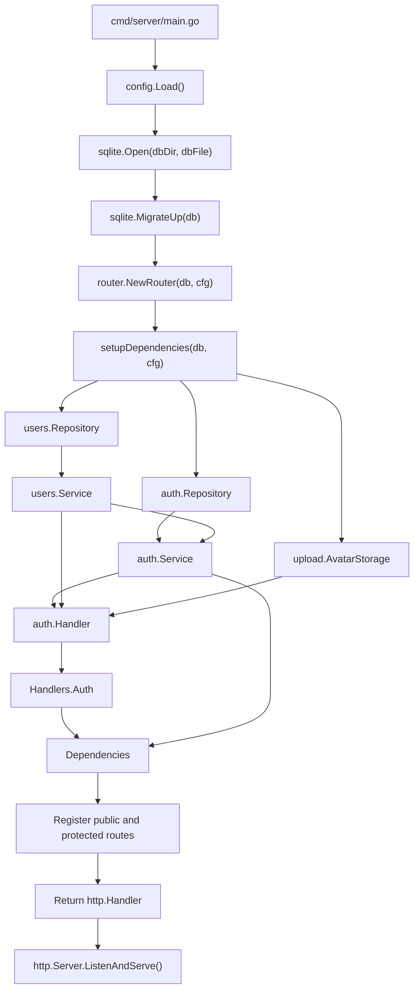

# Backend System Flow: Main to Handlers

This document describes how the backend starts, creates its dependencies, and
routes HTTP requests to the authentication handlers.

## Startup Flow



The startup sequence is:

1. `main.go` loads the application configuration.
2. It opens the SQLite database and runs pending migrations.
3. It calls `router.NewRouter(db, cfg)`.
4. `NewRouter` calls `setupDependencies(db, cfg)` to build the application
   dependency graph.
5. `setupDependencies` creates the users repository and service, avatar
   storage, auth repository and service, and auth handler.
6. The auth handler is stored in `Dependencies.Handlers.Auth`.
7. The auth service is stored separately in `Dependencies.AuthService` because
   the session middleware also needs it.
8. `NewRouter` cleans up expired sessions, registers routes, and returns the
   root `http.Handler` to `main.go`.
9. `main.go` gives that handler to `http.Server` and starts the server.

## Dependency Construction

`setupDependencies` builds dependencies from the lowest layer upward:

```text
Database
   |
   +--> users.Repository --> users.Service --------+
   |                                               |
   +--> auth.Repository ----> auth.Service --------+--> auth.Handler
                                                   |
Uploads directory --> upload.AvatarStorage --------+

auth.Handler --> Handlers.Auth --> Dependencies
auth.Service --------------------> Dependencies.AuthService
```

The handler receives all collaborators required by the current authentication
feature. No repository or service is created inside an HTTP handler.

## HTTP Request Flow

### Public Authentication Routes

```text
HTTP request
   |
   v
Root router: /api/
   |
   v
API router
   |
   +--> GET/POST /login ----> deps.Handlers.Auth.LoginHandler
   |
   +--> POST /register -----> deps.Handlers.Auth.RegisterHandler
```

The login handler uses `auth.Service`. The registration handler uses
`users.Service` and may use `upload.AvatarStorage` when a profile photo is
included.

### Protected Logout Route

```text
GET/POST /api/logout
   |
   v
SessionMiddleware(deps.AuthService, cfg.SessionCookieName)
   |
   +--> Missing or invalid session --> HTTP error response
   |
   +--> Valid session --> deps.Handlers.Auth.LogoutHandler
```

The middleware validates the session, refreshes its expiry, adds the user ID to
the request context, and then calls the logout handler.

### Uploaded Files

Requests under `/uploads/` are served by `http.FileServer` from
`cfg.UploadsDir`. They do not pass through an authentication handler.

## Where Future Features Go

When Posts, Comments, Followers, Groups, Chat, or Notifications are
implemented:

1. Create each feature's repository, service, and handler in its matching
   future section inside `internal/router/dependencies.go`.
2. Add the real handler to `Handlers`.
3. Add a service to `Dependencies` only when another application component,
   such as middleware or another handler, needs to share it.
4. Register the feature's routes in its matching future section inside
   `internal/router/router.go`.

This keeps `main.go` focused on application startup and shutdown while the
router package owns dependency preparation and HTTP wiring.
