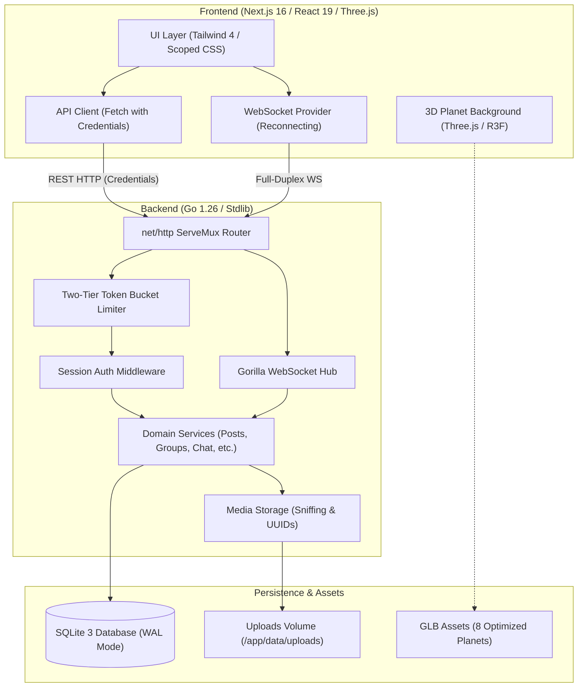
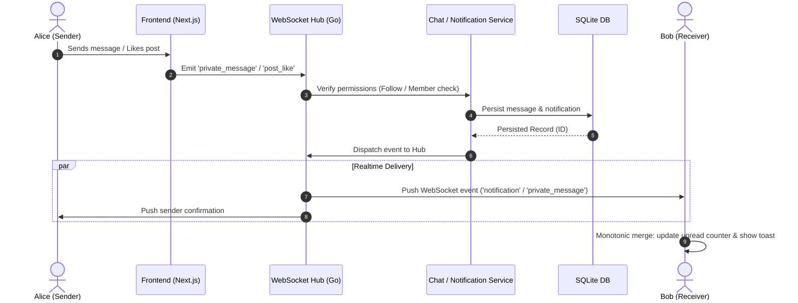

# README Intelligence Handoff — Social Network

> **Target Audience:** Future AI Agents (GPT-4o, Claude 3.7 Sonnet, etc.) tasked with writing the root `README.md`.  
> **Purpose:** Provide an authoritative, high-signal, pre-verified technical intelligence base so you can craft a world-class, factually accurate README without rescanning the repository or rediscovering architecture.

---

## 1. Project in 30 Seconds

- **What it is:** A production-grade, full-stack social network built around an interactive space theme. Users navigate social connections, customized feed streams, private/group messaging, and group events against an ambient 3D orbital background featuring 8 selectable celestial bodies with dynamic CSS color theme re-skinning.
- **Backend:** High-performance Go 1.26 server with zero third-party web frameworks, using Go standard library `net/http.ServeMux`, SQLite with WAL mode, Gorilla WebSocket, and an in-house two-tier token bucket rate limiter.
- **Frontend:** Next.js 16.3.2 (App Router) with React 19.2.8, TypeScript 5.9.3, Tailwind CSS 4, and Three.js 0.185.1 / React Three Fiber.
- **Key Engineering Philosophy:** Clean Architecture, zero heavy ORMs, transactional embedded migrations (`embed.FS`), single-connection SQLite serialization, and completely decoupled non-blocking 3D graphics.

---

## 2. Verified Technology Stack

| Layer              | Technology            | Exact Version | Key Details                                                      |
| ------------------ | --------------------- | :-----------: | ---------------------------------------------------------------- |
| **Frontend**       | Next.js               |   `16.3.2`    | App Router, React Server & Client Components, CSS Modules        |
| **UI Runtime**     | React                 |   `19.2.8`    | Modern concurrent features, hooks                                |
| **Language (Web)** | TypeScript            |    `5.9.3`    | Full client type safety                                          |
| **Styling**        | Tailwind CSS          |    `4.0.0`    | PostCSS `@tailwindcss/postcss`, scoped CSS variables             |
| **3D Engine**      | Three.js              |   `0.185.1`   | WebGL canvas, custom shaders, GLB model loading                  |
| **3D React Layer** | React Three Fiber     |    `9.7.0`    | Declarative 3D scene graph (`@react-three/drei: 10.7.8`)         |
| **Backend**        | Go                    |   `1.26.5`    | Standard library HTTP routing, concurrent worker pools           |
| **Database**       | SQLite3               |  `v1.14.50`   | `mattn/go-sqlite3` with foreign keys & WAL mode                  |
| **Realtime**       | Gorilla WebSocket     |   `v1.5.3`    | Single multiplexed full-duplex connection at `/api/ws`           |
| **Security**       | `golang.org/x/crypto` |   `v0.55.0`   | bcrypt password hashing (cost 10)                                |
| **Tokens & IDs**   | `google/uuid`         |   `v1.6.0`    | 32-byte session tokens & collision-proof media names             |
| **Containers**     | Docker / Compose      |  v2 Compose   | Multi-stage Dockerfiles (`debian:bookworm-slim`, `node:20-slim`) |

---

## 3. Current Feature Snapshot

- **Authentication & Onboarding:** Multi-step registration wizard with interactive 3D planet stages, login verification, password change with old-hash verification, session cookies (`HttpOnly`, `SameSite=Lax`, 24h sliding window).
- **Social Graph:** Public and private user profiles, directional follow relationships, follow request approval/decline workflows, personalized "Who to Follow" recommendations.
- **Posts & Feeds:** Rich posts with multi-media attachments (images/GIFs), cursor-based infinite feed with sticky filters (`All`, `Following`, `Friends`), 3-tier visibility (`public`, `followers`, `custom`).
- **Interactions & Sharing:** Live post likes with optimistic UI, threaded comments with attachments and live counters, in-app post sharing directly into 1-on-1 or group chat threads with interactive card previews.
- **Groups & Events:** Public (approval on join) and private (invite-only) groups, group member role management, upcoming events with future-date enforcement, attendee RSVP tracking (`going` / `not_going`), inline group post composer.
- **Realtime Chat:** Full-duplex messaging with conversation threads, unread counters, typing indicators, read receipts, and contact eligibility checks (mutual/one-way follow required).
- **Notification Center:** Database-persisted notifications across 15 business triggers, real-time WebSocket push, monotonic unread state merging (no read-state flickering), floating notification toast popups, "Mark All as Read" action.
- **3D Space Atmosphere:** 8 selectable planets (`earth`, `mercury`, `venus`, `mars`, `jupiter`, `saturn`, `uranus`, `sun`), Moon companion orbiting Earth, responsive viewport positioning (mobile/tablet/desktop), dynamic CSS color theme injection.
- **Abuse Prevention:** Custom two-tier token bucket rate limiter (global hard cap 30 tokens, endpoint soft cap 10 tokens) with cooldown penalties, discounting for high-frequency feed queries, and WebSocket chat frame throttling.

---

## 4. Architecture Summary

### Frontend Architecture

- **Router:** Next.js App Router. Grouped into route segments: `(auth)` for public onboarding, `(main)` for authenticated social views, and `(group-settings)` for full-width group management.
- **State & Realtime:** Global `WebSocketProvider` maintains a single multiplexed socket connection with an offline message queue. `NotificationProvider` wraps `useNotificationSync`, merging REST history and WebSocket events into a monotonic unread state.
- **3D Decoupling:** `PlanetBackground.tsx` runs in a separate background layer. Page routing never waits on 3D animations; celestial bodies scale and shift position asynchronously based on screen size and scroll position.

### Backend Architecture

- **Clean Separation:** Strict three-tier pattern (`Handler` -> `Service` -> `Repository`) across 12 packages in `internal/`.
- **Zero Framework:** Uses standard Go `net/http.ServeMux` with pattern matching (`GET /posts/{id}`).
- **SQLite Concurrency:** Avoids database lock contention by configuring `db.SetMaxOpenConns(1)` and `db.SetMaxIdleConns(1)`.
- **Transactional Migrations:** 30 up/down SQL migration pairs embedded into the binary via `embed.FS`, automatically executed on server startup.

---

## 5. Authentication & Privacy Rules

### Privacy Matrix

| Entity           | Privacy Mode | Access & Visibility Behavior                                                                                      |
| ---------------- | ------------ | ----------------------------------------------------------------------------------------------------------------- |
| **Profile**      | `public`     | Full profile (name, avatar, nickname, about me) visible to all users.                                             |
| **Profile**      | `private`    | Only approved followers and the owner see `about_me`. Non-followers see name/avatar with a follow request button. |
| **Profile Info** | Owner Only   | Email, Date of Birth, Age, and UUID are strictly private to the user themselves.                                  |
| **Post**         | `public`     | Visible to all authenticated users.                                                                               |
| **Post**         | `followers`  | Visible only to approved followers of the author.                                                                 |
| **Post**         | `custom`     | Visible only to author-selected followers stored in `post_allowed_viewers`.                                       |
| **Group**        | `public`     | Discoverable in directory; requires creator approval for join requests.                                           |
| **Group**        | `private`    | Hidden from directory and search; strictly invite-only by the group creator.                                      |
| **Private Chat** | 1-on-1       | Permitted **only** if User A follows User B OR User B follows User A.                                             |
| **Group Chat**   | Channel      | Strictly restricted to verified group members.                                                                    |

---

## 6. Realtime WebSocket System

- **Endpoint:** `GET /api/ws` (upgraded with session cookie).
- **Multiplexing:** Single socket carries private chat, group chat, typing indicators, read receipts, notification toasts, RSVP updates, and user presence.
- **Event Types:**
  - Presence: `user_online`, `user_offline`, `online_users`
  - Messaging: `private_message`, `group_message`, `typing`, `mark_read`, `messages_read`
  - Notifications: `notification` (identical wire payload to REST `Notification` struct)
  - Realtime Sync: `group_event_response_updated`, `follow_removed`, `invite_user_search_results`
  - Throttling/Errors: `error`

---

## 7. Space / 3D System

- **Active Planets (8):** `earth` (Default, with orbiting `moon`), `mercury`, `venus`, `mars`, `jupiter`, `saturn` (with rings), `uranus`, `sun`.
- **Dynamic CSS Variables:** Changing planets updates `--planet-accent`, `--planet-border`, `--planet-glow`, etc., re-theming the entire website instantaneously.
- **Performance & Usability:** Responsive camera offsets adjust for mobile screens. Users can toggle the 3D model off in Settings, falling back to a lightweight SVG/CSS starfield.
- **Asset Optimization:** All GLBs in `frontend/public/models/planets/` are lossless container-optimized (`dedup`, `prune`, `weld`, `reorder`). Jupiter's material was explicitly converted from specular/gloss to PBR metal/roughness to fix Three.js rendering bugs.

---

## 8. Database & Migrations

- **Engine:** SQLite3 with `PRAGMA foreign_keys = ON;`.
- **Migrations:** 30 pairs in `backend/pkg/db/migrations/sqlite/` (Latest: `20260915130001_create_likes_table.up.sql`).
- **Execution:** Automated on startup (`sqlite.MigrateUp(db)`).
- **CLI Commands:** `go run ./cmd/migrate [up|down|down-all|version|create <name>]`.
- **Bulk Seeder:** `go run ./cmd/seed` populates 8 sample users (`Password123!`), mutual follows, 5 groups, 4 events, 11 posts, comments, and messages.

---

## 9. Docker & Runtime Verification

- **Compose File:** `compose.yaml` (root).
- **Services:**
  - `backend`: port 8080, volume `backend-data:/app/data`.
  - `frontend`: port 3000, depends on `backend`.
- **Start Command:** `docker compose up --build`
- **Stop Command:** `docker compose down` (or `docker compose down -v` to wipe volume).

---

## 10. Strongest Engineering Stories for the README

1. **The Great 3D Architecture Purge:** Early iterations bound Three.js camera transitions to Next.js routes with GSAP, breaking browser navigation and mobile performance. The team boldly deleted over 60 files and re-architected 3D as a non-blocking background layer with dynamic CSS theme skinning.
2. **SQLite Single-Connection Serialization:** Solved SQLite's notorious `database is locked` concurrency errors in Go by configuring `db.SetMaxOpenConns(1)` with WAL mode, ensuring atomic serialized transactions without external database servers.
3. **Monotonic Realtime State:** Prevented notification UI jitter by enforcing monotonic read merging (`isRead: incoming || existing`), guaranteeing that stale REST polling responses never flip read notifications back to unread.
4. **Weighted Token Bucket Limiting:** Engineered an stdlib two-tier rate limiter with weighted query costing (discounting feed likes/comment count reads to 0.2 tokens) to protect APIs without penalizing legitimate feed scrolling.
5. **Lossless 3D Asset Pipeline:** Custom automated GLTF optimization chain with byte-level texture integrity verification and automated conversion of legacy material extensions.

---

## 11. Current Caveats (Crucial for README Accuracy)

1. **Frontend Hardcodes Localhost:** `frontend/src/lib/api.ts` hardcodes `http://localhost:8080` and `ws://localhost:8080`. Always document the app as accessed via `localhost:3000` connected to `localhost:8080`.
2. **Backend Hardcodes CORS Origin:** `backend/internal/middleware/cors.go` explicitly allows `http://localhost:3000`. Running the frontend on another port causes CORS errors.
3. **Missing Smoke Script:** `frontend/package.json` mentions `"test:smoke": "bash tests/run-smoke.sh"`, but `tests/run-smoke.sh` does not exist. Do not list this script in the README.
4. **Stale Documentation:** Disregard claims in `frontend/README.md` that group chat is disabled or 3D is dormant. Both are fully active in current code. Disregard `docs/TEST_AUDIT_REPORT.md` claims that followers/comments are unbuilt.
5. **Entrypoint Path:** The Go server entrypoint is `backend/cmd/server/main.go` (NOT `backend/cmd/main.go`).

---

## 12. Best Screenshot Targets for the Final README

| Screen / Feature             | Route               | Why Useful / Visual Appeal                                                     | Recommended State                     |
| ---------------------------- | ------------------- | ------------------------------------------------------------------------------ | ------------------------------------- |
| **Home Feed & 3D Planet**    | `/`                 | Shows post feed, sticky filters, recommendations, and 3D celestial background. | Logged in as `alice`, Earth selected. |
| **Interactive 3D Auth**      | `/register`         | Demonstrates the 3-step registration wizard with dynamic planet staging.       | Step 2 with biographical inputs.      |
| **Group Hub & Events**       | `/groups/[groupId]` | Shows group header, member cards, upcoming events with RSVPs, inline composer. | Group "Apollo Explorers Club".        |
| **Live Chat & Post Preview** | `/chat`             | Displays 1-on-1 messaging, typing indicators, and shared post preview cards.   | Chat thread between Alice and Bob.    |
| **3D Appearance Settings**   | `/settings`         | Highlights the 8-planet picker and theme customizer.                           | Appearance tab with Saturn selected.  |

---

## 13. README-Ready Mermaid Diagrams

### 13.1 System Architecture Diagram

### 13.2 Realtime Event & Notification Flow

---

## 14. Recommended README Structure for the Final Writer

1. **Hero Section:** Project title, tagline, badging (Go, Next.js, Three.js, SQLite, Docker), and hero screenshot.
2. **Key Features & Capabilities:** Grouped logically (Social Networking, Realtime Chat, Dynamic 3D Space Identity, Security & Rate Limiting).
3. **Interactive 3D System:** Explanation of the 8 selectable planets and dynamic theme re-skinning.
4. **Architecture & System Design:** Mermaid architecture diagram and explanation of the decoupled Go + Next.js stack.
5. **Quickstart / Getting Started:**
   - Prerequisites (Docker, Go 1.26, Node 20).
   - Docker Compose instructions (`docker compose up --build`).
   - Local development instructions (Makefile targets: `make server`, `make frontend`, `make seed`).
   - Sample seed accounts table (`alice`, `bob`, `Password123!`).
6. **API & WebSocket Overview:** High-level endpoint inventory and WebSocket event types.
7. **Testing & Quality Assurance:** Go test execution (`go test ./...`), race detector, Next.js build.
8. **Engineering Highlights:** Lessons learned, SQLite single-connection pooling, monotonic notifications.

---

## 15. Safe Facts to Use Directly

- **Port Configuration:** Backend runs on `8080`, Frontend runs on `3000`.
- **Database:** SQLite database is stored at `backend/data/social-network.db` (in container: `/app/data/social-network.db`).
- **Seed Password:** All seeded sample accounts use `Password123!`.
- **Session Duration:** 24 hours with sliding window refresh on every authenticated request.
- **Media Formats:** JPEG, PNG, GIF for avatars (5MB max); JPEG, PNG, GIF, WebP for posts/comments/events (5MB max).
- **Planets:** Exactly 8 selectable planets (`earth`, `mercury`, `venus`, `mars`, `jupiter`, `saturn`, `uranus`, `sun`) plus Earth's Moon.

---

## 16. Deep Reference Files

For deeper technical specifics, consult these companion files in `docs/ai-handoff/`:

- `docs/ai-handoff/PROJECT_AUDIT.md`: Complete 43-endpoint API inventory, component breakdown, full privacy matrix, and rate-limiting equations.
- `docs/ai-handoff/PROJECT_HISTORY.md`: Historical reconstruction of all 6 project phases, author domain splits, and the 3D cleanup log.
- `docs/ai-handoff/EVIDENCE_INDEX.md`: Searchable index linking every technical claim to source code symbols and line numbers.
- `docs/ai-handoff/VERIFICATION_LOG.md`: Raw execution results and logs for backend tests, race detector, TypeScript checks, and Next.js builds.
