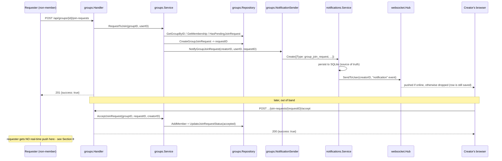
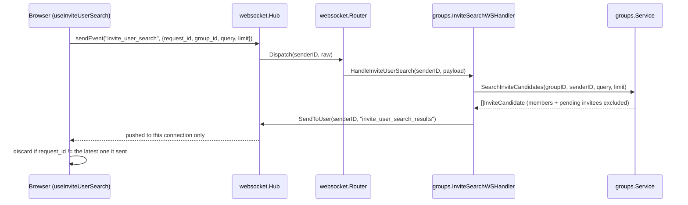
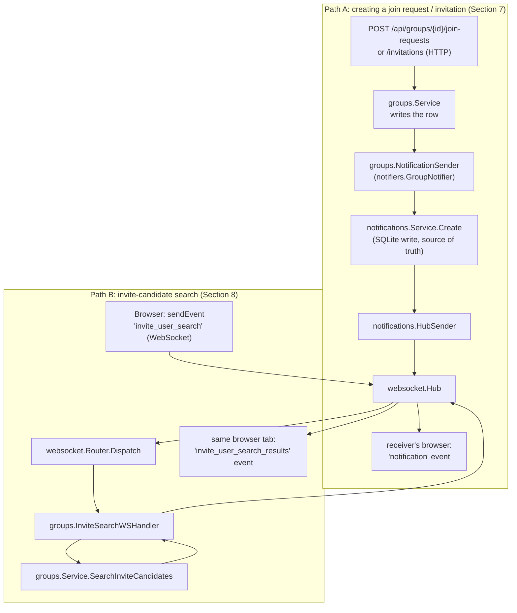

# Groups System

This document describes the backend Groups feature (`internal/groups`):
its data model, HTTP API, and - the focus of this writeup - exactly how
it plugs into the two other real-time docs in this folder,
[`notifications.md`](./notifications.md) and
[`websocket-system.md`](./websocket-system.md). Groups is the one
feature in this codebase that touches *both* real-time channels, in two
different ways, and it's easy to conflate them - this doc keeps them
separate and shows the wiring for each.

## 1. Scope

Implemented:

- Groups: create, list (paginated), get-by-ID, list members, check the
  caller's own membership/role.
- Join requests: a non-member asks to join; the group's creator
  accepts or rejects.
- Invitations: an existing member invites someone; the invited user
  accepts or declines.
- Real-time invite-candidate search: a member typing a name/username
  into the invite box gets results pushed back over the same
  WebSocket connection instead of polling an HTTP endpoint.
- A notification is created (and pushed in real time if the receiver
  is online) the moment a join request or invitation is created.

Not implemented yet: Group Events (there's a commented-out
`NotifyGroupEvent` stub in `service.go` marking where it will plug in)
and Group Chat (tracked in `websocket-system.md` Section 12). Also not
implemented: any real-time push back to the *requester*/*inviter* when
their join request or invitation is later accepted/rejected/declined -
see Section 8.

## 2. Data Model

Four tables, all SQLite, all with `ON DELETE CASCADE` back to `groups`
and/or `users`:

```text
groups                    group_members                group_invitations              group_join_requests
------                    -------------                -----------------              --------------------
id (PK)                   id (PK)                      id (PK)                        id (PK)
creator_id -> users(id)   group_id   -> groups(id)      group_id        -> groups(id)  group_id -> groups(id)
title                     user_id    -> users(id)       invited_by      -> users(id)   user_id  -> users(id)
description               role: 'creator' | 'member'    invited_user_id -> users(id)   status: pending|accepted|declined
created_at                joined_at                     status: pending|accepted|declined  created_at
updated_at                                              created_at                     updated_at
                                                         updated_at

UNIQUE(group_id, user_id)                UNIQUE(group_id, invited_user_id)   UNIQUE(group_id, user_id)
```

Migrations:
`pkg/db/migrations/sqlite/20260829174143_create_groups_table.{up,down}.sql`,
`..._create_group_members_table...`, `..._create_group_invitations_table...`,
`..._create_group_join_requests_table...`.

Two things are enforced at the schema level rather than only in Go:

- `group_members` has a `UNIQUE(group_id, user_id)` index - a user
  physically cannot be added to the same group twice, no matter what
  race happens above the database.
- `group_invitations` and `group_join_requests` each have a `CHECK
  (status IN ('pending','accepted','declined'))` constraint and their
  own `UNIQUE(group_id, invited_user_id | user_id)` index - but note
  that index covers *all* rows regardless of status, not just pending
  ones (see the "stale unique index" gap in Section 9).

## 3. Package Layout

```text
internal/groups/
    model.go         Group, GroupMember, GroupInvitation, GroupJoinRequest,
                      InviteCandidate, every HTTP request/response DTO
    errors.go         sentinel errors + the three *ErrorResponse(err) mappers
                      that turn a service error into an HTTP status + message
    validation.go     title/description/pagination/ID/search-query validation
    repository.go     SQL only - one method per query, no business rules
    service.go        business logic + the NotificationSender interface
                      (see Section 7)
    handler.go        HTTP only - one method per route
    ws.go             InviteSearchWSHandler - the direct WebSocket path
                      (see Section 8)
```

Same handler → service → repository shape as `posts` and
`notifications`. The one thing that makes Groups different from every
other feature package is that it has **two** entrypoints into its
service layer: `handler.go` (HTTP, session-authenticated) and `ws.go`
(WebSocket, dispatched through the shared `websocket.Router` - see
`websocket-system.md` Section 4.5).

## 4. Domain Rules & Invariants

Enforced in `service.go`, on top of the schema constraints above:

- **Creating a group makes you its creator and its first member, in
  one transaction.** `Repository.InsertGroup` inserts into `groups`
  and `group_members` (`role = 'creator'`) inside a single `tx` - there
  is no window where a group exists with zero members.
- **A group's creator is derived from `group_members.role`, not stored
  redundantly** for membership checks - `Service.IsGroupCreator`
  compares `group.CreatorID` (from the `groups` row) against the
  caller.
- **You can't invite or request-join your way into double membership**:
  `RequestToJoin` checks `GetMembership` first and returns
  `ErrAlreadyMember`; `CreateGroupInvitation` does the same for the
  invited user.
- **You can't have two pending join requests or invitations for the
  same group** - checked explicitly in Go (`HasPendingJoinRequest` /
  `HasPendingInvitation`) before insert, on top of the schema's unique
  index.
- **You can't invite yourself** (`ErrCannotInviteSelf`), and **only an
  existing member can invite anyone** (`ErrNotGroupMember` if the
  inviter isn't a member).
- **Only the creator can see or resolve pending join requests**
  (`GetPendingJoinRequests`, `AcceptJoinRequest`, `RejectJoinRequest`
  all check `group.CreatorID != creatorID` -> `ErrNotGroupCreator`).
  There's no co-admin concept - it's creator-only.
- **Only the invited user can see themselves resolving their own
  invitation** - `resolvePendingInvitation` checks `inv.InvitedUserID
  != userID` and returns `ErrInvitationNotFound` (not a 403) if someone
  else tries, so a caller can't distinguish "not yours" from "doesn't
  exist."
- **Accepting is idempotent against a race with membership**:
  `AcceptJoinRequest`/`AcceptGroupInvitation` call `repo.AddMember` and
  explicitly swallow `ErrAlreadyMember` (`err != nil &&
  !errors.Is(err, ErrAlreadyMember)`) before marking the
  request/invitation resolved - so accepting twice in a race doesn't
  fail loudly.
- **Invite-candidate search excludes both existing members and anyone
  with a pending invitation already** (`Repository.SearchInviteCandidates`'s
  `NOT EXISTS` subqueries) - a member can't see, or double-invite,
  someone who already has an invite outstanding.

## 5. HTTP API

All routes require a valid session (`sessionMiddleware`); the caller's
identity always comes from `auth.UserIDKey`, never a request body/query
param. Registered in `router/router.go`.

| Method | Path                                              | Handler                          | Notes                                    |
| -------- | --------------------------------------------------- | ----------------------------------- | -------------------------------------------- |
| GET    | `/api/groups`                                    | `ListGroupsHandler`               | `?limit=&offset=`, newest first          |
| POST   | `/api/groups`                                    | `CreateGroupHandler`              | body `{title, description}`            |
| GET    | `/api/groups/{id}`                               | `GetGroupHandler`                 |                                           |
| GET    | `/api/groups/{id}/members`                       | `GetGroupMembersHandler`          |                                           |
| GET    | `/api/groups/{id}/membership`                    | `GetMembershipHandler`            | `{is_member, role}` for the caller     |
| POST   | `/api/groups/{id}/join-requests`                 | `CreateJoinRequestHandler`        | -> triggers `NotifyGroupJoinRequest`   |
| GET    | `/api/groups/{id}/join-requests`                 | `GetPendingJoinRequestsHandler`   | creator only                             |
| POST   | `/api/groups/{id}/join-requests/{requestID}/accept` | `AcceptJoinRequestHandler`     | creator only, adds member                |
| POST   | `/api/groups/{id}/join-requests/{requestID}/reject` | `RejectJoinRequestHandler`     | creator only                             |
| POST   | `/api/groups/{id}/invitations`                   | `CreateGroupInvitationHandler`    | body `{invited_user_id}` -> triggers `NotifyGroupInvitation` |
| GET    | `/api/group-invitations`                         | `GetPendingInvitationsHandler`    | the caller's own pending invitations     |
| POST   | `/api/group-invitations/{invitationID}/accept`   | `AcceptGroupInvitationHandler`    | invited user only, adds member           |
| POST   | `/api/group-invitations/{invitationID}/decline`  | `DeclineGroupInvitationHandler`   | invited user only                        |

Every handler follows the same shape: parse path/body -> validate
(`validation.go`) -> call one `Service` method -> map the returned
error through `joinRequestErrorResponse` / `invitationErrorResponse` /
`inviteCandidateErrorResponse` (`errors.go`) to a status + message.
There is deliberately **no WebSocket equivalent** for creating a group,
requesting to join, or inviting someone - all of that is plain
request/response HTTP. Only the search-as-you-type part (Section 8)
uses the socket.

## 6. Core Flows



Group invitations follow the mirror-image flow: an existing **member**
calls `POST /api/groups/{id}/invitations`, `CreateGroupInvitation` fires
`NotifyGroupInvitation(invitedUserID, inviterID, invitationID)`, and
later the **invited user** (not the creator) calls accept/decline on
`/api/group-invitations/{invitationID}/...`.

## 7. Syncing To Notifications

This is the primary way Groups is "real-time": not by pushing
group-specific events, but by creating rows in the generic
notification system, which - if the receiver happens to be connected -
get pushed over the shared hub as a plain `"notification"` event
(`notifications.md` Section 9, `websocket-system.md` Section 7 event
catalog). Groups never touches `*websocket.Hub` directly for this path.

`internal/notifications.md` Section 6 documents the general adapter
pattern in depth using Groups as its worked example; this section is
the short version, from Groups' side of the fence:

```go
// internal/groups/service.go - declared here, not in internal/notifications
type NotificationSender interface {
    NotifyGroupInvitation(receiverID, actorID, invitationID int) error
    NotifyGroupJoinRequest(receiverID, actorID, requestID int) error
}

type Service struct {
    repo     *Repository
    notifier NotificationSender
}
```

`internal/notifications/notifiers/groups.go` implements it by wrapping
a real `*notifications.Service`:

```go
func (n *GroupNotifier) NotifyGroupJoinRequest(receiverID, actorID, requestID int) error {
    entityType := notifications.EntityGroupJoinRequest
    actor := actorID
    _, err := n.service.Create(notifications.CreateNotificationRequest{
        ReceiverID: receiverID,
        ActorID:    &actor,
        Type:       notifications.NotificationGroupJoinRequest,
        EntityType: &entityType,
        EntityID:   &requestID,
        Message:    "requested to join your group",
    })
    return err
}
```

Wired once, in `router.setupDependencies`:

```go
groupNotifier := notifiers.NewGroupNotifier(notificationsService) // implements groups.NotificationSender
groupsService := groups.NewService(groupsRepo, groupNotifier)
```

Both call sites follow the same shape - fire the notification *after*
the row is committed, and never fail the original action if it errors:

```go
// RequestToJoin, after CreateGroupJoinRequest succeeds:
if s.notifier != nil {
    if err := s.notifier.NotifyGroupJoinRequest(group.CreatorID, userID, int(requestID)); err != nil {
        // log the notification error, but don't fail the join request
    }
}

// CreateGroupInvitation, after CreateGroupInvitation succeeds:
if s.notifier != nil {
    if err := s.notifier.NotifyGroupInvitation(invitedUserID, inviterID, int(invitationID)); err != nil {
        // log the notification error, but don't fail the invitation
    }
}
```

**What is *not* wired yet:** accepting, rejecting, or declining never
calls the notifier - `AcceptJoinRequest`, `RejectJoinRequest`,
`AcceptGroupInvitation`, and `DeclineGroupInvitation` only touch
`repo`. So today a requester/inviter finds out their request was
resolved only by polling `GET /api/group-invitations` or re-checking
membership - there's no live push for that half of the lifecycle. (The
`NotificationSender` interface in `service.go` also has a commented-out
`NotifyGroupEvent` method - the placeholder for when the Group Events
feature is built.)

## 8. Syncing To WebSocket Directly - Invite-Candidate Search

This is the other, unrelated way Groups touches real-time
infrastructure: `internal/groups/ws.go` registers directly on the
shared `websocket.Router` (`websocket-system.md` Sections 4.5 and 8.2)
to serve typeahead search results without polling HTTP. It is a
request/response exchange over the *same* connection everything else
(chat, presence, notifications) already uses - Groups doesn't open a
second socket.

```go
// internal/groups/ws.go
const (
    EventInviteUserSearch        websocket.EventType = "invite_user_search"
    EventInviteUserSearchResults websocket.EventType = "invite_user_search_results"
)

type InviteSearchWSHandler struct {
    service *Service
    hub     *websocket.Hub
}

func (h *InviteSearchWSHandler) HandleInviteUserSearch(senderID int64, rawPayload json.RawMessage) {
    var req InviteUserSearchPayload // {request_id, group_id, query, limit}
    json.Unmarshal(rawPayload, &req)

    candidates, err := h.service.SearchInviteCandidates(req.GroupID, int(senderID), req.Query, req.Limit)
    if err != nil {
        h.sendError(senderID, message) // shared "error" event
        return
    }

    outEvent, _ := websocket.NewEvent(EventInviteUserSearchResults, InviteUserSearchResultsPayload{
        RequestID: req.RequestID,
        GroupID:   req.GroupID,
        Users:     toInviteCandidateResponse(candidates),
    })
    h.hub.SendToUser(senderID, outEvent) // back to the searcher only, never broadcast
}
```

Wired the same call, next to `SetMessageHandler`, in
`router.setupDependencies`:

```go
inviteSearchWSHandler := groups.NewInviteSearchWSHandler(groupsService, hub)

wsRouter := websocket.NewRouter()
wsRouter.Register(groups.EventInviteUserSearch, inviteSearchWSHandler.HandleInviteUserSearch)
wsHandler.SetMessageHandler(wsRouter.Dispatch)
```

`SearchInviteCandidates` re-checks membership itself
(`ErrNotGroupMember` if the caller isn't in the group) - the WebSocket
layer never assumes the caller is authorized just because they hold an
open, authenticated connection to *some* group's data.



`request_id` is a client-generated UUID the server echoes back
unmodified - it exists purely so a slower, earlier keystroke's result
can't clobber a faster, later one client-side (`useInviteUserSearch.ts`,
also documented in `websocket-system.md` Section 8.2).

## 9. Full Real-Time Signal Path

Putting Sections 7 and 8 side by side - these are two independent
paths through the same hub, triggered by different things, going to
different people:



| What triggers it                         | Transport in           | Who receives a live push | Event type                     | Falls back to |
| ------------------------------------------- | -------------------------- | ---------------------------- | ----------------------------------- | ----------------- |
| Creating a join request                   | HTTP                      | the group's creator          | `notification` (generic)          | polling `GET /api/notifications` |
| Creating an invitation                    | HTTP                      | the invited user             | `notification` (generic)          | polling `GET /api/notifications` |
| Accepting/rejecting/declining either one | HTTP                      | nobody (not wired yet)       | -                                   | polling `GET /api/group-invitations` / membership |
| Typing in the invite search box           | WebSocket (both ways)    | the searcher only            | `invite_user_search_results`      | none - this feature has no HTTP fallback |

## 10. Frontend Architecture

```text
frontend/src/features/groups/
    api/groups.ts                  plain fetch() calls for every HTTP endpoint in Section 5
    types/group.ts                 Group, GroupMember, Membership, InviteCandidate
    hooks/useGroupJoinRequest.ts   wraps createJoinRequest() - HTTP only, no websocket involved
    hooks/useGroupInvitation.ts    wraps createGroupInvitation() - HTTP only, no websocket involved
    hooks/useInviteUserSearch.ts   the ONE hook in this feature that talks to useWebSocket()
    components/GroupInviteSearch.tsx  combines useInviteUserSearch (search) + useGroupInvitation (the Invite button)
```

The split is deliberate and visible in the code: `useGroupJoinRequest`
and `useGroupInvitation` never import `useWebSocket` - they're plain
`fetch`-backed hooks with local `idle/requesting/requested`-style state,
because *creating* a join request or invitation is a one-shot HTTP
action with no live component. `useInviteUserSearch` is the only hook
that calls `useWebSocket().sendEvent(...)` and reads
`inviteSearchResults` from the shared `WebSocketProvider` context
(`websocket-system.md` Section 10) - because search-as-you-type is the
one part of Groups that actually benefits from a live channel instead
of a request/response round trip per keystroke.

Neither hook renders anything based on the `notification` event from
Section 7 - there is no groups-specific frontend code reacting to a
new join-request/invitation notification arriving live. It would
arrive at `WebSocketProvider` (whichever consumer eventually reads
notifications) exactly like any other notification, but there is no
groups-aware UI wired to it yet (consistent with `websocket-system.md`
Section 12: no global notifications UI exists yet at all).

## 11. Known Gaps

- **No real-time feedback on accept/reject/decline** (Section 7) - the
  requester/inviter only finds out by polling. Fixing this would mean
  adding, e.g., `NotifyJoinRequestAccepted`/`NotifyInvitationAccepted`
  methods to `groups.NotificationSender` and calling them from
  `AcceptJoinRequest`/`AcceptGroupInvitation`/etc., the same way the
  creation methods already work.
- **Stale unique index after a decline**: `group_invitations` and
  `group_join_requests` each have `UNIQUE(group_id, invited_user_id |
  user_id)` covering *every* status, not just `pending`. Once someone's
  invitation/join-request is declined, the Go-level `HasPending...`
  checks correctly allow a new attempt (they filter `WHERE status =
  'pending'`), but a second `INSERT` for the same `(group_id, user)`
  pair would violate the unique index rather than create a fresh row -
  worth verifying if declines are meant to be retryable, since the
  schema as written does not obviously support "declined, then invited
  again."
- **Group Events don't exist** - `NotifyGroupEvent` is a commented-out
  stub in `service.go`; there's no events table, no service, no
  handler.
- **Group Chat doesn't exist** - see `websocket-system.md` Section 12.
- **No backend tests for `internal/groups`** - unlike
  `internal/notifications` and `internal/websocket`, there is currently
  no `*_test.go` in this package, so none of the domain rules in
  Section 4 (self-invite, double-membership, pending-request dedup,
  creator-only access) are regression-tested.

## 12. Related Docs

- [`notifications.md`](./notifications.md) - the general notification
  system Section 7 plugs into (package layout, DB schema, the adapter
  pattern in depth, and the step-by-step guide for wiring up a new
  feature the same way).
- [`websocket-system.md`](./websocket-system.md) - the shared transport
  Section 8 plugs into (Hub/Client/Router internals, the full event
  catalog, and the frontend `WebSocketProvider`).
