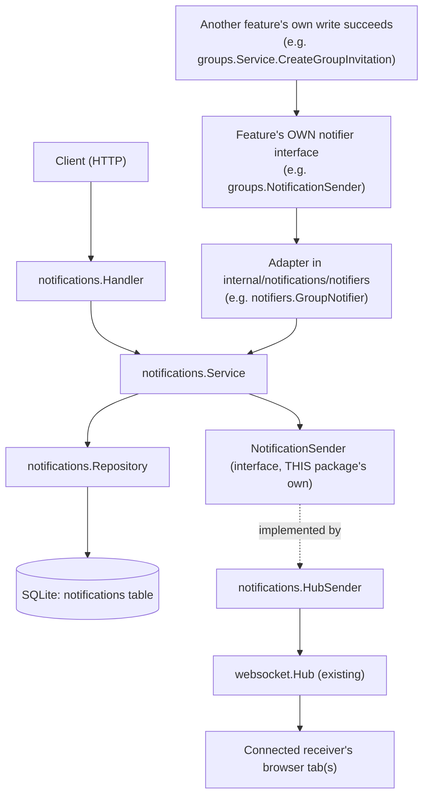

# Notification System

This document describes the backend notification system: persistent,
per-user notifications with real-time delivery over the existing websocket
hub. It is backend-only - there is no frontend notification UI yet.

## 1. Scope

Implemented:

- SQLite-backed storage of notifications (`internal/notifications`).
- Four notification types: `follow_request`, `group_invitation`,
  `group_join_request`, `group_event`.
- Listing, unread count, mark-one-read, mark-all-read, all scoped to the
  authenticated user.
- Real-time push over the existing websocket hub when the receiver is
  connected; notifications persist regardless of whether delivery succeeds.

Not implemented (out of scope for this change): the Follow Request and
Group Event features themselves do not exist yet in this backend.
Group Invitations and Group Join Requests **do** exist and already call
into this system (Section 6 walks through exactly how, using Groups as
the worked example) - Section 7 is the step-by-step guide for wiring up
a feature that doesn't yet call `notificationService.Create(...)`.

## 2. Database Table

Migration:
`pkg/db/migrations/sqlite/20260903211849_create_notifications_table.{up,down}.sql`

```sql
CREATE TABLE IF NOT EXISTS notifications (
    id INTEGER PRIMARY KEY AUTOINCREMENT,
    receiver_id INTEGER NOT NULL,   -- FK -> users(id), ON DELETE CASCADE
    actor_id INTEGER,               -- FK -> users(id), ON DELETE CASCADE, nullable
    type TEXT NOT NULL,             -- validated in Go, not by a CHECK constraint
    entity_type TEXT,               -- free-form label, e.g. "follow_request", "event"
    entity_id INTEGER,              -- id of the row entity_type refers to
    message TEXT NOT NULL,
    read_at DATETIME,               -- NULL until read
    created_at DATETIME NOT NULL DEFAULT CURRENT_TIMESTAMP
);

CREATE INDEX idx_notifications_receiver_created ON notifications(receiver_id, created_at DESC);
CREATE INDEX idx_notifications_receiver_read    ON notifications(receiver_id, read_at);
```

`type` is deliberately a plain `TEXT` column with no `CHECK` constraint.
Validity is enforced in Go (`IsValidNotificationType`) so a new type can be
added without a migration - see section 7.

## 3. Package Layout

```text
internal/notifications/
    model.go        Notification, NotificationType, CreateNotificationRequest, response types
    errors.go        ErrNotificationNotFound, ErrInvalidNotificationType
    validation.go    pagination / ID parsing for the HTTP layer
    repository.go    SQL only
    events.go        the "notification" websocket envelope
    sender.go        NotificationSender interface + HubSender adapter -> websocket.Hub
    service.go        business logic, delivery orchestration
    handler.go        HTTP only
    notifiers/
        groups.go      GroupNotifier: adapts this service to Groups' OWN notifier
                        interface (see Section 6) - one file per feature that plugs in
```

This mirrors the layout used by `internal/groups` and `internal/posts`:
handler → service → repository, with sentinel errors in `errors.go` and
request-parsing helpers in `validation.go`. `notifiers/` is a separate
sub-package on purpose: it's the only place that imports both this
package and (indirectly) a consuming feature's expectations, so
`internal/notifications` itself never has to import `internal/groups`,
`internal/posts`, etc.

## 4. Request Flow

Two different paths feed into this package: the HTTP API a client polls
directly, and the "a feature wants to notify someone" path used
internally by other backend packages (Groups today).



`Service` depends only on the `NotificationSender` interface
(`SendToUser(userID int, event any) error`), never on `*websocket.Hub`
directly. `HubSender` is the concrete adapter, wired up once in
`router.setupDependencies` and injected into `notifications.NewService`.

Note there are **two different interfaces both called
`NotificationSender`** in this codebase, and they are not the same
thing:

| Interface                            | Declared in                          | Purpose                                                                             | Implemented by              |
| ------------------------------------ | ------------------------------------ | ----------------------------------------------------------------------------------- | --------------------------- |
| `notifications.NotificationSender` | `internal/notifications/sender.go` | lets this package push over websocket without importing the hub directly            | `notifications.HubSender` |
| `groups.NotificationSender`        | `internal/groups/service.go`       | lets`groups.Service` create notifications without importing this package directly | `notifiers.GroupNotifier` |

Section 6 is about the second row - that's the pattern to copy for any
new feature.

## 5. HTTP Endpoints

All routes require a valid session (`sessionMiddleware`); the receiver is
always taken from `auth.UserIDKey` in the request context, never from a
request body or query parameter.

| Method | Path                                | Description                                                          |
| ------ | ----------------------------------- | -------------------------------------------------------------------- |
| GET    | `/api/notifications`              | `?limit=&offset=` page of the caller's notifications, newest first |
| GET    | `/api/notifications/unread-count` | `{"count": N}`                                                     |
| PATCH  | `/api/notifications/{id}/read`    | Mark one notification read (must be owned by the caller)             |
| PATCH  | `/api/notifications/read-all`     | Mark all of the caller's notifications read                          |

`MarkAsRead` and `MarkAllAsRead` never take a bare notification ID - the
repository query is always `WHERE id = ? AND receiver_id = ?`, so one user
can never mark another user's notification as read by guessing IDs
(`ErrNotificationNotFound` is returned identically whether the ID doesn't
exist or just isn't owned by the caller).

## 6. The Adapter Pattern (worked example: Groups)

This is how a feature is actually meant to plug into the notification
system - worked from the one real, already-wired example in the
codebase (`internal/groups`), not a hypothetical.

`groups.Service` never imports `internal/notifications`. Instead it
declares the exact shape of notification it needs, as an interface
local to its own package:

```go
// internal/groups/service.go
type NotificationSender interface {
    NotifyGroupInvitation(receiverID, actorID, invitationID int) error
    NotifyGroupJoinRequest(receiverID, actorID, requestID int) error
}

type Service struct {
    repo     *Repository
    notifier NotificationSender
}
```

`internal/notifications/notifiers/groups.go` implements that interface
by wrapping a real `*notifications.Service` and translating each
feature-specific call into a generic `Create`:

```go
type GroupNotifier struct {
    service *notifications.Service
}

func (n *GroupNotifier) NotifyGroupJoinRequest(receiverID, actorID, requestID int) error {
    entityType := notifications.EntityGroupJoinRequest
    actor := actorID
    _, err := n.service.Create(notifications.CreateNotificationRequest{
        ReceiverID: receiverID,
        ActorID:    &actor,
        Type:       notifications.NotificationGroupJoinRequest,
        EntityType: &entityType,
        EntityID:   &requestID,
        Message:    "requested to join your group",
    })
    return err
}
```

And the call site, inside `groups.Service.CreateJoinRequest`, right
after the join-request row itself is persisted - never before, and a
notification failure never fails the join request:

```go
requestID, err := s.repo.CreateGroupJoinRequest(groupID, userID)
if err != nil {
    return err
}

if s.notifier != nil {
    if err := s.notifier.NotifyGroupJoinRequest(
        group.CreatorID, // receiver
        userID,          // actor
        int(requestID),  // the join request itself
    ); err != nil {
        // log the notification error, but don't fail the join request
    }
}
return nil
```

Finally, wiring happens once, in `router.setupDependencies`:

```go
notificationsSender  := notifications.NewHubSender(hub)
notificationsService := notifications.NewService(notificationsRepo, notificationsSender)

groupNotifier := notifiers.NewGroupNotifier(notificationsService) // implements groups.NotificationSender
groupsService := groups.NewService(groupsRepo, groupNotifier)
```

**Why bother with the extra interface + adapter, instead of just
injecting `*notifications.Service` straight into `groups.Service`?**
Two reasons visible in the code: (1) `groups.Service`'s own unit tests
can fake `NotificationSender` with a two-method stub instead of needing
a real `notifications.Service` (and its DB) in scope, and (2)
`groups.Service` only ever sees the two operations it actually needs
(`NotifyGroupInvitation`/`NotifyGroupJoinRequest`), not the entire
notifications API (`GetForUser`, `MarkAsRead`, ...). The trade-off is
one extra small file per feature (`notifiers/<feature>.go`) - injecting
`*notifications.Service` directly and calling `.Create(...)` inline
would work too and is simpler, it just gives up both of those benefits.
Either way, the rules below always apply:

- The notifications package never creates, accepts, or rejects the
  underlying thing (a follow request, an invitation, a join request) -
  it only records that something happened. Business logic and
  validation belong entirely to the triggering feature.
- Always call `notifier.Notify...` (or `notificationService.Create`)
  from the triggering feature's **service** layer, never its handler,
  and only after the underlying row is already committed.
- A notification failure must never roll back or fail the original
  action - log it and move on, exactly as both existing call sites in
  `groups/service.go` do.

## 7. Adding A New Notification

Concrete, copy-pasteable walkthrough for a feature that wants to
trigger a brand new kind of notification - e.g. "someone liked your
post" (`post_like`), which doesn't exist yet. The steps are the same
regardless of which feature is doing the notifying.

**1. Declare the type** in `model.go` - this is the only place a new
`NotificationType` needs to be listed, and it's not a migration:

```go
const (
    NotificationFollowRequest    NotificationType = "follow_request"
    NotificationGroupInvitation  NotificationType = "group_invitation"
    NotificationGroupJoinRequest NotificationType = "group_join_request"
    NotificationGroupEvent       NotificationType = "group_event"
    NotificationPostLike         NotificationType = "post_like" // new
)

var validNotificationTypes = map[NotificationType]bool{
    NotificationFollowRequest:    true,
    NotificationGroupInvitation:  true,
    NotificationGroupJoinRequest: true,
    NotificationGroupEvent:       true,
    NotificationPostLike:         true, // new
}
```

Optionally add an `EntityType` constant too (e.g. `EntityPost = "post"`)
if the notification should carry a descriptive `entity_type` alongside
`entity_id` - this is free-form and only used for display, not enforced
against a real table.

**2. Declare a narrow notifier interface in your own feature package**
(don't import `internal/notifications` into your feature's `Service` -
mirror what `groups.NotificationSender` does in Section 6):

```go
// internal/posts/service.go
type NotificationSender interface {
    NotifyPostLike(receiverID, actorID, postID int) error
}

type Service struct {
    repo     *Repository
    notifier NotificationSender
}

func NewService(repo *Repository, notifier NotificationSender) *Service {
    return &Service{repo: repo, notifier: notifier}
}
```

**3. Implement that interface as an adapter** in `notifiers/` (new
file, e.g. `posts.go`):

```go
package notifiers

import "social/internal/notifications"

type PostsNotifier struct {
    service *notifications.Service
}

func NewPostsNotifier(service *notifications.Service) *PostsNotifier {
    return &PostsNotifier{service: service}
}

func (n *PostsNotifier) NotifyPostLike(receiverID, actorID, postID int) error {
    entityType := "post"
    actor := actorID
    _, err := n.service.Create(notifications.CreateNotificationRequest{
        ReceiverID: receiverID,
        ActorID:    &actor,
        Type:       notifications.NotificationPostLike,
        EntityType: &entityType,
        EntityID:   &postID,
        Message:    "liked your post",
    })
    return err
}
```

**4. Wire it up once**, in `router.setupDependencies`, right next to
where Groups does the same thing:

```go
postsNotifier := notifiers.NewPostsNotifier(notificationsService)
postsService  := posts.NewService(postsRepo, postsNotifier) // constructor now takes the notifier too
```

**5. Call it from your feature's service, after your own write
succeeds** - never before, and never let a notification failure undo or
fail the action that triggered it:

```go
// inside posts.Service, right after the like itself is recorded
if err := s.notifier.NotifyPostLike(post.AuthorID, likerID, post.ID); err != nil {
    log.Printf("notify post like: %v", err)
    // do not return err - the like already succeeded
}
```

**6. No database migration needed** - `type`/`entity_type` are plain
`TEXT` columns validated only in Go (Section 2).

**7. Nothing to do on the frontend to get delivery working** - any
connected receiver already gets a `notification` websocket event
through the existing hub pipeline the moment `Create` succeeds (Section
8). What's still missing today is a UI that *reads* those events - see
`docs/backend_docs/websocket-system.md` Section 12 - until that exists,
the notification is still safely queryable via `GET /api/notifications`
and `GET /api/notifications/unread-count`.

### Existing Notification Types Reference

| Type                   | EntityType             | Triggered by (today)                               | Receiver                       |
| ---------------------- | ---------------------- | -------------------------------------------------- | ------------------------------ |
| `follow_request`     | `follow_request`     | nobody yet - Follow Requests feature doesn't exist | the target user (once built)   |
| `group_invitation`   | `group_invitation`   | `groups.Service.CreateGroupInvitation`           | the invited user               |
| `group_join_request` | `group_join_request` | `groups.Service.CreateJoinRequest`               | the group's creator            |
| `group_event`        | `event`              | nobody yet - Group Events feature doesn't exist    | each group member (once built) |

## 8. Real-Time Delivery & Offline Users

```text
Service.Create(req)
   |
   v
Repository.Create(req)  -- SQLite INSERT, always runs first
   |
   v
(on success) build the "notification" websocket event
   |
   v
NotificationSender.SendToUser(receiverID, event)
   |
   +-- receiver connected  -> pushed immediately to every open tab
   |
   +-- receiver offline    -> Hub silently drops it (no error)
   |
   +-- send itself errors  -> logged, Create still returns success
```

The stored row is the source of truth. Delivery is best-effort: whether the
user is online, offline, or the websocket write fails outright, the
notification already exists in SQLite and will appear in
`GET /api/notifications` / `/unread-count` the next time the client asks.

## 9. Websocket Event Format

Reuses the existing envelope from `internal/websocket/events.go`
(`{"type": ..., "payload": ...}`), with a new event type distinct from
chat's `private_message` / `typing`:

```json
{
    "type": "notification",
    "payload": {
        "id": 123,
        "actor_id": 7,
        "type": "group_invitation",
        "entity_type": "group_invitation",
        "entity_id": 31,
        "message": "You received a group invitation",
        "read_at": null,
        "created_at": "2026-09-04T12:00:00Z"
    }
}
```

## 10. Tests

`internal/notifications/*_test.go` cover, against a real migrated SQLite
temp database (no mocking of the DB):

- Repository: create, get-by-user pagination and newest-first ordering,
  unread count, mark-as-read (including the already-read no-op and unknown
  ID cases), mark-all-as-read.
- Security: a second user can neither read nor mark-as-read another user's
  notifications, at both the repository and service layers.
- Service: valid creation, rejection of an invalid `NotificationType`, and
  the core persistence guarantee - a notification stays stored even when
  the `NotificationSender` returns an error.
- Websocket: a real `websocket.Hub` + a real client connection (via
  `httptest.Server` and the `gorilla/websocket` client) receiving the
  `notification` envelope; an offline receiver (nobody registered on the
  hub) still ending up with the notification in SQLite; and a check that
  the notification event type never collides with `chat.EventPrivateMessage`
  / `chat.EventTyping`.

Run with:

```sh
go test ./internal/notifications/...
```
