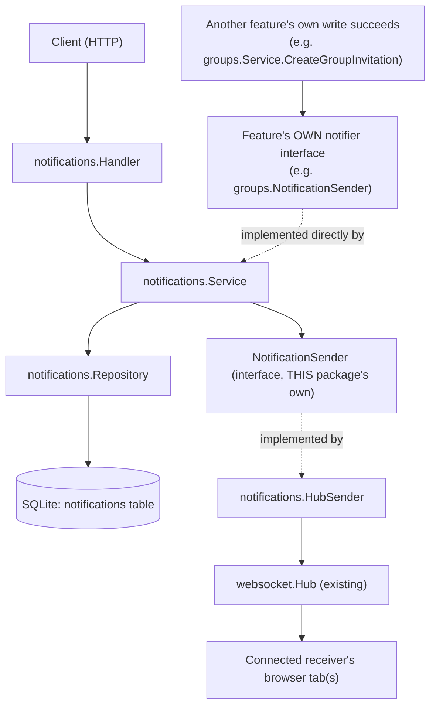

# Notification System

This document describes the notification system end to end: persistent,
per-user notifications stored in SQLite, delivered in real time over the
existing websocket hub, and rendered in the frontend notification bell and
inbox. Section 8 and Section 9 are the copy-pasteable "how do I add a new
notification type" guides - read those first if that's what you're here for.

## 1. Scope

Implemented:

- SQLite-backed storage of notifications (`internal/notifications`).
- Four notification types: `follow_request`, `group_invitation`,
  `group_join_request`, `group_event`.
- Listing, unread count, mark-one-read, mark-all-read, all scoped to the
  authenticated user.
- Real-time push over the existing websocket hub when the receiver is
  connected; notifications persist regardless of whether delivery succeeds.
- A generic `Data` field carrying feature-specific display/navigation
  context (Section 7), so the root `Notification` struct never has to grow
  a new column per feature.
- A frontend notification bell dropdown and `/notifications` inbox page
  that render Group invitations and Group join requests, including
  Accept/Reject actions, read/unread state, and navigation to the right
  group.

Not implemented yet: Follow Requests and Group Events are declared as
`NotificationType`/`EntityType` constants (so the system already knows
about them) but nothing produces them yet - no `followers` or `events`
feature package exists. Section 8 walks through adding Follow Requests as
the worked "how would I actually do this" example, precisely because it's
the type that already has a name but no producer.

Group Invitations and Group Join Requests **do** exist end to end - both
backend and frontend - and are the worked examples for everything else in
this document.

## 2. Database Table

Migration:
`pkg/db/migrations/sqlite/20260903211849_create_notifications_table.{up,down}.sql`

```sql
CREATE TABLE IF NOT EXISTS notifications (
    id INTEGER PRIMARY KEY AUTOINCREMENT,
    receiver_id INTEGER NOT NULL,   -- FK -> users(id), ON DELETE CASCADE
    actor_id INTEGER,               -- FK -> users(id), ON DELETE CASCADE, nullable
    type TEXT NOT NULL,             -- validated in Go, not by a CHECK constraint
    entity_type TEXT,               -- free-form label, e.g. "follow_request", "event"
    entity_id INTEGER,              -- id of the row entity_type refers to
    message TEXT NOT NULL,
    read_at DATETIME,               -- NULL until read
    created_at DATETIME NOT NULL DEFAULT CURRENT_TIMESTAMP
);

CREATE INDEX idx_notifications_receiver_created ON notifications(receiver_id, created_at DESC);
CREATE INDEX idx_notifications_receiver_read    ON notifications(receiver_id, read_at);
```

`type` is deliberately a plain `TEXT` column with no `CHECK` constraint.
Validity is enforced in Go (`IsValidNotificationType`) so a new type can be
added without a migration - see Section 8.

**This table never grows a new column for a new feature.** There is no
`group_id`, `post_id`, or `event_id` column, and there never should be -
see Section 7 for where that information actually lives.

## 3. Package Layout

```text
internal/notifications/
    model.go        NotificationType, Notification, GroupNotificationData,
                     CreateNotificationRequest, response types
    errors.go        ErrNotificationNotFound, ErrInvalidNotificationType
    validation.go    pagination / ID parsing for the HTTP layer
    repository.go    SQL only - also derives Data (Section 7) at read time
    events.go        the "notification" websocket envelope
    sender.go        NotificationSender interface + HubSender adapter -> websocket.Hub
    service.go        business logic, delivery orchestration, and Notify(...)
    handler.go        HTTP only
```

This mirrors the layout used by `internal/groups` and `internal/posts`:
handler → service → repository, with sentinel errors in `errors.go` and
request-parsing helpers in `validation.go`.

There is **no adapter sub-package** (there used to be one,
`notifiers/`, but it added nothing once the feature-facing interface
became a single generic method - see Section 6). `internal/notifications`
still never imports `internal/groups`, `internal/posts`, etc. - features
depend on this package's exported types, not the other way around.

## 4. Request Flow

Two different paths feed into this package: the HTTP API a client polls
directly, and the "a feature wants to notify someone" path used
internally by other backend packages (Groups today).



`Service` depends only on the `NotificationSender` interface
(`SendToUser(userID int, event any) error`), never on `*websocket.Hub`
directly. `HubSender` is the concrete adapter, wired up once in
`router.setupDependencies` and injected into `notifications.NewService`.

Note there are **two different interfaces both called
`NotificationSender`** in this codebase, and they are not the same
thing:

| Interface                          | Declared in                        | Purpose                                                                  | Implemented by            |
| ----------------------------------- | ----------------------------------- | ------------------------------------------------------------------------- | --------------------------- |
| `notifications.NotificationSender` | `internal/notifications/sender.go` | lets this package push over websocket without importing the hub directly | `notifications.HubSender` |
| `groups.NotificationSender`        | `internal/groups/service.go`       | lets `groups.Service` create notifications without importing this package's repository/SQL | `*notifications.Service`  |

The second row used to be implemented by a small adapter
(`notifiers.GroupNotifier`). That adapter is gone: once the interface
became one generic method (Section 6), `*notifications.Service` already
has the right shape, so it's injected directly. Section 6 is the pattern
to copy for any new feature.

## 5. HTTP Endpoints

All routes require a valid session (`sessionMiddleware`); the receiver is
always taken from `auth.UserIDKey` in the request context, never from a
request body or query parameter.

| Method | Path                                | Description                                                          |
| ------ | ----------------------------------- | ---------------------------------------------------------------------- |
| GET    | `/api/notifications`               | `?limit=&offset=` page of the caller's notifications, newest first   |
| GET    | `/api/notifications/unread-count`  | `{"count": N}`                                                        |
| PATCH  | `/api/notifications/{id}/read`     | Mark one notification read (must be owned by the caller)             |
| PATCH  | `/api/notifications/read-all`      | Mark all of the caller's notifications read                          |

`MarkAsRead` and `MarkAllAsRead` never take a bare notification ID - the
repository query is always `WHERE id = ? AND receiver_id = ?`, so one user
can never mark another user's notification as read by guessing IDs
(`ErrNotificationNotFound` is returned identically whether the ID doesn't
exist or just isn't owned by the caller).

## 6. How Features Plug In (worked example: Groups)

This is how a feature is actually meant to plug into the notification
system - worked from the one real, already-wired example in the
codebase (`internal/groups`), not a hypothetical.

`groups.Service` never imports `internal/notifications`' repository or
SQL. Instead it declares the exact shape of notification sender it
needs, as a **single-method interface local to its own package**:

```go
// internal/groups/service.go
type NotificationSender interface {
    Notify(notifications.CreateNotificationRequest) error
}

type Service struct {
    repo     *Repository
    notifier NotificationSender
}
```

`*notifications.Service` implements this directly:

```go
// internal/notifications/service.go
func (s *Service) Notify(req CreateNotificationRequest) error {
    _, err := s.Create(req)
    return err
}
```

Groups builds the generic `CreateNotificationRequest` itself - it's the
only place that knows "a join request notification has type
`group_join_request` and entity_type `group_join_request`" - via a small
private helper:

```go
// internal/groups/service.go
func (s *Service) notify(receiverID, actorID int, notifType notifications.NotificationType, entityType string, entityID int, message string) {
    if s.notifier == nil {
        return
    }
    actor, et, eid := actorID, entityType, entityID
    if err := s.notifier.Notify(notifications.CreateNotificationRequest{
        ReceiverID: receiverID,
        ActorID:    &actor,
        Type:       notifType,
        EntityType: &et,
        EntityID:   &eid,
        Message:    message,
    }); err != nil {
        log.Printf("groups: %s notification for entity %d failed: %v", notifType, entityID, err)
    }
}
```

And the call site, inside `groups.Service.RequestToJoin`, right after
the join-request row itself is persisted - never before, and a
notification failure never fails the join request:

```go
requestID, err := s.repo.CreateGroupJoinRequest(groupID, userID)
if err != nil {
    return err
}

s.notify(
    group.CreatorID, // receiver
    userID,          // actor
    notifications.NotificationGroupJoinRequest,
    notifications.EntityGroupJoinRequest,
    int(requestID),
    "requested to join your group",
)
return nil
```

Finally, wiring happens once, in `router.setupDependencies` - Groups
receives `notificationsService` straight through its own
`NotificationSender` interface, no adapter in between:

```go
notificationsSender  := notifications.NewHubSender(hub)
notificationsService := notifications.NewService(notificationsRepo, notificationsSender)

groupsService := groups.NewService(groupsRepo, notificationsService) // *notifications.Service satisfies groups.NotificationSender
```

**Why declare `groups.NotificationSender` at all, instead of just typing
the field as `*notifications.Service`?** So `groups.Service`'s own unit
tests can fake the interface with a two-line stub instead of needing a
real `notifications.Service` (and its DB) in scope, and so
`groups.Service` only ever depends on the one operation it actually
needs (`Notify`), not the entire notifications API (`GetForUser`,
`MarkAsRead`, ...). The rules below always apply regardless of which
feature is notifying:

- The notifications package never creates, accepts, or rejects the
  underlying thing (a follow request, an invitation, a join request) -
  it only records that something happened. Business logic and
  validation belong entirely to the triggering feature.
- Always call `notifier.Notify(...)` from the triggering feature's
  **service** layer, never its handler, and only after the underlying
  row is already committed.
- A notification failure must never roll back or fail the original
  action - log it and move on, exactly as `groups.Service.notify` does.

## 7. The `Data` Field: Feature-Specific Display Context

The root `Notification` struct only carries fields common to *every*
notification type:

```go
// internal/notifications/model.go
type Notification struct {
    ID         int              `json:"id"`
    ReceiverID int              `json:"receiver_id"`
    ActorID    *int             `json:"actor_id,omitempty"`
    Type       NotificationType `json:"type"`

    EntityType *string `json:"entity_type,omitempty"`
    EntityID   *int    `json:"entity_id,omitempty"`

    Message string `json:"message"`
    Data    any    `json:"data,omitempty"`

    ReadAt    *time.Time `json:"read_at,omitempty"`
    CreatedAt time.Time  `json:"created_at"`
}
```

It never grows a `GroupID`, `PostID`, or `EventID` field. Instead,
anything a specific notification type needs to display or navigate with
goes into `Data`, as a typed struct next to `Notification` in
`model.go`:

```go
// internal/notifications/model.go
type GroupNotificationData struct {
    GroupID       int     `json:"group_id"`
    GroupTitle    string  `json:"group_title"`
    ActorUsername *string `json:"actor_username,omitempty"`
}
```

**`Data` is derived at read time, not stored.** The `notifications`
table has no `group_id` column. `Repository` resolves it from
`EntityType`/`EntityID` via a join, every time a notification is read:

```go
// internal/notifications/repository.go
const notificationSelect = `SELECT n.id, n.receiver_id, n.actor_id, n.type, n.entity_type, n.entity_id,
 n.message, n.read_at, n.created_at, g.id, g.title, u.username
 FROM notifications n
 LEFT JOIN group_invitations i ON n.entity_type = 'group_invitation' AND n.entity_id = i.id
 LEFT JOIN group_join_requests jr ON n.entity_type = 'group_join_request' AND n.entity_id = jr.id
 LEFT JOIN groups g ON g.id = COALESCE(i.group_id, jr.group_id)
 LEFT JOIN users u ON u.id = n.actor_id`

func buildGroupData(groupID *int, groupTitle, actorUsername *string) any {
    if groupID == nil || groupTitle == nil {
        return nil // no matching group -> Data is omitted from JSON entirely
    }
    return &GroupNotificationData{GroupID: *groupID, GroupTitle: *groupTitle, ActorUsername: actorUsername}
}
```

The `LEFT JOIN`s (not `JOIN`s) and the lack of any `status = 'pending'`
filter are deliberate: a notification for an invitation that was later
accepted, declined, or even deleted still resolves the group it
originally referred to, and a notification type with no matching row
(e.g. `follow_request`, until Section 8 gives it one) simply gets
`Data: nil`, which `omitempty` drops from the JSON - it never errors.

**Why derive instead of storing a snapshot at creation time?** Two
reasons: (1) no schema change is needed per feature - adding a new
`Data` shape is pure Go, and (2) it always reflects the *current* group
title/name, not whatever it was called when the notification was
created.

**This is display/navigation context only - never authorization
evidence.** `notification.data.group_id` tells the UI which group to
show or link to; it must never be treated as proof the caller may act on
that group. Every accept/reject/decline endpoint re-derives the actual
group/invitation/request from its own path parameters and re-checks the
session user against the real row (`groups.Repository.RespondToInvitation`,
`RespondToJoinRequest`) - it never trusts anything that arrived via a
notification payload.

## 8. Adding A New Notification Type (Backend)

Concrete, copy-pasteable walkthrough using **Follow Requests** as the
worked example - it's the best example precisely because
`NotificationFollowRequest` / `EntityFollowRequest` already exist in
`model.go` today but nothing produces them yet. Swap "follow request"
for whatever your feature actually is; the steps don't change.

**1. Declare the type.** For `follow_request` this step is already
done - it's already in both places `model.go` requires:

```go
const (
    NotificationFollowRequest    NotificationType = "follow_request" // already exists
    NotificationGroupInvitation  NotificationType = "group_invitation"
    NotificationGroupJoinRequest NotificationType = "group_join_request"
    NotificationGroupEvent       NotificationType = "group_event"
)

var validNotificationTypes = map[NotificationType]bool{
    NotificationFollowRequest:    true, // already exists
    NotificationGroupInvitation:  true,
    NotificationGroupJoinRequest: true,
    NotificationGroupEvent:       true,
}
```

For a genuinely new type, add both lines - a `NotificationType` constant
and an entry in `validNotificationTypes` - that's it, no migration.
Optionally add an `EntityType` constant too (`EntityFollowRequest =
"follow_request"` already exists) if the notification should carry a
descriptive `entity_type` alongside `entity_id`.

**2. Decide whether you need a `Data` type at all.** Not every
notification needs one - `ActorID`, `Message`, `EntityType`, and
`EntityID` are already on the root `Notification` and are often enough
(e.g. a simple "someone liked your post" could just say so in `Message`
and let the frontend resolve `ActorID` however it already resolves
users). Add a `Data` type when the UI needs to *display or navigate
with* something the root fields don't carry - for follow requests,
that's the follower's username so the notification can read "@alice
wants to follow you" without a second round trip:

```go
// internal/notifications/model.go, next to GroupNotificationData
type FollowNotificationData struct {
    ActorUsername string `json:"actor_username"`
}
```

**3. If you added a `Data` type, derive it in the repository** the same
way `buildGroupData` does - a `LEFT JOIN` keyed off `entity_type` +
`entity_id`, with no status filter so resolved/historical requests keep
working:

```go
// internal/notifications/repository.go

// notificationSelect gains one more LEFT JOIN:
//  LEFT JOIN follow_requests fr ON n.entity_type = 'follow_request' AND n.entity_id = fr.id
//  LEFT JOIN users actor ON actor.id = n.actor_id   -- already joined as `u` for Groups; reuse it

func buildFollowData(actorUsername *string) any {
    if actorUsername == nil {
        return nil
    }
    return &FollowNotificationData{ActorUsername: *actorUsername}
}
```

If `follow_request`'s only useful `Data` is the actor's username, and
`actor_id` is already joined to `users` for Groups' `ActorUsername`,
you may not need a *new* join at all - just build `FollowNotificationData`
from the same `actorUsername` column `buildGroupData` already reads, in
whichever `n.Type` branch applies. Route the right builder by
`n.Type`/`n.EntityType` in `GetByUser` and `getByID`.

**4. Declare a narrow notifier interface in your own feature package**
(don't import `internal/notifications` into anything but the request
type - mirror what `groups.NotificationSender` does in Section 6):

```go
// internal/followers/service.go
type NotificationSender interface {
    Notify(notifications.CreateNotificationRequest) error
}

type Service struct {
    repo     *Repository
    notifier NotificationSender
}

func NewService(repo *Repository, notifier NotificationSender) *Service {
    return &Service{repo: repo, notifier: notifier}
}
```

**5. Add a small private helper + call site**, exactly like
`groups.Service.notify` - build the generic request, call `Notify`, log
(don't return) on error, and call it from the service method that just
committed the underlying row:

```go
// internal/followers/service.go
func (s *Service) notify(receiverID, actorID, entityID int) {
    if s.notifier == nil {
        return
    }
    actor, et := actorID, notifications.EntityFollowRequest
    if err := s.notifier.Notify(notifications.CreateNotificationRequest{
        ReceiverID: receiverID,
        ActorID:    &actor,
        Type:       notifications.NotificationFollowRequest,
        EntityType: &et,
        EntityID:   &entityID,
        Message:    "wants to follow you",
    }); err != nil {
        log.Printf("followers: follow request %d notification failed: %v", entityID, err)
    }
}

func (s *Service) CreateFollowRequest(followerID, followeeID int) error {
    requestID, err := s.repo.CreateFollowRequest(followerID, followeeID)
    if err != nil {
        return err
    }
    s.notify(followeeID, followerID, int(requestID))
    return nil
}
```

**6. Wire it up once**, in `router.setupDependencies`, right next to
where Groups does the same thing - `*notifications.Service` satisfies
`followers.NotificationSender` directly, no adapter file needed:

```go
followersService := followers.NewService(followersRepo, notificationsService)
```

**7. No database migration needed for the notification itself** -
`type`/`entity_type` are plain `TEXT` columns validated only in Go
(Section 2). You will need a migration for whatever entity table your
feature actually stores its own rows in (e.g. `follow_requests`), but
that's your feature's schema, unrelated to the `notifications` table.

**8. Delivery already works with zero extra code.** The moment
`Notify` → `Create` succeeds, any connected receiver gets a
`notification` websocket event through the existing hub pipeline
(Section 11), and it's immediately queryable via `GET
/api/notifications` and `GET /api/notifications/unread-count` - both
before and after you do the frontend work in Section 9.

## 9. Adding A New Notification Type (Frontend)

Continuing the Follow Request example. All of this lives under
`frontend/src/features/notifications/`.

**1. Add the type to the supported list**
(`types/notification.ts`) - a type the backend can send but the
frontend doesn't list here is silently dropped by `toNotification`
(this is intentional: unsupported types shouldn't crash the UI, they
just don't render yet):

```ts
export type SupportedNotificationType =
  | "group_invitation"
  | "group_join_request"
  | "follow_request"; // new

const SUPPORTED_NOTIFICATION_TYPES: readonly string[] = [
  "group_invitation",
  "group_join_request",
  "follow_request", // new
];
```

**2. Define the typed `Data` shape and a type guard**, mirroring
`GroupNotificationData`/`isGroupNotificationData`/`getGroupNotificationData`
exactly - this is the *only* place that inspects `data: unknown`'s
actual shape, so no component ever needs an unsafe cast:

```ts
// types/notification.ts
export interface FollowNotificationData {
  actor_username: string;
}

function isFollowNotificationData(data: unknown): data is FollowNotificationData {
  if (typeof data !== "object" || data === null) return false;
  return typeof (data as FollowNotificationData).actor_username === "string";
}

export function getFollowNotificationData(notification: {
  data?: unknown;
}): FollowNotificationData | null {
  return isFollowNotificationData(notification.data) ? notification.data : null;
}
```

**3. Decide how `Notification.data` should be typed.** Today `data` is
typed narrowly as `GroupNotificationData | null` because only one shape
exists. Once a second shape (`FollowNotificationData`) exists, widen it
- either a union (`GroupNotificationData | FollowNotificationData |
null`, requiring callers to narrow on `notification.type` before
reading a field) or keep it as `unknown` on `Notification` and always go
through the per-type getter. Prefer whichever the components that
actually consume it end up needing - don't widen speculatively before a
second type exists.

**4. Update `toNotification`** to populate `data` from whichever getter
matches the notification's `type`:

```ts
export function toNotification(raw: RawNotification): Notification | null {
  if (!isSupportedNotificationType(raw.type)) return null;
  const data =
    raw.type === "follow_request"
      ? getFollowNotificationData(raw)
      : getGroupNotificationData(raw);
  return {
    id: raw.id,
    actorId: raw.actor_id ?? null,
    type: raw.type,
    entityType: raw.entity_type ?? null,
    entityId: raw.entity_id ?? null,
    message: raw.message,
    data,
    isRead: raw.read_at != null,
    createdAt: raw.created_at,
  };
}
```

**5. Render it.** `NotificationItem.tsx` is shared by the bell dropdown
and the `/notifications` inbox page - add a label to `TYPE_LABELS` and a
branch wherever the component currently checks `notification.type ===
"group_invitation"` / `"group_join_request"`:

```ts
const TYPE_LABELS: Record<SupportedNotificationType, string> = {
  group_invitation: "Group invitation",
  group_join_request: "Join request",
  follow_request: "Follow request", // new
};
```

If the new type has its own accept/reject action (as `group_invitation`
does via `InvitationActions`), that component must live in the
*owning* feature (e.g. `features/followers/components/`), never in
`features/notifications/` - see Section 10 of
`docs/frontend/groups-frontend-architecture.md` for why Notification
components only ever call into a feature's already-exported action
components, never re-implement accept/reject logic themselves.

**6. Update navigation** in `useNotificationNavigate.ts` if clicking the
notification should go somewhere - add a `case "follow_request":` next
to the existing `group_join_request` / `group_invitation` cases, reading
from `notification.data` the same way they do.

**7. Nothing else needs to change.** `useNotificationSync.ts`,
`mergeNotifications.ts`, `NotificationProvider`, `NotificationBell`, and
`NotificationDropdown`/`NotificationInbox` are all already generic over
`Notification` - they don't know or care which concrete types exist.

### Existing Notification Types Reference

| Type                  | EntityType            | Triggered by (today)                     | Receiver                    | `Data` type              | Frontend UI |
| ---------------------- | ---------------------- | ------------------------------------------ | ------------------------------ | --------------------------- | ------------- |
| `follow_request`     | `follow_request`     | nobody yet - Follow Requests feature doesn't exist | the target user (once built)  | none yet (Section 8)       | not yet     |
| `group_invitation`   | `group_invitation`   | `groups.Service.CreateGroupInvitation`    | the invited user               | `GroupNotificationData`    | yes         |
| `group_join_request` | `group_join_request` | `groups.Service.RequestToJoin`            | the group's creator            | `GroupNotificationData`    | yes         |
| `group_event`        | `event`              | nobody yet - Group Events feature doesn't exist | each group member (once built) | none yet                   | not yet     |

## 10. Real-Time Delivery & Offline Users

```text
Service.Create(req)  (called directly, or via Notify(req))
   |
   v
Repository.Create(req)  -- SQLite INSERT, always runs first
   |
   v
(on success) build the "notification" websocket event from the same Notification struct REST returns
   |
   v
NotificationSender.SendToUser(receiverID, event)
   |
   +-- receiver connected  -> pushed immediately to every open tab
   |
   +-- receiver offline    -> Hub silently drops it (no error)
   |
   +-- send itself errors  -> logged, Create still returns success
```

The stored row is the source of truth. Delivery is best-effort: whether the
user is online, offline, or the websocket write fails outright, the
notification already exists in SQLite and will appear in
`GET /api/notifications` / `/unread-count` the next time the client asks.

## 11. WebSocket Event Format

Reuses the existing envelope from `internal/websocket/events.go`
(`{"type": ..., "payload": ...}`), with a new event type distinct from
chat's `private_message` / `typing`. `NewNotificationEvent` wraps the
exact same `Notification` struct `GET /api/notifications` returns as the
payload - **REST and WebSocket cannot drift apart because there is only
one struct and one JSON encoding path**:

```json
{
    "type": "notification",
    "payload": {
        "id": 123,
        "receiver_id": 1,
        "actor_id": 7,
        "type": "group_invitation",
        "entity_type": "group_invitation",
        "entity_id": 31,
        "message": "invited you to join a group",
        "data": {
            "group_id": 3,
            "group_title": "Go Developers",
            "actor_username": "hussain"
        },
        "read_at": null,
        "created_at": "2026-09-04T12:00:00Z"
    }
}
```

`data` is omitted from the JSON entirely (not `null`) whenever
`buildGroupData`/`buildFollowData`/etc. has nothing to resolve - the
struct tag is `json:"data,omitempty"`.

## 12. Tests

There are currently no automated tests for `internal/notifications` or
`internal/groups`. If you add a new notification type, a good minimal
test to add alongside it (against a real migrated temp SQLite DB, no
mocking) is:

- `Repository.Create` + `Repository.GetByUser` return the expected
  `Data` for a fresh entity, and still resolve it after the entity is
  marked accepted/declined/resolved (historical data must keep working -
  Section 7).
- `Repository.Create` returns `Data: nil` for a notification type with
  no matching entity, instead of erroring.
- The feature's own service calls `notifier.Notify(...)` with the
  correct `ReceiverID`/`ActorID`/`Type`/`EntityType`/`EntityID` - fake
  the single-method `NotificationSender` interface rather than standing
  up a real `notifications.Service`.
- A failing notifier does not fail or roll back the feature's own
  action (Section 6's best-effort rule).
