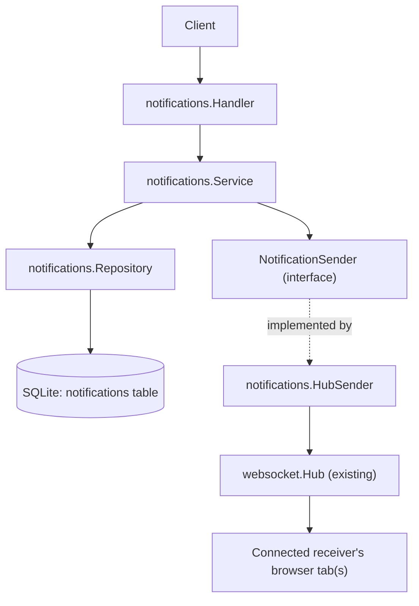

# Notification System

This document describes the backend notification system: persistent,
per-user notifications with real-time delivery over the existing websocket
hub. It is backend-only - there is no frontend notification UI yet.

## 1. Scope

Implemented:

- SQLite-backed storage of notifications (`internal/notifications`).
- Four notification types: `follow_request`, `group_invitation`,
  `group_join_request`, `group_event`.
- Listing, unread count, mark-one-read, mark-all-read, all scoped to the
  authenticated user.
- Real-time push over the existing websocket hub when the receiver is
  connected; notifications persist regardless of whether delivery succeeds.

Not implemented (out of scope for this change): the Follow Request, Group
Invitation, Group Join Request, and Group Event features themselves do not
exist yet in this backend, so nothing currently *calls*
`notificationService.Create(...)`. Section 6 below is the contract those
features should use once they're built.

## 2. Database Table

Migration:
`pkg/db/migrations/sqlite/20260903211849_create_notifications_table.{up,down}.sql`

```sql
CREATE TABLE IF NOT EXISTS notifications (
    id INTEGER PRIMARY KEY AUTOINCREMENT,
    receiver_id INTEGER NOT NULL,   -- FK -> users(id), ON DELETE CASCADE
    actor_id INTEGER,               -- FK -> users(id), ON DELETE CASCADE, nullable
    type TEXT NOT NULL,             -- validated in Go, not by a CHECK constraint
    entity_type TEXT,               -- free-form label, e.g. "follow_request", "event"
    entity_id INTEGER,              -- id of the row entity_type refers to
    message TEXT NOT NULL,
    read_at DATETIME,               -- NULL until read
    created_at DATETIME NOT NULL DEFAULT CURRENT_TIMESTAMP
);

CREATE INDEX idx_notifications_receiver_created ON notifications(receiver_id, created_at DESC);
CREATE INDEX idx_notifications_receiver_read    ON notifications(receiver_id, read_at);
```

`type` is deliberately a plain `TEXT` column with no `CHECK` constraint.
Validity is enforced in Go (`IsValidNotificationType`) so a new type can be
added without a migration - see section 7.

## 3. Package Layout

```text
internal/notifications/
    model.go        Notification, NotificationType, CreateNotificationRequest, response types
    errors.go        ErrNotificationNotFound, ErrInvalidNotificationType
    validation.go    pagination / ID parsing for the HTTP layer
    repository.go    SQL only
    events.go        the "notification" websocket envelope
    sender.go        NotificationSender interface + HubSender adapter
    service.go        business logic, delivery orchestration
    handler.go        HTTP only
```

This mirrors the layout used by `internal/groups` and `internal/posts`:
handler → service → repository, with sentinel errors in `errors.go` and
request-parsing helpers in `validation.go`.

## 4. Request Flow



`Service` depends only on the `NotificationSender` interface
(`SendToUser(userID int, event any) error`), never on `*websocket.Hub`
directly. `HubSender` is the concrete 1.6adapter, wired up once in
`router.setupDependencies` and injected into `notifications.NewService`.

## 5. HTTP Endpoints

All routes require a valid session (`sessionMiddleware`); the receiver is
always taken from `auth.UserIDKey` in the request context, never from a
request body or query parameter.

| Method | Path                                | Description                                                          |
| ------ | ----------------------------------- | -------------------------------------------------------------------- |
| GET    | `/api/notifications`              | `?limit=&offset=` page of the caller's notifications, newest first |
| GET    | `/api/notifications/unread-count` | `{"count": N}`                                                     |
| PATCH  | `/api/notifications/{id}/read`    | Mark one notification read (must be owned by the caller)             |
| PATCH  | `/api/notifications/read-all`     | Mark all of the caller's notifications read                          |

`MarkAsRead` and `MarkAllAsRead` never take a bare notification ID - the
repository query is always `WHERE id = ? AND receiver_id = ?`, so one user
can never mark another user's notification as read by guessing IDs
(`ErrNotificationNotFound` is returned identically whether the ID doesn't
exist or just isn't owned by the caller).

## 6. How A Feature Should Call NotificationService

Once Follow Requests, Group Invitations, Group Join Requests, or Group
Events exist, their **service** layer (never their handler, never the
notifications package) should call `notificationService.Create(...)` right
after its own write succeeds:

```go
// inside e.g. followers.Service.CreateFollowRequest, after the follow
// request row itself has been inserted:
_, err = s.notifications.Create(notifications.CreateNotificationRequest{
    ReceiverID: targetUserID,
    ActorID:    &requesterID,
    Type:       notifications.NotificationFollowRequest,
    EntityType: strPtr(notifications.EntityFollowRequest),
    EntityID:   &followRequestID,
    Message:    fmt.Sprintf("%s sent you a follow request", requesterUsername),
})
if err != nil {
    log.Printf("notify follow request: %v", err)
    // do not fail or roll back the follow request itself for this
}
```

Rules that follow from the responsibility boundary in the spec:

- The notifications package never creates, accepts, or rejects follow
  requests, invitations, join requests, or events - it only records that
  something happened.
- A notification failure must never undo or fail the original action. Log
  it and move on.
- `notificationService` is injected into a feature's `Service` constructor
  the same way `*websocket.Hub` is injected into `chat.Service` today -
  add a `notifications *notifications.Service` field, pass it in from
  `router.setupDependencies` (which already builds and exposes
  `Dependencies.NotificationsService`).

Expected `(Type, EntityType)` pairs per the spec:

| Type                   | EntityType             | Receiver                                                                                                                                 |
| ---------------------- | ---------------------- | ---------------------------------------------------------------------------------------------------------------------------------------- |
| `follow_request`     | `follow_request`     | the target user                                                                                                                          |
| `group_invitation`   | `group_invitation`   | the invited user                                                                                                                         |
| `group_join_request` | `group_join_request` | the group's creator                                                                                                                      |
| `group_event`        | `event`              | each group member (reuse the existing group members repository/service to list them; the spec suggests skipping the event's own creator) |

## 7. Adding A New Notification Type

1. Add a new `NotificationType` const in `model.go` (e.g.
   `NotificationPostLike NotificationType = "post_like"`).
2. Add it to `validNotificationTypes`.
3. Optionally add an `Entity...` constant if it needs its own entity_type
   label.
4. No migration needed - `type` and `entity_type` are plain `TEXT` columns.

## 8. Real-Time Delivery & Offline Users

```text
Service.Create(req)
   |
   v
Repository.Create(req)  -- SQLite INSERT, always runs first
   |
   v
(on success) build the "notification" websocket event
   |
   v
NotificationSender.SendToUser(receiverID, event)
   |
   +-- receiver connected  -> pushed immediately to every open tab
   |
   +-- receiver offline    -> Hub silently drops it (no error)
   |
   +-- send itself errors  -> logged, Create still returns success
```

The stored row is the source of truth. Delivery is best-effort: whether the
user is online, offline, or the websocket write fails outright, the
notification already exists in SQLite and will appear in
`GET /api/notifications` / `/unread-count` the next time the client asks.

## 9. Websocket Event Format

Reuses the existing envelope from `internal/websocket/events.go`
(`{"type": ..., "payload": ...}`), with a new event type distinct from
chat's `private_message` / `typing`:

```json
{
    "type": "notification",
    "payload": {
        "id": 123,
        "actor_id": 7,
        "type": "group_invitation",
        "entity_type": "group_invitation",
        "entity_id": 31,
        "message": "You received a group invitation",
        "read_at": null,
        "created_at": "2026-09-04T12:00:00Z"
    }
}
```

## 10. Tests

`internal/notifications/*_test.go` cover, against a real migrated SQLite
temp database (no mocking of the DB):

- Repository: create, get-by-user pagination and newest-first ordering,
  unread count, mark-as-read (including the already-read no-op and unknown
  ID cases), mark-all-as-read.
- Security: a second user can neither read nor mark-as-read another user's
  notifications, at both the repository and service layers.
- Service: valid creation, rejection of an invalid `NotificationType`, and
  the core persistence guarantee - a notification stays stored even when
  the `NotificationSender` returns an error.
- Websocket: a real `websocket.Hub` + a real client connection (via
  `httptest.Server` and the `gorilla/websocket` client) receiving the
  `notification` envelope; an offline receiver (nobody registered on the
  hub) still ending up with the notification in SQLite; and a check that
  the notification event type never collides with `chat.EventPrivateMessage`
  / `chat.EventTyping`.

Run with:

```sh
go test ./internal/notifications/...
```
