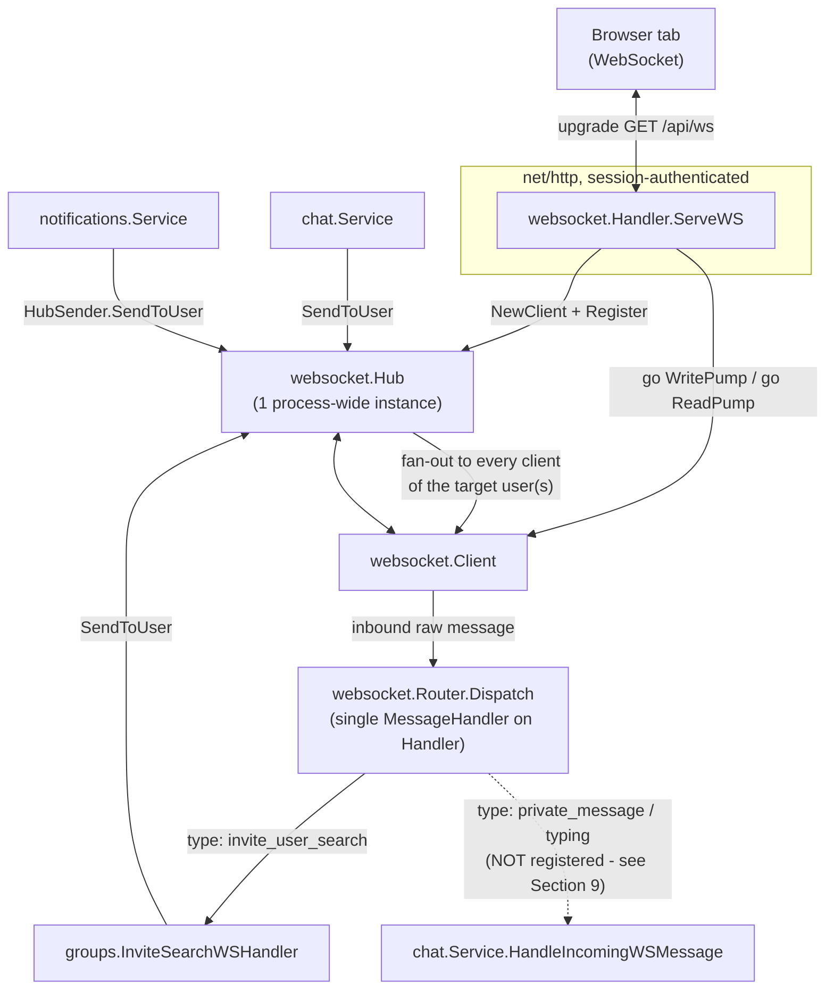
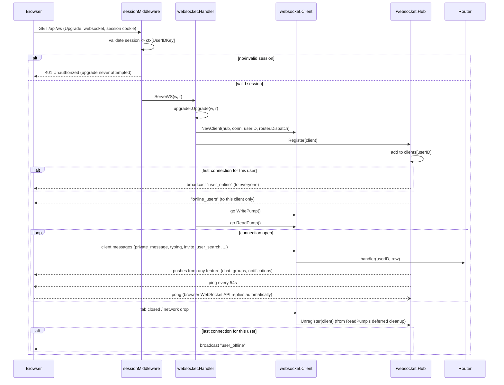

# WebSocket System

This document describes the real-time communication layer end to end: the
backend hub/client/router primitives (`internal/websocket`), the three
features currently built on top of it (Chat, Groups invite search,
Notifications), and the frontend connection manager
(`WebSocketProvider`). It also calls out one integration gap found while
tracing the code (Section 9) - the docs are written from reading the
current source, not from the original design intent.

## 1. Scope

Implemented and wired end to end:

- A single persistent WebSocket connection per browser tab, authenticated
  via the existing session cookie, upgraded at `GET /api/ws`.
- A `Hub` that tracks every connection, keyed by user ID (a user can have
  several connections open - multiple tabs/devices), and can push events
  to one user, a list of users, or everyone.
- Online/offline presence broadcast automatically on first-connect /
  last-disconnect per user.
- A `Router` that dispatches inbound client -> server events by `type` to
  whichever feature registered a handler for it.
- Three features already sending/receiving over the hub: **Groups**
  (real-time invite-candidate search), **Notifications** (push on
  create - see `notifications.md` for its full structure and how to add
  one), and **Chat** (private messages + typing indicators - see the
  gap in Section 9).
- A frontend `WebSocketProvider` that owns the single `WebSocket` object,
  auto-reconnects, and fans incoming events out to whichever
  hook/component cares (`useChat`, `useInviteUserSearch`, online-status
  consumers).

Not implemented yet (tracked in `docs/TODO/04_websocket_chat_notifications.md`):
group chat, chat permission rules (follow/profile-based), and the
notification-producing business logic in Follow Requests (Groups already
calls the notification service - see `notifications.md` section 6).

## 2. Architecture At A Glance



The `Hub` is the only shared, mutable piece of state. Every feature that
needs to push to a user holds a `*websocket.Hub` reference (or, for
Notifications, an interface wrapping it) and calls `SendToUser` /
`SendToUsers` / `Broadcast`. Nothing else touches the hub's internal map.

## 3. Package Layout

```text
internal/websocket/
    hub.go        Hub: connection registry, presence tracking, fan-out sends
    client.go     Client: per-connection read/write pumps, upgrader config
    handler.go    Handler: HTTP entrypoint (auth check + upgrade + spawn pumps)
    router.go     Router: inbound event dispatch table
    events.go     Event envelope + the handful of events websocket itself owns
    hub_test.go   Register/Unregister/online-tracking + concurrent-send tests
```

Feature packages that participate in real-time messaging keep their own
event types and payloads next to their own code rather than in
`internal/websocket`:

- `internal/chat/models.go` - `EventPrivateMessage`, `EventTyping`
- `internal/groups/ws.go` - `EventInviteUserSearch`, `EventInviteUserSearchResults`
- `internal/notifications/events.go` - `EventNotification`

This keeps `internal/websocket` a pure transport layer with zero
knowledge of chat, groups, or notifications - it only knows about
`Event{Type, Payload}` and generic connection management.

## 4. Core Primitives

### 4.1 The Event Envelope

Every message, in both directions, is JSON shaped as:

```json
{ "type": "some_event_type", "payload": { "...": "..." } }
```

```go
// internal/websocket/events.go
type EventType string

type Event struct {
    Type    EventType       `json:"type"`
    Payload json.RawMessage `json:"payload"`
}

func NewEvent(eventType EventType, payload any) (Event, error)
```

Keeping `Payload` as `json.RawMessage` lets the transport layer
marshal/unmarshal the envelope without knowing any feature's payload
shape - only the eventual handler (chat, groups, notifications) decodes
the inner payload into its own struct.

Events owned directly by the transport layer (`events.go`):

| EventType       | Payload              | Direction       | Purpose                                   |
| ---------------- | --------------------- | --------------- | ------------------------------------------ |
| `user_online`   | `UserStatusPayload`  | server -> all clients | a user's first connection just opened     |
| `user_offline`  | `UserStatusPayload`  | server -> all clients | a user's last connection just closed      |
| `online_users`  | `OnlineUsersPayload` | server -> new client   | sent once, right after that client registers |
| `error`         | `ErrorPayload`        | server -> one client   | generic error channel, used by every feature |

### 4.2 `Client` - one struct per connection

```go
type Client struct {
    Hub     *Hub
    Conn    *websocket.Conn
    UserID  int64
    send    chan []byte   // buffered, size 256
    done    chan struct{} // closed exactly once, signals shutdown
    handler MessageHandler // func(senderID int64, raw []byte)
}
```

- **`ReadPump`** blocks on `Conn.ReadMessage()` in a loop, forwarding
  every inbound frame to `handler` (the process-wide `Router.Dispatch`).
  On any read error it unregisters itself from the hub and returns -
  this is what detects a client going away.
- **`WritePump`** owns the connection's write side exclusively (required
  by `gorilla/websocket` - only one goroutine may write at a time). It
  selects over three cases: `done` (send a close frame and exit),
  `send` (write the next queued message), and a `pingPeriod` ticker
  (write a ping frame to keep NAT/proxies from dropping an idle
  connection and to detect dead peers).
- **`Send(data []byte) bool`** is non-blocking: if the client's `done`
  channel is closed, or the 256-slot buffer is full, it drops the
  message and returns `false`. Callers (`Hub.SendToUser` etc.) use that
  return value to trigger `Unregister` - a client that can't keep up
  with its buffer is treated as dead rather than blocking the sender.
- **Timeouts:** `pongWait = 60s`, `pingPeriod = 54s` (9/10 of pongWait),
  `writeWait = 10s`, `maxMessageSize = 8192` bytes. A client that misses
  pong responses for 60s is dropped by the read deadline.

### 4.3 `Hub` - the connection registry

```go
type Hub struct {
    mu      sync.RWMutex
    clients map[int64]map[*Client]bool // userID -> set of that user's connections
}
```

All access to `clients` goes through `mu`; every send method copies the
target `*Client` pointers out of the map under `RLock` and releases the
lock *before* writing to any client's channel, so a slow/blocked client
can never hold up the mutex for everyone else.

| Method                          | Behavior                                                                                 |
| -------------------------------- | ------------------------------------------------------------------------------------------ |
| `Register(client)`              | Adds the connection; if it's that user's first connection, broadcasts `user_online` and always pushes `online_users` to just that client |
| `Unregister(client)`            | Removes the connection and closes it; if it was the user's last connection, broadcasts `user_offline` |
| `SendToUser(userID, event)`     | Delivers to every connection that user currently has open (multi-tab)                     |
| `SendToUsers(userIDs, event)`   | Same, for several users at once (used nowhere yet, but available)                         |
| `Broadcast(event)`              | Delivers to every connected client, all users                                             |
| `BroadcastStatus(userID, bool)` | Builds and broadcasts `user_online`/`user_offline`                                        |
| `GetOnlineUserIDs()`            | Snapshot of currently-connected user IDs                                                  |
| `IsUserOnline(userID)`          | O(1) presence check                                                                       |

Presence is **connection-counted**, not session-counted: opening the app
in two tabs keeps the user "online" until *both* tabs disconnect.

### 4.4 `Handler` - the HTTP entrypoint

```go
func (h *Handler) ServeWS(w http.ResponseWriter, r *http.Request) {
    userID := r.Context().Value(auth.UserIDKey).(int) // set by sessionMiddleware
    conn, _ := upgrader.Upgrade(w, r, nil)
    client := NewClient(h.hub, conn, int64(userID), h.messageHandler)
    h.hub.Register(client)
    go client.WritePump()
    go client.ReadPump()
}
```

Authentication happens *before* the protocol upgrade: `GET /api/ws` is
registered behind the same `sessionMiddleware` as every other protected
route (see `router.go:43`), so a request without a valid session cookie
never reaches `ServeWS` at all - `sessionMiddleware` returns 401 first.
There is no separate WebSocket-specific auth handshake.

`upgrader.CheckOrigin` currently always returns `true` (`client.go:26`) -
acceptable for local development, but worth tightening (to the
frontend's origin) before this ships anywhere public, since it currently
allows cross-origin pages to open a WebSocket using the browser's
ambient session cookie.

### 4.5 `Router` - inbound dispatch

```go
type Router struct {
    handlers map[EventType]EventHandler // func(senderID int64, payload json.RawMessage)
}

func (r *Router) Dispatch(senderID int64, raw []byte) {
    var event Event
    json.Unmarshal(raw, &event)
    if handler, ok := r.handlers[event.Type]; ok {
        handler(senderID, event.Payload)
    }
    // no handler registered -> silently ignored
}
```

There is exactly **one** `Router` and **one** `Handler.messageHandler`
for the whole process (`wsHandler.SetMessageHandler(wsRouter.Dispatch)`
in `dependencies.go`). Every client's `ReadPump` calls into the same
router; the router itself demultiplexes by `event.Type` into whichever
feature registered that type. This is what lets Chat, Groups, and any
future feature share one physical connection per browser tab instead of
each opening its own socket.

## 5. Connection Lifecycle



## 6. Concurrency & Safety

- **One writer per connection**: only `WritePump` ever calls
  `Conn.WriteMessage` / `Conn.NextWriter`. Everything else that wants to
  send goes through the buffered `send` channel via `Client.Send`,
  which is safe to call from any goroutine (multiple hub sends can race
  to enqueue into the same channel with no data race, since channel
  sends are inherently safe).
- **Hub map access** is always under `mu` (RWMutex), and every send path
  releases the lock before touching a client's channel - so a client
  with a full/blocked buffer never stalls `Register`/`Unregister`/other
  sends.
- **Idempotent close**: `Client.Close()` uses `sync.Once` so it is safe
  to call from both `ReadPump`'s and `WritePump`'s deferred cleanup
  without double-closing the `done` channel or the connection.
- **Backpressure policy**: the `send` channel is a fixed 256-slot buffer.
  If a client can't drain it fast enough, new sends are dropped
  (`Client.Send` returns `false`) and the hub immediately unregisters
  that client rather than letting a slow consumer back up memory or
  block the sender.
- Verified by `hub_test.go`: `TestHubConcurrentSend` runs 100 concurrent
  goroutines mixing `Broadcast` and `SendToUser` against 50 registered
  clients (with `nil` connections, since only the map bookkeeping is
  under test) to catch data races under `go test -race`.

## 7. Full Event Catalog

| EventType                      | Direction | Owner         | Payload                                   |
| -------------------------------- | ----------- | --------------- | -------------------------------------------- |
| `user_online`                  | S -> all client(s) | websocket     | `{ user_id, is_online: true }`             |
| `user_offline`                 | S -> all client(s) | websocket     | `{ user_id, is_online: false }`            |
| `online_users`                 | S -> 1 client      | websocket     | `{ user_ids: number[] }`                   |
| `error`                         | S -> 1 client      | websocket (shared by every feature) | `{ message: string }`   |
| `private_message`               | C -> S and S -> C  | chat          | `{ id?, sender_id, recipient_id, content, created_at? }` |
| `typing`                        | C -> S and S -> C  | chat          | `{ sender_id, recipient_id, is_typing }`   |
| `invite_user_search`            | C -> S             | groups        | `{ request_id, group_id, query, limit? }`  |
| `invite_user_search_results`    | S -> 1 client      | groups        | `{ request_id, group_id, users: InviteCandidate[] }` |
| `notification`                  | S -> 1 client      | notifications | see `notifications.md` section 9           |

`C -> S` = sent by the browser over the same open socket; `S -> C` =
pushed by the server. Note that `private_message` and `typing` are
listed as bidirectional by design (client sends, server echoes back to
both parties) but **the server-side inbound half is currently
unreachable** - see Section 9.

## 8. Feature Integrations

### 8.1 Chat (`internal/chat`)

`chat.Service` holds a `*websocket.Hub` directly (not an interface -
unlike Notifications) and exposes `HandleIncomingWSMessage(senderID,
raw)`, matching the `websocket.MessageHandler` signature so it could be
wired in directly.

Outbound flow, as coded in `service.go`:

```text
handlePrivateMessage(senderID, payload)
  -> trim + validate content (non-empty, <= 2000 runes)
  -> validate recipient (>0, != senderID)
  -> repo.SavePrivateMessage(senderID, recipientID, content)   // SQLite write, source of truth
  -> build "private_message" event from the saved row (has DB id + created_at)
  -> hub.SendToUser(recipientID, event)
  -> hub.SendToUser(senderID, event)   // echo back so the sender's own UI updates from the same source of truth
```

`handleTyping` is fire-and-forget (no persistence): it re-stamps
`sender_id` from the authenticated connection (never trusts the
client's own claim) and forwards straight to the recipient only.

Validation failures go out over the shared `error` event type to the
*sender only* (`sendError`), which the frontend surfaces via
`WebSocketProvider`'s `errorMessage` state.

History and conversation listing are plain HTTP, not WebSocket:
`GET /api/chat/history?user_id=&limit=&offset=` and
`GET /api/chat/conversations` (`chat/handler.go`). Loading history also
marks the counterpart's messages read as a side effect
(`Service.GetHistory` calls `MarkMessagesAsRead` before returning).

### 8.2 Groups - Invite Candidate Search (`internal/groups/ws.go`)

A request/response pattern built on top of the same socket instead of a
plain HTTP endpoint, so the group-invite typeahead gets push-based
results without polling:

```text
Frontend (useInviteUserSearch, debounced 200ms)
  -> sendEvent("invite_user_search", { request_id, group_id, query, limit })
Router.Dispatch -> InviteSearchWSHandler.HandleInviteUserSearch(senderID, payload)
  -> service.SearchInviteCandidates(groupID, senderID, query, limit)
  -> hub.SendToUser(senderID, "invite_user_search_results", { request_id, group_id, users })
Frontend matches inviteSearchResults.request_id against the last request it fired
  and ignores anything else (stale-response guard for out-of-order replies)
```

`request_id` (a client-generated UUID) exists purely to let the frontend
discard stale results if a slower earlier search resolves after a newer
one - the server doesn't interpret or store it. Errors during the search
(e.g. the caller isn't a member of the group) go out as a normal `error`
event to the same `senderID`.

### 8.3 Notifications (`internal/notifications`)

Unlike Chat and Groups, Notifications never touches `*websocket.Hub`
directly - `Service` depends on a narrow `NotificationSender` interface,
implemented by `HubSender` (`sender.go`), which is the only place that
knows about the concrete hub. `Service.Create(...)` always writes to
SQLite first; delivery over the hub is best-effort and never affects
whether `Create` succeeds.

The notification system has its own dedicated writeup -
`docs/backend_docs/notifications.md` - covering its full package
structure, database schema, HTTP endpoints, the adapter pattern used to
plug a new feature into it, and a step-by-step guide for adding a brand
new notification type. This document only covers the slice of it that
touches the websocket transport (the `notification` event in the
catalog above, and `HubSender` as one more thing that holds a
`*websocket.Hub` reference).

## 9. Wiring: `router.setupDependencies`

One `Hub` instance is created once and threaded into every feature that
needs it:

```go
hub := websocket.NewHub()

chatService := chat.NewService(chatRepo, hub)              // direct hub dependency
wsHandler   := websocket.NewHandler(hub)

notificationsSender  := notifications.NewHubSender(hub)     // hub hidden behind an interface
notificationsService := notifications.NewService(notificationsRepo, notificationsSender)

inviteSearchWSHandler := groups.NewInviteSearchWSHandler(groupsService, hub) // direct hub dependency

wsRouter := websocket.NewRouter()
wsRouter.Register(groups.EventInviteUserSearch, inviteSearchWSHandler.HandleInviteUserSearch)
wsHandler.SetMessageHandler(wsRouter.Dispatch)
```

### ⚠️ Known gap: Chat's inbound WebSocket events are never registered

Tracing this file against `chat.Service.HandleIncomingWSMessage` turns
up a real wiring gap, not just a documentation nit:

- `chat.Service.HandleIncomingWSMessage` has exactly the right shape to
  be either registered on `wsRouter` per event type, or set directly as
  `wsHandler`'s `messageHandler`.
- **Neither happens.** The only call to `wsRouter.Register` in the
  entire backend is the one line above, for
  `groups.EventInviteUserSearch`. `private_message` and `typing` have no
  entry in `wsRouter.handlers`.
- `Router.Dispatch` silently no-ops when `handlers[event.Type]` is
  missing (`router.go:29-32`) - there's no error, no log line, nothing
  visible.

**Net effect as the code stands today:** when the frontend calls
`sendEvent("private_message", ...)` (from `useChat.sendMessage`) or
`sendEvent("typing", ...)`, the browser sends the frame, the server's
`ReadPump` reads it, hands it to `Router.Dispatch`, and it is dropped on
the floor - `chat.Service.handlePrivateMessage` is never invoked, no row
is written to `private_messages`, and neither party receives the
message. The outbound half (loading history over HTTP, and anything
delivered via `hub.SendToUser` from elsewhere) is unaffected, but live
sending currently does not work end to end.

The fix is one line in `dependencies.go`, either:

```go
wsRouter.Register(chat.EventPrivateMessage, func(senderID int64, payload json.RawMessage) {
    chatService.HandleIncomingWSMessage(senderID, /* re-wrap payload as the original Event */)
})
```

or, more simply, giving `chat.Service` two `EventHandler`-shaped methods
(one per event type, taking `json.RawMessage` instead of re-parsing the
outer envelope) so they register on `wsRouter` the same way Groups'
handler does - `HandleIncomingWSMessage` currently re-unmarshals the
whole `Event` itself, which only makes sense if it's used as the
top-level `MessageHandler` rather than a per-type `EventHandler`.

## 10. Frontend Architecture

```text
frontend/src/
    lib/websocket/types.ts        EventType union + every payload/context type
    providers/WebSocketProvider.tsx  owns the WebSocket, reconnects, fans out state
    lib/api.ts                    getWebSocketUrl() -> ws://localhost:8080/api/ws
    features/chat/hooks/useChat.ts           thin wrapper: sendMessage/sendTyping + per-chat filtering
    features/groups/hooks/useInviteUserSearch.ts  debounced search + stale-response guarding
```

### 10.1 `WebSocketProvider`

Mounted once near the app root (`app/layout.tsx`) so every page shares
one socket. Responsibilities:

- **Connect** as soon as the provider mounts (`useEffect(connect, [])`).
  Because `/api/ws` sits behind `sessionMiddleware`, an unauthenticated
  visitor's upgrade request gets rejected with 401 and the socket simply
  never opens - the provider doesn't currently branch on auth state
  itself, it just tries and lets the server gate it.
- **Auto-reconnect**: `ws.onclose` schedules `connect()` again after a
  flat 300ms, every time, with no backoff and no retry cap. Fine for
  local dev; on a flaky connection in production this would reconnect
  aggressively rather than backing off.
- **Guards against duplicate sockets**: `connect()` bails out if a
  socket is already `OPEN`/`CONNECTING`, or if a connect attempt is
  already in flight (`isConnectingRef`).
- **State exposed via context** (`WebSocketContextType`):
  `isConnected`, `onlineUserIDs`, `lastMessage`, `typingStatus`,
  `errorMessage`, `inviteSearchResults`, and `sendEvent(type, payload)`.
- **`onmessage`** is a single `switch` on `data.type` that updates only
  the relevant piece of state - e.g. `online_users` replaces
  `onlineUserIDs` wholesale (sent once, right after connect), while
  `user_online`/`user_offline` patch it incrementally.
- **`sendEvent`** wraps `{ type, payload }` and calls
  `socket.send(JSON.stringify(...))`. If the socket is mid-`CONNECTING`,
  it retries the same send after 500ms instead of dropping it; if it's
  fully closed, it surfaces `errorMessage` and kicks off a reconnect.

### 10.2 Consumption pattern

Feature hooks never touch the `WebSocket` object directly - they call
`useWebSocket()` and either read a slice of shared state (`useChat`
reads `onlineUserIDs`/`lastMessage`/`typingStatus`) or call `sendEvent`.
This keeps exactly one physical connection per tab regardless of how
many chat threads or search boxes are mounted at once.

`useChat(recipientID)` derives `isPartnerOnline` and `isPartnerTyping`
from the *global* `onlineUserIDs`/`typingStatus` state by filtering for
`recipientID`, and exposes `isMessageForThisChat` so a chat screen can
ignore `lastMessage` updates that belong to a different conversation
(since `lastMessage` is one shared slot for the whole app, not
per-conversation).

`useInviteUserSearch(groupId)` debounces input by 200ms, stamps each
outgoing search with a fresh `request_id`, and only accepts a result
whose `request_id` matches the most recently fired request - this is
what prevents a slow earlier keystroke's results from clobbering a
faster later one.

## 11. Testing

- `internal/websocket/hub_test.go`: registration/unregistration
  correctness for multi-connection users, and a race-detector-friendly
  concurrent-send stress test (100 goroutines mixing `Broadcast` and
  `SendToUser` over 50 clients). Run with:

  ```sh
  go test -race ./internal/websocket/...
  ```

- `internal/notifications/*_test.go` includes a real
  `httptest.Server` + `gorilla/websocket` client test asserting delivery
  of the `notification` event over an actual connection, plus an
  offline-receiver case (see `notifications.md` section 10).
- **Not yet covered by tests**: `chat.Service.HandleIncomingWSMessage`
  (private message / typing handling), `groups.InviteSearchWSHandler`,
  and - most importantly given Section 9 - there is no integration test
  that would have caught the missing `wsRouter.Register` calls for chat,
  because nothing currently exercises `Router.Dispatch` end to end for
  `private_message`/`typing`.

## 12. Remaining Work (from `docs/TODO/04_websocket_chat_notifications.md`)

Already done: WebSocket core (backend + frontend), private chat
persistence/history/emoji support, notification infrastructure
(storage, listing, unread count, mark-read, real-time push), and group
invite/join-request notifications.

Still open, per that checklist:

- **Chat permissions**: no follow/profile-based check before allowing a
  private message - anyone can currently message anyone (once the
  Section 9 gap is fixed and messages actually reach the handler).
- **Group chat**: no `group_messages` table, no send/broadcast/history
  for group conversations, no membership-gated delivery.
- **Notification producers**: Follow Requests don't exist yet, so
  `NotificationFollowRequest` is never triggered; Groups already calls
  `notificationService.Create` for invitations/join-requests (per
  `notifications.md`).
- **Frontend**: no dedicated private-chat page/panel yet (only the
  hook), no group chat UI, no global notifications UI/unread badge.
