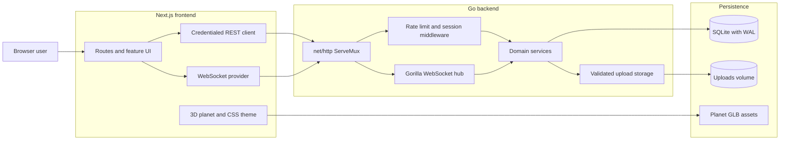
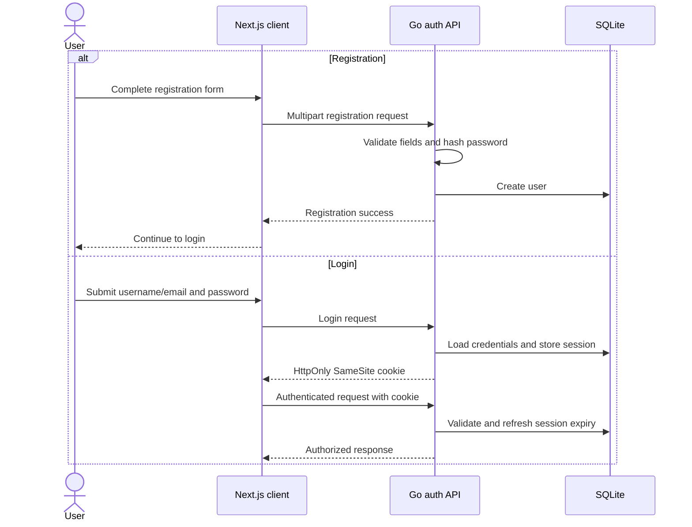
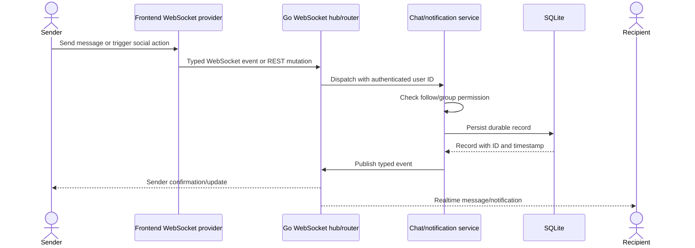
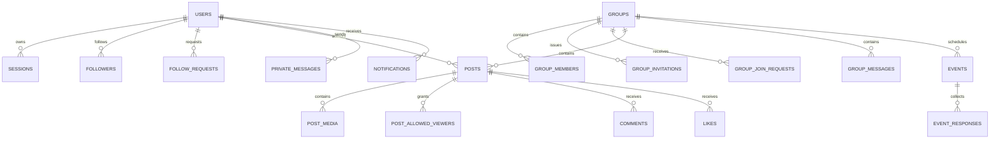

# README Source of Truth

## How to use this file

This file contains only public-facing facts that can be used without re-auditing the repository. Positive wording is intentional. Internal defect details live in `FINAL_ISSUE_REGISTER.md`; claim-limiting items are summarized only in **Public Claims to Avoid**.

The strongest accurate positioning is: a full-stack, space-themed social network with privacy-aware social features, realtime communication, SQLite persistence, and a distinctive configurable 3D presentation. Do not call it production-ready.

## Project Summary

The project is a full-stack social network built around an ambient space identity. It combines profiles and follow relationships, privacy-aware posts and comments, public/private groups, group events, private and group chat, realtime notifications, validated media uploads, and an eight-planet visual theme.

The frontend is a Next.js/React/TypeScript application. The backend is a Go service built on `net/http`, Gorilla WebSocket, and SQLite. REST endpoints handle durable application operations, while one multiplexed WebSocket connection carries chat, presence, typing, read receipts, notifications, and selected live updates. Embedded SQL migrations initialize and evolve the database.

README-safe summary sentence:

> A full-stack social network that combines privacy-aware social features, realtime chat and notifications, group events, and a configurable 3D space experience.

## README-Safe Feature Table

| Feature | Public Status | README-Safe Description | Confidence |
|---|---|---|---|
| Authentication | Present | Registration and username-or-email login backed by bcrypt password hashing and cookie-based sessions. | High |
| Profiles | Present | Editable public/private profiles with viewer-aware field visibility. | High |
| Followers | Present | Direct follows for public profiles and approval-based requests for private profiles. | High |
| Posts | Present — careful wording | Media posts with public, followers-only, and selected-follower visibility plus cursor-based feed filters. | High |
| Comments | Present | Comments with optional media that inherit the parent post's API access rules. | High |
| Groups | Present | Public and private groups with membership, creator-managed invitations, join requests, member posts, settings, and moderation controls. | High |
| Events | Present | Member-created group events with future-date validation and changeable RSVP responses. | High |
| Private Chat | Present — careful wording | Follow-based realtime private messaging with persisted history, typing indicators, and read receipts. | High |
| Group Chat | Present — careful wording | Realtime group chat with persisted history and membership checked for history, sending, and delivery. | High |
| Notifications | Present | Persisted in-app notifications with realtime push, unread counts, toasts, and read controls. | High |
| 3D / Space | Present | Eight selectable celestial themes, an Earth/Moon scene, dynamic color theming, responsive presentation, and an off switch. | High |
| Docker | Present — careful wording | Two-service Docker Compose setup for the default local `localhost:3000`/`localhost:8080` topology. | Medium-high |
| Migrations | Present — careful wording | Embedded transactional SQLite migrations, automatic startup application, and a migration CLI. | High |

## Verified Technology Stack

Only active, directly used technologies are listed.

| Layer | Technology | README-safe role |
|---|---|---|
| Frontend framework | Next.js 16.3.2, App Router | Routes and application shell for the web client. |
| UI runtime | React 19.2.8 | Component rendering and client-side state. |
| Frontend language | TypeScript 5.9.3 | Typed frontend implementation. |
| Styling | Tailwind CSS 4 plus scoped/global CSS | Layout, responsive UI, and theme variables. |
| 3D rendering | Three.js 0.185.1 | GLB planet rendering and scene materials. |
| React 3D layer | React Three Fiber 9.7.0 and Drei 10.7.8 | Declarative scenes, loaders, and WebGL integration. |
| Backend language | Go 1.26.5 module target | HTTP, domain services, concurrency, and command-line tools. |
| HTTP stack | Go standard library `net/http` / `ServeMux` | Method-aware routing and middleware without a web framework. |
| Realtime transport | Gorilla WebSocket 1.5.3 | One multiplexed bidirectional connection at `/api/ws`. |
| Database | SQLite via `mattn/go-sqlite3` 1.14.50 | Relational persistence with foreign keys and WAL mode. |
| Authentication crypto | `golang.org/x/crypto` bcrypt | Password hashing and verification. |
| Identifiers | `google/uuid` 1.6.0 | Randomized media filenames and application identifiers. |
| Containers | Docker and Compose | Local two-service container workflow and persistent backend data volume. |

## Verified Core Features

- Multi-step registration with required identity fields and optional avatar, nickname, and biography.
- Login by username or email, server-side sessions, a 24-hour sliding session window, and server-side REST logout.
- Editable profiles, avatar updates, password changes, and public/private profile controls.
- Public-profile direct follows; private-profile follow requests with accept and decline flows.
- Personalized follow and group recommendations plus universal search.
- Text and image posts, multi-image attachments, likes, comments, comment media, and direct post pages.
- Cursor-based feeds with `All`, `Following`, and mutual-follow `Friends` filters.
- In-app post sharing into eligible private or group chat conversations with preview cards.
- Weighted two-tier rate limiting across HTTP requests and chat message frames.

## Verified Privacy Model

| Domain | Verified public description |
|---|---|
| Profiles | Public profiles expose the normal profile view. Private profiles limit biography and social-list visibility to the owner and approved followers. Email, date of birth, age, and UUID remain owner-only. |
| Posts | `public` posts are available to authenticated users; `followers` posts require an approved follow relationship; `custom` posts target selected approved followers. |
| Comments | Comment access is derived from the parent post, including group membership where applicable. |
| Public groups | Discoverable; joining uses a request reviewed by the group creator. |
| Private groups | Hidden from group discovery and direct outsider reads; entry is through a creator-issued invitation. |
| Group content | Posts, comments, events, RSVP actions, and chat history require group membership. |
| Private chat | Messaging is available when either participant follows the other. The server rechecks this relationship when a message is sent. |
| Group chat | Current membership is checked when loading history, sending, and resolving broadcast recipients. |

README-safe privacy sentence:

> Privacy rules are enforced on the backend for profile fields, post visibility, comments, group content, events, and chat participation.

Do not extend that sentence to claim that raw uploaded file URLs are private.

## Verified Realtime Features

The application uses one authenticated WebSocket endpoint, `/api/ws`, to multiplex:

- private and group messages;
- typing indicators and private-message read receipts;
- online/offline presence and online-user snapshots;
- in-app notification events;
- group-event response updates;
- follow-removal synchronization;
- group invitation search results; and
- transport/rate-limit error events.

Durable chat messages and notifications are written to SQLite. Runtime testing confirmed private delivery, group broadcast, offline persistence, same-session multi-tab fan-out, read receipts, typing events, notification push, and immediate group-message authorization changes after member removal.

README-safe realtime sentence:

> A single multiplexed WebSocket channel powers private and group chat, typing indicators, read receipts, presence, notifications, and selected live UI updates.

## Verified Group/Event Features

- Public and private group creation with optional uploaded or template artwork.
- Creator role assigned transactionally when a group is created.
- Public-group join requests with duplicate prevention and creator accept/reject controls.
- Creator-managed invitations with invitee accept/decline flows.
- Member-only group posts, comments, events, RSVP actions, and message history.
- Future-dated event creation with optional cover image/template.
- `going` and `not_going` RSVP choices that can be changed.
- Member removal with creator protection and immediate backend authorization effect.

README-safe group sentence:

> Public groups use approval-based join requests, while private groups are hidden from discovery and use creator-managed invitations.

## Verified 3D / Space Experience

The current 3D system is active. It is not the removed route-intercepting solar-system concept.

- Eight selectable themes: Earth, Mercury, Venus, Mars, Jupiter, Saturn, Uranus, and the Sun.
- A separate Moon companion appears with Earth.
- Planet selection updates shared CSS color variables across the interface.
- Responsive scale and position settings adapt scenes to viewport classes.
- Preferences persist in local storage and synchronize across tabs.
- Users can disable the 3D model, which unmounts the WebGL scene and leaves the lightweight starfield.
- The render loop pauses when the tab is hidden and respects reduced-motion behavior.
- Nine shipped GLB files match the current registry: eight selectable bodies plus the Moon.

README-safe 3D sentence:

> The interface uses a configurable 3D celestial backdrop whose selected planet also drives the application's color theme.

## Verified Database / Migration Architecture

- SQLite runs with foreign keys enabled and WAL mode.
- The Go connection pool is intentionally serialized to one open/idle connection for predictable local SQLite concurrency.
- The current schema is built from 30 timestamped migration pairs embedded in the backend binary with `embed.FS`.
- Up migrations run automatically when the server starts.
- A separate migration command supports `up`, `down`, `down-all`, `version`, and `create` operations.
- A repeat-safe seeder creates sample users and connected social, group, event, post, comment, chat, and notification data.
- Application repositories match the actual migrated schema.

README-safe database sentence:

> SQLite persistence is managed through embedded, transactional migrations that run automatically at backend startup and are also available through a dedicated CLI.

Do not describe every historical down migration as universally reversible.

## Verified Docker / Development Setup

The repository contains backend and frontend Dockerfiles plus a root `compose.yaml`:

- frontend: `http://localhost:3000`;
- backend API: `http://localhost:8080`;
- WebSocket: `ws://localhost:8080/api/ws`;
- persistent backend data: named volume mounted at `/app/data`.

Present this as a local/containerized development setup. The current public instructions should keep the default localhost ports and origins.

## Verified Project Structure

```text
social-network/
├── backend/
│   ├── cmd/
│   │   ├── server/          # HTTP/WebSocket application
│   │   ├── migrate/         # migration CLI
│   │   └── seed/            # sample-data seeder
│   ├── internal/            # domain handlers, services, repositories, middleware
│   ├── pkg/                 # database/migrations and shared packages
│   └── tests/               # backend integration suites
├── frontend/
│   ├── public/models/       # shipped planet/Moon GLB assets
│   └── src/
│       ├── app/             # Next.js App Router routes/layouts
│       ├── components/      # shared layout, feedback, and space UI
│       ├── features/        # auth, posts, groups, chat, notifications, settings, etc.
│       ├── providers/       # global realtime/application providers
│       └── lib/             # API, WebSocket, and upload helpers
├── docs/                    # architecture, process, audit, and handoff material
├── 3d/                      # source/optimization tooling assets; not web-served
├── compose.yaml
└── Makefile
```

The backend follows a consistent `Handler → Service → Repository` direction. SQL is kept in repository/data layers, while authorization rules are primarily enforced in services.

## Verified Team Workflow

The Git history records a four-person team with feature-domain ownership across groups/events/3D integration, posts/comments/uploads/Docker, profiles/followers/search/feed, and WebSocket/chat/notifications/interactions. Work was integrated through short feature branches and recurring pull-request checkpoints, with cross-domain dependencies converging around follower permissions, privacy rules, group membership, and realtime delivery.

README-safe workflow language:

> The project was developed by a four-person team using domain ownership, feature branches, and regular pull-request integration checkpoints.

Do not infer a currently enforced CI or branch-protection policy from the historical workflow notes.

## Verified Project Journey

The public journey can be told in six concise phases:

1. **Foundations:** Go/SQLite backend, migration runner, authentication, sessions, and Next.js frontend scaffold.
2. **Realtime primitives:** one multiplexed WebSocket hub plus initial private-message and group persistence.
3. **Parallel feature development:** posts, comments, notifications, followers, group membership, and events.
4. **Privacy convergence:** private profiles, follow requests, three-tier post visibility, and unified group posts.
5. **Hardening and simplification:** token-bucket rate limiting, group privacy, 3D asset work, and removal of a complex route-intercepting visual architecture.
6. **Integration and polish:** likes, post sharing through chat, recommendations, infinite feed, notification toasts, settings, eight-planet theming, and 3D onboarding.

The most useful historical transition is the 3D redesign: the team removed a navigation-blocking solar-system concept and rebuilt 3D as an ambient layer that does not control routing.

## Best Engineering Stories

### 1. Making 3D support the app instead of controlling it

- **Problem:** An early animated solar-system navigation concept coupled camera timelines to route changes and made normal browser navigation fragile.
- **Design decision:** Keep standard Next.js routing authoritative and move 3D into a separate visual layer.
- **Solution:** Remove the route-interception/GSAP system, then add a responsive planet background, shared theme variables, local preferences, reduced-motion behavior, and a true off state.
- **Lesson:** Immersive visuals work best when they enhance core interaction instead of owning application control flow.

### 2. Coordinating parallel schema work with embedded migrations

- **Problem:** Four contributors were adding related social domains with ordering and dependency constraints.
- **Design decision:** Treat migrations as timestamped, embedded application assets and keep multi-statement writes transactional.
- **Solution:** Build a migration runner, automatic startup application, a CLI, and foreign-key-backed domain tables.
- **Lesson:** A shared migration discipline makes parallel feature work easier to integrate and reproduce.

### 3. One realtime channel for many product concerns

- **Problem:** Chat, notifications, presence, typing, receipts, and group updates all needed low-latency delivery.
- **Design decision:** Use one per-client multiplexed WebSocket connection and dispatch typed events through a central router/hub.
- **Solution:** Combine persistent domain services with a concurrency-safe hub that supports several live connections per user.
- **Lesson:** A small typed event protocol can serve multiple realtime features without multiplying connections.

### 4. Keeping authorization close to current state

- **Problem:** Long-lived sockets can outlast changes to follows or group membership.
- **Design decision:** Re-derive permissions from the database at the operation boundary instead of caching membership in the hub.
- **Solution:** Check follow permission on private-message send and group membership on history, send, and broadcast resolution.
- **Lesson:** Fresh authorization checks matter more than transport lifetime for mutable social relationships.

### 5. Preventing stale realtime state from moving backward

- **Problem:** A slower REST refresh could arrive after a WebSocket event or read mutation and regress notification UI state.
- **Design decision:** Merge by notification ID and make read state monotonic.
- **Solution:** Preserve the union of known notifications and combine read state with logical OR, guarded by a data-version mechanism for counts.
- **Lesson:** Realtime clients need convergence rules, not simple last-response replacement.

### 6. Tuning protection around real UI traffic

- **Problem:** A flat rate limit penalized feed screens that legitimately issue several lightweight count/status requests.
- **Design decision:** Separate global and per-endpoint buckets and assign cheaper costs to high-frequency reads.
- **Solution:** Implement a Go standard-library token bucket with weighted requests and WebSocket message throttling.
- **Lesson:** Abuse controls should reflect the shape of normal client behavior.

## Recommended Screenshots

Use seeded/demo accounts only. Avoid exposing personal email, date of birth, UUIDs, session values, raw upload indexes, or private messages belonging to real users.

| Screen | Route | What it demonstrates | Recommended state/demo data | Privacy considerations |
|---|---|---|---|---|
| Home feed and planet theme | `/` | Feed filters, post cards, interactions, recommendations, and the ambient 3D identity | Signed in as seeded `alice`; Earth or Saturn selected; mix of public posts | Use seeded content; crop account-specific private controls if unnecessary |
| Registration journey | `/register` | Multi-step onboarding and the 3D planet stage | A middle step filled with fictional details | Do not show a real email or date of birth |
| Profile privacy and social graph | `/profile/alice` or another seeded username | Profile header, follow state, posts, and public/private presentation | Use seeded public profile; optionally pair two screenshots for follow state | Avoid owner-only personal fields |
| Group hub and events | `/groups/[groupId]` | Group identity, members, posts, upcoming events, and RSVP controls | Seeded group with several members and a future event | Use a group the screenshot account may view; avoid hidden private-group data |
| Private chat | `/chat` | Conversation list, realtime thread, typing/read UI, and shared-post preview | Seeded Alice/Bob conversation with neutral demo text | Never use a real conversation; hide unrelated conversation previews |
| Group chat | `/groups/[groupId]` | Members-only group messaging within the group experience | Seeded public group while signed in as a member | Use demo messages and confirm membership before capture |
| Notification center | `/notifications` | Persisted notifications, unread state, and read actions | A controlled mix of follow, group, comment, and like events | Keep names/content fictional |
| Appearance settings | `/settings` | Planet picker, model toggle, and theme customization | Appearance segment with Saturn selected | No sensitive account settings in frame |

## Recommended Mermaid Diagrams

### High-level system architecture



### Authentication flow



### Realtime flow



### Database domains



## README-Safe Commands

### Docker-based local setup

These commands match the current default localhost topology. `docker compose config` was verified; the Dockerfiles and Compose wiring were statically reviewed. A full Compose cluster launch was not part of the runtime audit.

```bash
docker compose up --build
```

Open `http://localhost:3000`. Stop without deleting the data volume:

```bash
docker compose down
```

Use `docker compose down -v` only when intentionally discarding the development database/uploads volume.

### Native local development

Run the backend and frontend in separate terminals:

```bash
make server
```

```bash
make frontend
```

The Makefile also provides:

```bash
make migrate
make seed
make test
```

`make seed` changes local development data. The server also applies pending up migrations automatically at startup.

Equivalent backend commands:

```bash
cd backend
go run ./cmd/server
go run ./cmd/migrate version
go run ./cmd/seed
```

### Verified quality commands

```bash
cd backend
go build ./...
go vet ./...
go test -count=1 ./...
go test -race -count=1 ./...
```

```bash
cd frontend
npm run lint
npx tsc --noEmit --incremental false
npm run build -- --webpack
```

Do not list `npm run test:smoke`; its referenced script is not present.

## Public Claims to Avoid

Avoid these claims unless the implementation changes and is re-verified:

- “Production-ready,” “enterprise-ready,” or “secure for internet deployment.”
- Configurable arbitrary frontend/backend origins or a verified non-localhost deployment.
- Simultaneous independent sessions across several devices/browsers.
- Logout immediately terminates every already-open realtime connection.
- Seamless automatic chat catch-up after every network reconnect.
- Private/authorization-gated raw media files or private object storage.
- Every invalid custom-post audience is rejected.
- Every down migration is fully reversible under all valid data.
- Complete full-stack E2E coverage or any frontend automated test suite.
- Group members can invite users; current invitations are creator-managed.
- Registration automatically signs the new user in.
- WebP is accepted by every upload type.
- The old solar-system navigation, GSAP route transitions, separate group-post schema, or black-hole UI are current features.
- Group chat or the current 3D system is disabled/dormant.

## Historical Claims Allowed in Journey Section

These are supported only as clearly historical statements:

- An early route-intercepting solar-system/GSAP concept was removed after it complicated navigation and mobile behavior.
- More than 60 files from the superseded visual architecture were deleted during the simplification phase.
- Group posts were originally planned as separate tables but were unified into the main `posts`/`comments` model through `posts.group_id`.
- Post sharing evolved into chat-native messages with embedded preview cards.
- Rate limiting evolved from no protection to a weighted global/per-endpoint token-bucket design.
- GLB assets were optimized with lossless container operations; lossy texture reduction and decoder-heavy compression were deliberately avoided.
- A black-hole visual and separate group-content schema were explored but are not part of the current product.

## Recommended Final README Structure

1. **Hero:** project name, one-sentence summary, active-stack badges, and current hero screenshot.
2. **Project overview:** what was built and the space-themed identity.
3. **Visual tour:** feed, groups/events, chat, and appearance screenshots.
4. **Core features:** profiles/follows, posts/comments, groups/events, chat/notifications.
5. **Space experience:** eight selectable themes and decoupled 3D architecture.
6. **Privacy model:** concise profile/post/group/chat matrix.
7. **Architecture:** high-level Mermaid diagram and Handler → Service → Repository explanation.
8. **Realtime system:** multiplexed event flow and persistence boundary.
9. **Database and migrations:** SQLite, WAL, embedded migrations, and seed data.
10. **Technology stack:** the verified table above.
11. **Engineering highlights:** two to four of the stories above.
12. **Project journey:** concise phases and the 3D redesign.
13. **Repository structure:** accurate current tree.
14. **Getting started:** default localhost Docker workflow first; native Makefile workflow second.
15. **Development and testing:** only the verified commands.
16. **Documentation and team workflow:** point to current docs and explain the four-person collaboration model.

Do not add a public bug/limitations section by default. Do not add a license section unless a real license file is added; none is currently present.
