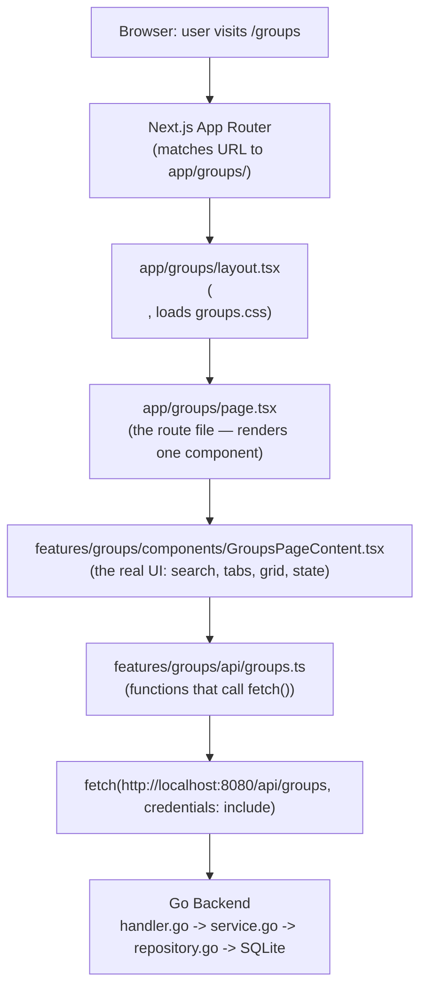
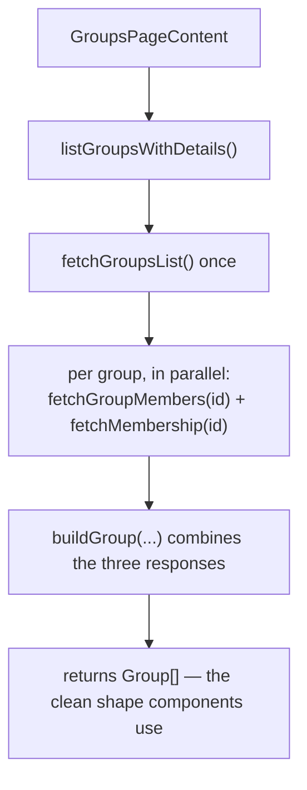
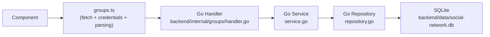

# Groups Frontend Architecture — A Teaching Guide

> **⚠️ Partially outdated (2026-09-06):** this guide was written when join
> requests were simulated on the frontend with `mockJoinRequests.ts` and
> `localStorage` (see the "mock" references throughout, especially the
> `mockJoinRequests.ts` section). That file has since been deleted. Join
> requests, invitations, and membership state are now real, backend-persisted
> data served by `backend/internal/groups` and read through
> `features/groups/api/groups.ts`, `features/groups/hooks/useGroupData.ts`,
> and `features/groups/hooks/useGroupAction.ts`. Treat every mention of
> "mock", "simulated", or `localStorage`-backed join requests below as
> historical context for *why* the code evolved the way it did, not as a
> description of current behavior.

This document explains, in detail, how the Groups feature on the frontend
(`frontend/src/app/groups/` and `frontend/src/features/groups/`) is built and
*why* it's organized the way it is. It's written for someone learning
Next.js + React + TypeScript, not just as a reference — every claim below is
checked against the actual code, not assumed.

---

## 1. Big picture

### Why two folders instead of one?

Look at what each folder is *for*:

- **`app/`** — this is Next.js's **routing** folder. Every folder inside
  `app/` becomes a URL. Next.js looks at this folder structure to decide
  what page loads for what address in the browser. It does not care what's
  *inside* the page — only that a `page.tsx` exists at a given path.
- **`features/groups/`** — this is a folder invented by convention, not by
  Next.js. Next.js has no idea it exists. It's where the actual "Groups"
  feature — its UI pieces, its data-fetching functions, its TypeScript
  shapes — physically lives.

Why not just write everything inside `app/groups/page.tsx`? Because a route
file has one job: **be an address that Next.js can find**. If all the logic
is stuffed into it, the file becomes a dumping ground, and — more
importantly — Next.js has strict rules about *how* route files can behave
(see [Section 8](#8-server-components-vs-client-components)), which
conflicts with writing interactive UI code freely.

So the split is:

| Folder | Owns |
|---|---|
| `app/` | **Where** things live (URLs, layouts, routing) |
| `features/groups/` | **What** the Groups feature actually does (components, data fetching, types) |

`app/groups/page.tsx` is deliberately almost empty — it just says "when
someone visits `/groups`, render the `GroupsPageContent` component." All the
real work is imported from `features/`.

### How the pieces connect



TypeScript's role doesn't sit in this vertical chain — it sits *beside* it.
Every arrow above carries data (a list of groups, a group ID, a form's
title/description), and `features/groups/types/group.ts` is the shared
vocabulary that describes the *shape* of that data so every file in the
chain agrees on what a "Group" looks like. TypeScript checks this agreement
at compile time, before the code ever runs.

---

## 2. `app/groups`

### `src/app/groups/page.tsx`

```tsx
import type { Metadata } from "next";
import GroupsPageContent from "@/features/groups/components/GroupsPageContent";

export const metadata: Metadata = {
  title: "Groups | Social Network",
};

export default function GroupsPage() {
  return <GroupsPageContent />;
}
```

- **What it represents**: this file *is* the route. In the App Router, a
  file literally named `page.tsx` inside a folder is what makes that folder
  a visitable URL.
- **What URL creates it**: `app/groups/page.tsx` → `/groups`. The folder
  name (`groups`) becomes the URL segment.
- **What it imports**: the `Metadata` type (used only to type-check the
  `metadata` object) and `GroupsPageContent` — the real component, imported
  through the `@/` alias.
- **Why it's small**: it has exactly two jobs — declare the page's
  `<title>` via `metadata`, and render one component. Zero state, zero
  fetching, zero interactivity.
- **Why the UI logic isn't written here**: this file is a **Server
  Component** by default (no `"use client"`). Server Components can't use
  `useState`, `useEffect`, or `onClick`. The Groups page needs all three
  (search box, tabs, loading state), so that logic lives in
  `GroupsPageContent`, which opts into being a Client Component.
- **What happens when the browser visits `/groups`**: Next.js runs
  `GroupsLayout` wrapping `GroupsPage`, which renders
  `<GroupsPageContent />`. Because that component is a Client Component,
  React sends its JavaScript to the browser, where `useEffect` then fetches
  the groups over the network.

### `src/app/groups/layout.tsx`

```tsx
import "./groups.css";

export default function GroupsLayout({ children }: { children: React.ReactNode }) {
  return <main className="groups-shell">{children}</main>;
}
```

- **What a Next.js layout is**: a `layout.tsx` file wraps every `page.tsx`
  inside the same folder (and its subfolders) with shared markup. Unlike a
  page, a layout doesn't map to one specific URL — it applies to a whole
  subtree of routes.
- **Why this one exists**: two reasons. First, it imports `groups.css` —
  because the import sits here (not in the global `app/layout.tsx`), Next.js
  only loads that stylesheet for pages under `/groups/*`. It can never leak
  onto `/login`, `/register`, or `/`. Second, it wraps every Groups page in
  one `<main className="groups-shell">`, so `/groups`, `/groups/create`, and
  `/groups/[groupId]` don't each repeat that wrapper — `.groups-shell` is
  the CSS "root" every style in `groups.css` is scoped under.
- **What `children` means**: `children` is just a prop — whatever page
  Next.js decided to render inside this layout gets passed in as
  `children`. For `/groups`, `children` is `<GroupsPage />`; for
  `/groups/create`, it's `<CreateGroupPage />`. The layout doesn't know or
  care which — it wraps whatever it's given.
- **Which pages use this layout**: every route nested under `app/groups/` —
  `page.tsx`, `create/page.tsx`, and `[groupId]/page.tsx`. Next.js applies
  layouts automatically based on folder nesting; there's no manual
  "attach this layout" step.
- **How it differs from `src/app/layout.tsx`**: the root layout applies to
  the *entire app* — it has `<html>`/`<body>` and is mandatory.
  `app/groups/layout.tsx` is a *nested* layout — it only applies inside
  `/groups/*`, and renders **inside** the root layout's `<body>`, not
  instead of it:

```text
RootLayout (<html><body>)
  └── GroupsLayout (<main class="groups-shell">)
        └── GroupsPage
              └── GroupsPageContent
```

### `src/app/groups/create/page.tsx`

```tsx
import CreateGroupForm from "@/features/groups/components/CreateGroupForm";

export default function CreateGroupPage() {
  return <CreateGroupForm />;
}
```

- **Why `/groups/create` automatically exists**: because there's a folder
  named `create` inside `app/groups/`, containing a `page.tsx`. Next.js's
  routing is purely file-system based — routes are never registered in a
  config file. A folder + `page.tsx` = a URL.
- **What this page renders**: exactly one thing, `<CreateGroupForm />` —
  the same minimal pattern as `groups/page.tsx`.
- **Why the form is separated from the page**: the form needs `useState`
  (to hold what the user typed) and an `onSubmit` handler, so it must be a
  Client Component. The page itself stays a plain Server Component.

### `src/app/groups/[groupId]/page.tsx`

```tsx
interface GroupDetailsPageProps {
  params: Promise<{ groupId: string }>;
}

export default async function GroupDetailsPage({ params }: GroupDetailsPageProps) {
  const { groupId } = await params;
  const parsedId = Number(groupId);

  if (!Number.isInteger(parsedId) || parsedId <= 0) {
    return <StateMessage title="Unable to load this group." />;
  }

  return <GroupDetailsContent key={parsedId} groupId={parsedId} />;
}
```

**What `[groupId]` means**: square brackets around a folder name create a
**dynamic route segment**. Instead of one fixed URL, this folder matches
*any* value in that position:

```text
URL                  →  groupId (as received by the page)
/groups/1            →  "1"
/groups/25           →  "25"
/groups/100          →  "100"
```

- **How `groupId` reaches the page**: Next.js reads whatever the user typed
  after `/groups/` in the URL and hands it to the page as `params.groupId`.
  Note the type: `Promise<{ groupId: string }>` — in this project's Next.js
  version (16.3.2), `params` is a `Promise`, not a plain object, so the
  function must be `async` and must `await params` to read it (this changed
  starting in Next 15 — exactly the kind of version difference the
  project's `AGENTS.md` warns training data may not reflect).
- It always arrives as a **string**, even though a database ID is a number
  — URLs are text. That's why the code does `Number(groupId)` to convert
  it, then validates it's a real positive whole number before trusting it
  (protects against someone visiting `/groups/abc` or `/groups/-5`).
- **How that ID is eventually used**: `parsedId` is passed as a prop into
  `GroupDetailsContent`, which calls `getGroupDetails(groupId)` in
  `api/groups.ts` — which builds the URL
  `http://localhost:8080/api/groups/25` and fetches it.
- **Why we don't create a separate page for every group**: there could be
  thousands of groups, created by users at runtime. A dynamic segment is a
  single template file that serves every possible ID. Compare this to
  `create/page.tsx`, a **static** route that only ever matches the literal
  word "create".
- `key={parsedId}` on `<GroupDetailsContent>` isn't a routing concept —
  it's a React one, fully explained in
  [Section 10](#10-react-concepts-used).

### `groups.css`

A single plain CSS file (no Tailwind, no CSS Modules) containing every
class name used across the Groups pages (`.groups-card`, `.groups-tab`,
`.groups-action--primary`, etc.). It's organized there — rather than in the
global `app/globals.css` — for one reason: **isolation**. Because it's only
`import`-ed from `app/groups/layout.tsx`, Next.js only ships that CSS to the
browser when someone visits a `/groups/*` page. It's physically impossible
for these styles to affect `/login` or `/`. This mirrors a pattern already
used for the login/register pages (their look lives in `globals.css` but is
scoped with a `main:has(form)` selector) — same goal, different technique.

---

## 3. `features/groups`

`features/groups/` isn't a Next.js concept — Next.js only cares about
`app/`. This folder exists because of a design choice called
**feature-based** (or "feature-sliced") architecture.

The alternative — and the more common first instinct — is **type-based**
folders at the project root:

```text
src/
├── components/     ← every component from every feature, mixed together
├── api/            ← every API function from every feature
├── types/          ← every type from every feature
```

That works fine for a tiny app. But the project's own TODO doc
(`docs/TODO/01_leader_groups_events.md`) lists what's coming: Groups, Group
Events, Join Requests, Invitations — and the wider project plan includes
Posts, Profiles, Followers, Chat, Notifications. Imagine all of those
dumped into one flat `components/` folder:

```text
components/
├── GroupCard.tsx
├── PostCard.tsx
├── UserCard.tsx
├── ChatMessage.tsx
├── NotificationItem.tsx
├── GroupMembershipAction.tsx
├── FollowButton.tsx
...  (50+ files, no grouping)
```

Nothing tells you which files belong together. Deleting the entire Groups
feature later would mean hunting through every folder to find its pieces.

With feature-based folders:

```text
features/
├── groups/
│   ├── components/
│   ├── api/
│   └── types/
├── posts/          ← (future) same shape
├── profiles/       ← (future) same shape
```

Each feature is **self-contained**: its components, API calls, and types
live together. This gives:

- **Locality** — everything needed to work on Groups is in one folder.
- **Safe deletion/refactor** — removing the whole feature later is
  "delete `features/groups/`", not an archaeology dig.
- **Fewer merge conflicts** — a teammate building `features/posts/` while
  someone else builds `features/groups/` almost never touches the same
  files.
- **Clear ownership** — matches the project's own docs, where one person
  owns the entire Groups feature end-to-end.

This doesn't mean *everything* shared goes away — if two features truly
need the same generic button, that could live in a top-level
`components/ui/` folder later. But feature-*specific* things (a `GroupCard`
is meaningless outside Groups) stay inside that feature's folder.

---

## 4. Every component, explained

### `CreateGroupForm.tsx`

1. **Responsibility**: render the "Create Group" form, hold what the user
   types, validate it, and submit it.
2. **Why separate**: needs `useState` and `onSubmit`, so it must be a
   Client Component — it can't live directly in
   `app/groups/create/page.tsx` (a Server Component).
3. **Who imports it**: only `app/groups/create/page.tsx`.
4. **What it imports**: `useRouter` (from `next/navigation`, to redirect
   after success), `Link` (Cancel button), `createGroup` from
   `../api/groups`.
5. **Props**: none.
6. **TypeScript types used**: a local
   `interface FormErrors { title?: string; description?: string }` — the
   `?` makes each field *optional*, since most of the time there are no
   errors at all.
7. **State**: five `useState` calls — `title`, `description`, `errors`,
   `submitError`, `submitting`.
8. **Hooks**: `useState` (×5), `useRouter`.
9. **Client or Server**: **Client Component**.
10. **Why**: the `useState` calls and `onSubmit={handleSubmit}` handler —
    Server Components cannot hold state or respond to events.
11. **Events**: typing in either field (`onChange`), submitting the form
    (`onSubmit`), clicking Cancel (navigates via `Link`).
12. **Data in**: nothing from outside — starts with empty strings.
13. **Renders**: a `<form>` with two labeled fields, inline error text
    under each, and Cancel/Create Group buttons.
14. **If it didn't exist**: the create-group page would have no way to
    collect or validate input — that logic would have to live directly in
    `create/page.tsx`, forcing that route file to become a Client
    Component too, defeating the "keep route files thin" pattern.

### `GroupDetailsContent.tsx`

1. **Responsibility**: fetch one group's full details (the group itself,
   plus its member list) and render the whole `/groups/[groupId]` page
   body — loading, error, or the real content.
2. **Why separate**: needs `useEffect` (fetch after mount) and `useState`
   (hold the result), which a Server Component page file can't do.
3. **Who imports it**: `app/groups/[groupId]/page.tsx`.
4. **What it imports**: `getGroupDetails`, `GroupHeader`, `MembersList`,
   `StateMessage`, `Link`.
5. **Props**: `{ groupId: number }`.
6. **Types used**: `Group`, `GroupMember`, `MembershipState`.
7. **State**: `group`, `members`, `loading`, `error`, `reloadToken` — five
   `useState` calls.
8. **Hooks**: `useState` (×5), `useEffect`.
9. **Client or Server**: **Client Component**.
10. **Why**: `useEffect` to fetch after mount, `useState` to store the
    result.
11. **Events**: clicking "Try Again" after a failed load (`handleRetry`);
    the join-request button (further down the tree) updates this
    component's local `group` state via `handleMembershipChange`.
12. **Data in**: just `groupId` (a number) as a prop.
13. **Renders**: `"Loading group..."`, an error block with Try
    Again/Back to Groups, or the real content (`GroupHeader` + "About" +
    "Members" sections).
14. **If it didn't exist**: `[groupId]/page.tsx` would have to become a
    Client Component itself just to fetch and hold this data, losing the
    benefit of doing `groupId` parsing/validation as a clean `async` Server
    Component.

### `GroupHeader.tsx`

1. **Responsibility**: render the top block of the group details page —
   cover image, title, member count, creator name, and the membership
   action button.
2. **Why separate**: a distinct visual section that `GroupDetailsContent`
   composes alongside "About" and "Members" — keeps `GroupDetailsContent`
   from becoming one giant render function.
3. **Who imports it**: only `GroupDetailsContent.tsx`.
4. **What it imports**: `GroupMembershipAction`.
5. **Props**: `{ group: Group; onMembershipChange?: (state: MembershipState) => void }`.
6. **Types used**: `Group`, `MembershipState`.
7. **State**: none — a plain presentational component.
8. **Hooks**: none.
9. **Client or Server**: not marked `"use client"` itself (see
   [Section 8](#8-server-components-vs-client-components) for why that's
   fine).
11. **Events**: none directly — forwards a callback (`onRequestSent`) down
    into `GroupMembershipAction`, where the actual click happens.
12. **Data in**: the full `group` object.
13. **Renders**: cover image or placeholder, `<h1>` title, member count
    text, "Created by X" text, and `<GroupMembershipAction variant="detail">`.
14. **If it didn't exist**: its markup would just be inlined directly into
    `GroupDetailsContent`, mixing "how do I fetch this group" with "how do
    I lay out its header."

### `GroupMembershipAction.tsx`

1. **Responsibility**: the single place that decides *which button to
   show* based on `membershipState`, and what happens when it's clicked.
2. **Why separate**: this exact decision (not_member → "Request to Join",
   pending → disabled "Request Pending", member → disabled "Joined",
   creator → disabled "Creator") is needed in **two** places —
   `GroupCard` (the list) and `GroupHeader` (the details page). Pulling it
   into one component means the logic is written once, not copy-pasted
   twice.
3. **Who imports it**: `GroupCard.tsx` and `GroupHeader.tsx`.
4. **What it imports**: `requestToJoinGroup` from `../api/groups`.
5. **Props**: `{ groupId: number; membershipState: MembershipState; variant?: "card" | "detail"; onRequestSent?: () => void }`.
6. **Types used**: `MembershipState` (a union type).
7. **State**: one `useState` — `submitting` (button shows "Sending..." and
   is disabled while the mock request runs).
8. **Hooks**: `useState`.
9. **Client or Server**: **Client Component**.
10. **Why**: it's the one component that actually *performs an action* —
    an `onClick` that calls an async function and updates local state.
    Textbook reason for `"use client"`.
11. **Events**: clicking the button (only does something when
    `membershipState === "not_member"` — the other three states render the
    button as `disabled`).
12. **Data in**: `groupId` and `membershipState` from whichever parent
    rendered it.
13. **Renders**: exactly one `<button>`, chosen by a `switch` over the four
    possible `MembershipState` values.
14. **If it didn't exist**: `GroupCard` and `GroupHeader` would each need
    their own copy of that four-way `switch` — duplicated membership logic.

### `GroupsGrid.tsx`

1. **Responsibility**: turn an array of `Group` objects into a grid of
   `GroupCard`s, or show an empty-state message if the array is empty.
2. **Why separate**: isolates "how do I lay out many cards" from "how do I
   get the list of groups" (`GroupsPageContent`) and "how does one card
   look" (`GroupCard`).
3. **Who imports it**: only `GroupsPageContent.tsx`.
4. **What it imports**: `GroupCard`.
5. **Props**: `{ groups: Group[]; emptyState: ReactNode; onMembershipChange?: (groupId: number, state: MembershipState) => void }`.
6. **Types used**: `Group`, `MembershipState`, React's built-in
   `ReactNode` ("anything React can render").
7. **State/hooks**: none.
9. **Client or Server**: not a Client Component itself.
11. **Events**: none of its own — `onMembershipChange` is a pass-through
    prop handed to each `GroupCard`.
12. **Data in**: the already filtered/searched array of groups.
13. **Renders**: either the `emptyState` node, or a `<div className="groups-grid">`
    of `GroupCard`s.
14. **If it didn't exist**: the "is the list empty?" check and `.map()`
    loop would live directly inside `GroupsPageContent`.

### `GroupsPageContent.tsx`

The biggest and most important file — the "brain" of the `/groups` page.

1. **Responsibility**: fetch all groups, hold the search text and active
   tab, filter the data accordingly, and decide whether to show a loading
   skeleton, an error message, or the real grid.
2. **Why separate**: `app/groups/page.tsx` must stay a Server Component.
3. **Who imports it**: only `app/groups/page.tsx`.
4. **What it imports**: `listGroupsWithDetails` (API), `GroupsSearch`,
   `GroupsTabs`, `GroupsGrid`, `GroupCardSkeleton`, `StateMessage`.
5. **Props**: none.
6. **Types used**: `Group`, `GroupsTab`, `MembershipState`.
7. **State**: `groups`, `loading`, `error`, `searchTerm`, `activeTab`,
   `reloadToken` — six `useState` calls.
8. **Hooks**: `useState` (×6), `useEffect` (the fetch), `useMemo` (×3 — tab
   filtering, search filtering, and the right empty-state message).
9. **Client or Server**: **Client Component**.
10. **Why**: `useEffect` for fetch-on-mount, `useState`/`useMemo` for
    interactive filtering.
11. **Events**: typing in search (via `GroupsSearch`), clicking a tab (via
    `GroupsTabs`), clicking "Try Again", and a card reporting "I just sent
    a join request" (bubbling up via `handleMembershipChange`).
12. **Data in**: nothing from a parent — fetches its own data.
13. **Renders**: the "Groups" title + "Create Group" button,
    `GroupsSearch`, `GroupsTabs`, then one of: skeleton cards, an error
    message, or `GroupsGrid`.
14. **If it didn't exist**: see [Section 15](#15-why-not-put-everything-in-one-file).

The actual composition, in order:

```text
GroupsPageContent
      ├── GroupsSearch          (controlled input, reports typed text upward)
      ├── GroupsTabs            (reports clicked tab upward)
      └── GroupsGrid            (receives the already-filtered groups)
              └── GroupCard     (one per group)
                      └── GroupMembershipAction
```

`GroupsSearch`, `GroupsTabs`, and `GroupsGrid` are **siblings** inside
`GroupsPageContent`, not a chain where one renders the next.

### `GroupsSearch.tsx`

1. **Responsibility**: render the search `<input>` and report every
   keystroke to its parent.
2. **Why separate**: isolates the search box's markup/accessibility (the
   visually-hidden `<label>`) from the filtering *logic*, which lives in
   `GroupsPageContent`.
3. **Who imports it**: only `GroupsPageContent.tsx`.
5. **Props**: `{ value: string; onChange: (value: string) => void }`.
6. **Types**: plain `string` and a function type.
7/8. **No state, no hooks** — this is a **controlled input**: the parent
   owns the actual `searchTerm` state; this component just displays
   whatever `value` it's given and calls `onChange` on every keystroke.
9. **Client or Server**: not marked `"use client"` itself — see
   [Section 8](#8-server-components-vs-client-components).
11. **Events**: `onChange` on the `<input>`.
12. **Data in**: the current search string.
13. **Renders**: a hidden `<label>` (for screen readers) + one
    `<input type="search">`.
14. **If it didn't exist**: the search `<input>` and its label would be
    inlined into `GroupsPageContent`, and couldn't be reused elsewhere.

### `GroupsTabs.tsx`

1. **Responsibility**: render the three tab buttons (All Groups / My
   Groups / Joined) and report which one was clicked.
2. **Why separate**: display logic here, filtering decision (what "My
   Groups" actually *means*) in `GroupsPageContent`.
3. **Who imports it**: only `GroupsPageContent.tsx`.
5. **Props**: `{ active: GroupsTab; onChange: (tab: GroupsTab) => void }`.
6. **Types**: `GroupsTab` (union: `"all" | "mine" | "joined"`).
7/8. **No state** — `active` is passed in, not tracked internally.
9. **Client or Server**: not marked `"use client"`.
11. **Events**: `onClick` on each tab button.
12. **Data in**: which tab is currently active.
13. **Renders**: a `<div role="tablist">` with one `<button role="tab">`
    per entry in a hardcoded `TABS` array.
14. **If it didn't exist**: same story — this markup would move into
    `GroupsPageContent`.

### `MemberItem.tsx`

1. **Responsibility**: render exactly one row in the members list — an
   avatar initial, username, and role badge.
2. **Why separate**: the smallest reusable unit — `MembersList` repeats
   this markup once per member.
3. **Who imports it**: only `MembersList.tsx`.
5. **Props**: `{ member: GroupMember }`.
6. **Types**: `GroupMember`.
7/8. **No state, no hooks.**
9. **Client or Server**: not a Client Component.
11. **Events**: none.
12. **Data in**: one member object.
13. **Renders**: an `<li>` with a circular initial avatar, username, and
    "Creator"/"Member" text.
14. **If it didn't exist**: `MembersList` would inline this markup inside
    its own `.map()`.

### `MembersList.tsx`

1. **Responsibility**: take the raw array of members, sort so the creator
   appears first, and render one `MemberItem` per member — or an
   empty-state line if there are none.
2. **Why separate**: separates "how is the list arranged" from "how does
   one member look" (`MemberItem`) and "where did this list come from"
   (`GroupDetailsContent`).
3. **Who imports it**: only `GroupDetailsContent.tsx`.
4. **What it imports**: `MemberItem`.
5. **Props**: `{ members: GroupMember[] }`.
6. **Types**: `GroupMember[]`.
7/8. **No state, no hooks** — sorting happens fresh on every render with a
   plain `.sort()` call, not memoized state.
9. **Client or Server**: not a Client Component.
11. **Events**: none.
12. **Data in**: the full members array for one group.
13. **Renders**: either `"No members yet."` or a `<ul>` of sorted
    `MemberItem`s.
14. **If it didn't exist**: the sort-then-map logic would live inside
    `GroupDetailsContent`.

### `StateMessage.tsx`

1. **Responsibility**: a generic "here's a message, optionally with extra
   text and an action button/link below it" box — reused for every
   loading/error/empty state across the feature.
2. **Why separate**: without it, every different message ("Loading
   groups...", "Unable to load groups.", "No groups found.", "You haven't
   joined any groups yet.") would need its own bespoke markup.
3. **Who imports it**: `GroupsPageContent.tsx`, `GroupDetailsContent.tsx`,
   and `app/groups/[groupId]/page.tsx` (for the invalid-ID case).
5. **Props**: `{ title: string; description?: ReactNode; action?: ReactNode }`.
6. **Types**: React's `ReactNode` for the two optional slots — meaning
   "the caller can pass in literally anything renderable," which is why
   one call site passes a `<button>` and another passes a `<div>`
   containing two links.
7/8. **No state, no hooks.**
9. **Client or Server**: not a Client Component itself — notably it's
   imported directly by `app/groups/[groupId]/page.tsx`, a genuine Server
   Component, which works precisely *because* `StateMessage` has no hooks
   or event handlers of its own.
11. **Events**: none of its own — whatever `action` it's given might
    contain a button with a click handler, but that's the caller's
    concern.
12. **Data in**: a title string plus two optional "slots."
13. **Renders**: `<div className="groups-state-message">` with the title,
    optional description, and optional action.
14. **If it didn't exist**: every loading/error/empty case across four
    different components would duplicate near-identical markup.

---

## 5. Component tree

### `/groups`

```text
app/groups/layout.tsx  (<main class="groups-shell">)
  └── app/groups/page.tsx
        └── GroupsPageContent
              ├── GroupsSearch
              ├── GroupsTabs
              ├── (loading) GroupCardSkeleton × 4
              ├── (error)   StateMessage (+ Try Again button)
              └── (success) GroupsGrid
                    └── GroupCard  (one per group)
                          └── GroupMembershipAction
```

### `/groups/[groupId]`

```text
app/groups/layout.tsx
  └── app/groups/[groupId]/page.tsx
        ├── (invalid id) StateMessage
        └── (valid id) GroupDetailsContent
              ├── (loading) StateMessage
              ├── (error)   StateMessage (+ Try Again / Back to Groups)
              └── (success)
                    ├── GroupHeader
                    │     └── GroupMembershipAction
                    └── MembersList
                          └── MemberItem  (one per member)
```

### `/groups/create`

```text
app/groups/layout.tsx
  └── app/groups/create/page.tsx
        └── CreateGroupForm
```

---

## 6. `api/`

### Why give API calls their own file

If every component that needed data called `fetch()` directly,
`GroupsPageContent` might fetch groups one way; `GroupDetailsContent` might
build the URL slightly differently, forget `credentials: "include"` (which
is required — without it, the browser won't send the session cookie, and
the backend rejects the request as "not logged in"), or handle errors
inconsistently. Centralizing all of this in `api/groups.ts` means:

- The base URL (`http://localhost:8080/api`) is written **once**.
- Every request consistently includes `credentials: "include"`.
- Error handling is written **once**, in `parseJsonResponse`.
- Components never need to know the backend's actual JSON shape
  (`creator_id`, `is_member`, snake_case fields) — they only ever see the
  clean `Group`/`GroupMember` shapes from `types/group.ts`.

### Function-by-function map

| Function | HTTP call | Backend endpoint | Purpose |
|---|---|---|---|
| `fetchGroupsList()` (private) | `GET` | `/api/groups` | raw list of groups |
| `fetchGroup(id)` (private) | `GET` | `/api/groups/{id}` | one raw group |
| `fetchGroupMembers(id)` (private) | `GET` | `/api/groups/{id}/members` | raw member list |
| `fetchMembership(id)` (private) | `GET` | `/api/groups/{id}/membership` | is the current user a member, and what role? |
| `createGroup(input)` (exported) | `POST` | `/api/groups` | creates a group, returns its new numeric ID |
| `listGroupsWithDetails()` (exported) | *(combines the above)* | — | what `GroupsPageContent` actually calls |
| `getGroupDetails(id)` (exported) | *(combines the above)* | — | what `GroupDetailsContent` actually calls |
| `requestToJoinGroup(id)` (exported) | none — **mocked** | *(doesn't exist yet)* | see below |

The four `fetch...` functions are private simply by **not being exported**
— nothing outside this file can call them directly. Components only ever
import the five exported functions at the bottom, which forces every
component to go through the "already assembled" data, never a half-raw
backend response.

Only one backend endpoint returns a bare record — `GET /groups` gives just
`{id, creator_id, title, description, created_at, updated_at}`, with no
member count, no creator name, and no "is this the current logged-in
user's group?" flag. So `listGroupsWithDetails()` does this, per group:



That's the real flow:



Everything above is **real and connected today** — verified by registering
real users and creating real groups against the actual Go server.

### `mockJoinRequests.ts` — what "mock" means here

"Mock data" means: data (or behavior) faked on the frontend because the
real backend feature doesn't exist yet, so the UI can still be built and
tested around it.

Concretely: the backend has **no route at all** for "request to join a
group" — not even a half-built one. `backend/internal/groups/service.go`
has an internal `AddMember` method, but it's never wired to an HTTP route
in `router.go`, and there's no `group_join_requests` database table
(confirmed in `docs/TODO/01_leader_groups_events.md`, where that whole
section is unchecked).

So `requestToJoinGroup(groupId)` in `groups.ts` doesn't make a network call
at all — it calls `markJoinRequestPending(groupId)`, which saves the
group's ID into the browser's `localStorage` under the key
`"social-network:mock-group-join-requests"`. When deciding what membership
state to show, `resolveMembershipState()` checks: *is the backend saying
"not a member"? If so, is this ID sitting in that localStorage list?* If
yes → show `"pending"`.

This lets anyone testing the UI click "Request to Join" and actually *see*
the button change to "Request Pending," and see it *stay* pending across a
page reload — without needing the backend team to have finished the
join-request feature first. That's the whole value of mock data: it
decouples frontend progress from backend progress.

When the real endpoint (something like `POST /api/groups/{id}/join-requests`)
exists, the fix is contained to exactly one function —
`requestToJoinGroup` in `groups.ts` — swapped from calling
`markJoinRequestPending` to calling `fetch(...)`. No component changes,
because every component only ever calls `requestToJoinGroup()`, never the
mock file directly.

---

## 7. `types/group.ts`

```ts
export type MembershipState = "not_member" | "pending" | "member" | "creator";

export type GroupsTab = "all" | "mine" | "joined";

export interface Group {
  id: number;
  title: string;
  description: string;
  creatorId: number;
  creatorName: string;
  memberCount: number;
  coverImage?: string | null;
  createdAt: string;
  membershipState: MembershipState;
}

export interface GroupMember {
  userId: number;
  username: string;
  role: "creator" | "member";
  joinedAt: string;
}
```

**`MembershipState`** — a **union type** of four exact string literals. It
does *not* mean "any string" — TypeScript rejects `"not_member2"` or
`"Member"` (wrong case) anywhere this type is expected. There are
genuinely only four valid values, and this lets TypeScript catch typos at
compile time and lets the `switch` in `GroupMembershipAction` be checked
for completeness. Used in `Group.membershipState`, and as a
parameter/return type all through `groups.ts` and the membership-related
components.

**`GroupsTab`** — same idea, three literals, used only for the tab state
(`GroupsPageContent`'s `activeTab`, `GroupsTabs`'s props).

**`interface Group`** — describes the *shape* every group object must
have, once the frontend has cleaned it up (this is **not** the backend's
raw JSON — that's the private `ApiGroup` type in `groups.ts`). Field by
field:

- `id: number` — SQLite auto-increments a numeric primary key, so the ID
  is genuinely a number, not text.
- `title`, `description: string` — free text the user typed.
- `creatorId: number` — a foreign key pointing at a user's numeric ID.
- `creatorName: string` — resolved on the frontend from the members list
  (the raw backend group record doesn't include it).
- `memberCount: number` — also derived on the frontend (`members.length`),
  not sent directly by the backend's list endpoint.
- `coverImage?: string | null` — the `?` makes this **optional**; its type
  is `string | null`, meaning "either a URL, or explicitly no image."
  Today the backend has no cover-image field at all, so this is always
  `null`.
- `createdAt: string` — the backend sends timestamps as ISO-formatted text
  (RFC3339), not a JS `Date` object, so the type is `string`.
- `membershipState: MembershipState` — the union type above.

Example object matching `Group`:

```ts
const example: Group = {
  id: 1,
  title: "Tech Enthusiasts",
  description: "Discussing the latest in software, hardware...",
  creatorId: 4,
  creatorName: "alicetest",
  memberCount: 12,
  coverImage: null,
  createdAt: "2026-08-30T17:21:52Z",
  membershipState: "creator",
};
```

**`interface GroupMember`** — one row in a group's member list: `userId`,
`username`, a `role` (a smaller two-value union, `"creator" | "member"` —
*not* the same type as `MembershipState`, even though they overlap,
because a member row can never be `"pending"` or `"not_member"` — those
states only make sense from the *current user's* point of view, not as a
property of a member row), and `joinedAt`.

**`interface` vs `type` here**: both `Group` and `GroupMember` use
`interface` because they describe the shape of an **object** (a set of
named fields). `MembershipState` and `GroupsTab` use `type` because they
describe a **union of exact values**, which `interface` syntax can't
express. The rule of thumb in this codebase: object shape → `interface`;
anything else (unions, aliases) → `type`.

**Type vs Props vs API response — three related but different things**:

- A **type/interface** is just a description, checked only while writing
  code (TypeScript compiles it away — it doesn't exist at runtime).
- **Props** are the actual values a component receives when rendered —
  e.g. `GroupCardProps` in `GroupCard.tsx` is an interface describing what
  props that component accepts; the *props themselves* are the real
  object passed in like `<GroupCard group={someGroup} />`.
- An **API response** is real JSON data that arrived over the network at
  runtime — TypeScript can *say* it should match `ApiGroup`, but that's a
  promise, not a guarantee (if the backend changed its response shape
  tomorrow, TypeScript wouldn't know until the type was updated by hand —
  which is why `groups.ts` has a comment pointing at
  `backend/internal/groups/handler.go` as the source of truth).

---

## 8. Server Components vs Client Components

Files with `"use client"` at the top:

- `GroupsPageContent.tsx`
- `GroupDetailsContent.tsx`
- `GroupMembershipAction.tsx`
- `CreateGroupForm.tsx`

**Why exactly these four?** Each uses at least one of: `useState`,
`useEffect`, or an event handler that needs to update state (`onClick`,
`onSubmit`) — capabilities that only exist in the browser. A **Server
Component** runs once, on the server (or at build time), produces static
output, and is done — it can't "wake up later" when a user clicks
something, because it isn't running in the browser at all.

**The simple rule**: default to a Server Component (write nothing — that's
the default in the App Router). Only add `"use client"` when a file
genuinely needs `useState`, `useEffect`, browser-only APIs
(`localStorage`, `window`), or event handlers that must respond to user
interaction over time.

**Why not put `"use client"` on everything?** Two costs: every Client
Component's code has to be sent to the browser as JavaScript and
hydrated — more code shipped, slower page; and it defeats the purpose of
Server Components, which can do things like read files or query databases
directly on the server without exposing that code to the browser at all
(not used in this feature yet, but relevant generally).

**The subtle part** — `GroupsTabs.tsx` has
`onClick={() => onChange(tab.id)}` and `GroupsSearch.tsx` has
`onChange={(event) => onChange(event.target.value)}`, yet **neither file
has `"use client"` at the top**. This is not a bug.

`"use client"` doesn't mark an individual component as "interactive." It
marks a **boundary** in the file dependency graph. Once one file declares
it, *everything that file imports* — directly or indirectly — is
automatically bundled and treated as client code too, even if those
imported files never say `"use client"` themselves. Since `GroupsTabs` and
`GroupsSearch` are only ever imported by `GroupsPageContent` (which does
say `"use client"`), they're already "inside" that boundary. They inherit
it for free.

If, hypothetically, `GroupsTabs` were imported directly from a real Server
Component (like `app/groups/page.tsx`, bypassing `GroupsPageContent`
entirely), Next.js would fail to build — a function can't be serialized
across the server→client boundary.

Practical rule for this codebase: a component only needs its *own*
`"use client"` line if it might ever be rendered directly by a Server
Component. Since `GroupsSearch`, `GroupsTabs`, `GroupsGrid`, `GroupCard`,
`GroupHeader`, `MembersList`, `MemberItem`, and `StateMessage` are all
either purely presentational (no events/state at all) or only ever nested
inside one of the four Client Components above, they correctly have no
directive of their own — the "keep client boundaries small" principle in
practice.

`StateMessage` is the cleanest proof: it's used both inside client trees
*and* directly by `app/groups/[groupId]/page.tsx`, a real Server
Component — which works precisely because `StateMessage` has zero hooks
and zero event handlers of its own.

---

## 9. Data flow

**Opening `/groups` initially:**

```text
User opens /groups
   ↓
page.tsx renders <GroupsPageContent />
   ↓
useEffect runs (after mount, in the browser) → listGroupsWithDetails()
   ↓
groups: null, loading: true  → skeleton cards shown
   ↓ (response arrives)
setGroups(result); setLoading(false)
   ↓
useMemo recomputes tabFilteredGroups → visibleGroups
   ↓
GroupsGrid renders real GroupCards
```

**1. User searches for a group** — typing in `GroupsSearch`'s `<input>`
fires its `onChange`, which calls the prop `GroupsPageContent` gave it —
literally `setSearchTerm` (`<GroupsSearch value={searchTerm} onChange={setSearchTerm} />`).
`searchTerm` updates → the `visibleGroups` `useMemo` re-runs (it's in the
dependency array) → `GroupsGrid` re-renders with the filtered array. No
network call — pure client-side filtering of already-loaded data.

**2. User changes a Groups tab** — same shape: click → `GroupsTabs` calls
`onChange(tab.id)` → `setActiveTab(tab)` in `GroupsPageContent` →
`tabFilteredGroups` `useMemo` re-runs → grid updates. No new fetch.

**3. User opens a group** — clicking a `GroupCard`'s title or cover is a
plain `<Link href={`/groups/${group.id}`}>`, so Next.js navigates to
`/groups/25`. That mounts `GroupDetailsContent`, whose `useEffect` calls
`getGroupDetails(25)`, fetching group + members + membership and calling
`setGroup`/`setMembers`.

**4. User requests to join** — traced fully in
[Section 17](#17-trace-one-feature-end-to-end-request-to-join).

**5. User creates a group** — typing updates `title`/`description` state
in `CreateGroupForm` (controlled inputs). Submitting calls `validate()`;
if there are errors, `setErrors(...)` and stop — nothing is sent. If
valid, `createGroup({ title, description })` sends a real
`POST /api/groups`. On success, `router.push(`/groups/${groupId}`)`
navigates straight to the new group's details page (which fetches it
fresh, as in step 3).

**6. User opens the member list** — not a separate interaction; it's part
of loading the group details page. `getGroupDetails` fetches members
alongside the group in the same `Promise.all`, and
`MembersList`/`MemberItem` render them once state updates.

**7. Group creator handles join requests** — **this does not exist in the
code today.** There's no "pending requests" screen, no Accept/Reject
buttons anywhere in this feature. This was explicitly out of scope (join
request approval is a separate, not-yet-implemented task).

---

## 10. React concepts used

**Components** — every file in `components/` is a function that returns
JSX (e.g. `MemberItem.tsx` is the smallest one).

**Props** — data passed *into* a component from its parent
(`GroupCard.tsx`):

```tsx
interface GroupCardProps {
  group: Group;
  onMembershipChange?: (groupId: number, state: MembershipState) => void;
}
export default function GroupCard({ group, onMembershipChange }: GroupCardProps) { ... }
```

**State (`useState`)** — data a component remembers between renders and
can change itself. `CreateGroupForm.tsx` has five: `title`, `description`,
`errors`, `submitError`, `submitting`.

**`useEffect`** — run code *after* a render, typically to talk to the
outside world (here: fetch data). `GroupsPageContent.tsx`:

```tsx
useEffect(() => {
  let cancelled = false;
  listGroupsWithDetails()
    .then((result) => { if (cancelled) return; setGroups(result); setLoading(false); })
    .catch(() => { ... });
  return () => { cancelled = true; };
}, [reloadToken]);
```

The `cancelled` flag is an important pattern: if the user clicks "Try
Again" (changing `reloadToken`, which re-runs this effect) *before* the
first fetch has finished, the cleanup function marks the old, now-outdated
request as cancelled, so its `.then()` won't overwrite fresher state with
stale data.

**Derived state via `useMemo`** — instead of storing `visibleGroups` in
its own `useState` (which would then need manual syncing), it's *computed*
from other state every render, only recalculating when its dependencies
change:

```tsx
const visibleGroups = useMemo(() => {
  const term = searchTerm.trim().toLowerCase();
  if (!term) return tabFilteredGroups;
  return tabFilteredGroups.filter((group) =>
    group.title.toLowerCase().includes(term) || group.description.toLowerCase().includes(term));
}, [tabFilteredGroups, searchTerm]);
```

**Event handlers** — functions attached to things like
`onClick`/`onChange`/`onSubmit`. `GroupsTabs.tsx`:
`onClick={() => onChange(tab.id)}`.

**Forms** — `CreateGroupForm.tsx` uses a real
`<form onSubmit={handleSubmit}>`, and `handleSubmit` calls
`event.preventDefault()` first — without that, the browser would do a
full-page reload/navigation on submit, wiping all React state.

**Conditional rendering** — showing different JSX depending on state.
`GroupsPageContent.tsx`:

```tsx
{loading && <div className="groups-grid">{/* skeletons */}</div>}
{!loading && error && <StateMessage title="Unable to load groups." .../>}
{!loading && !error && <GroupsGrid groups={visibleGroups} .../>}
```

`{condition && <JSX/>}` is a common shorthand: if `condition` is `false`,
React renders nothing; if `true`, it renders the JSX.

**`.map()` to render lists** — `GroupsGrid.tsx`:
`{groups.map((group) => <GroupCard key={group.id} group={group} .../>)}`.
The `key` prop is required for lists — it's how React tells which
rendered item is which between re-renders (an array index would work but
is discouraged when items can reorder; `group.id` is stable and unique, so
it's the right key here).

**Controlled inputs** — an `<input>` whose displayed value is driven
entirely by React state. `GroupsSearch.tsx`:

```tsx
<input value={value} onChange={(event) => onChange(event.target.value)} />
```

The input can never show anything except exactly what `value` says — every
keystroke calls `onChange`, which updates the parent's state, which flows
back down as a new `value`. This is why `CreateGroupForm`'s fields are
also called "controlled."

**Component composition** — building complex UI by nesting simple
components (`GroupsPageContent` → `GroupsGrid` → `GroupCard` →
`GroupMembershipAction`) rather than one giant component. This is the
central idea running through the whole codebase.

**The `key` prop used for remounting (not just lists)** —
`app/groups/[groupId]/page.tsx`:

```tsx
return <GroupDetailsContent key={parsedId} groupId={parsedId} />;
```

Normally `key` is only needed inside `.map()`. Here it's used on a single
element deliberately: if a user navigates from `/groups/1` straight to
`/groups/2` via client-side navigation, Next.js would normally *reuse* the
same `GroupDetailsContent` instance and just give it a new `groupId` prop.
Changing `key` tells React "treat this as a completely different
component" — React throws away the old instance (with its stale `group`/
`members`/`loading` state from group 1) and mounts a brand-new one for
group 2. This guarantees the loading state resets correctly without extra
manual reset code in a `useEffect`.

---

## 11. TypeScript concepts used

- **`interface`** — describes an object shape:
  `interface Group { id: number; ... }`.
- **`type` alias** — names any type, including unions:
  `type MembershipState = "not_member" | "pending" | "member" | "creator";`.
- **Union types** — a value that must be one of several exact options
  (`MembershipState`, `GroupsTab`, and `role: "creator" | "member"` inline
  in `GroupMember`).
- **Optional properties (`?`)** — `coverImage?: string | null` (`Group`),
  `title?: string` (`FormErrors`), `onMembershipChange?: (...) => void`
  (many props). The `?` means the field can be entirely missing from the
  object — different from being explicitly `null` or `undefined`, though
  TypeScript treats a missing optional field the same as `undefined`.
- **Arrays of a type** — `Group[]`, `GroupMember[]`, `ApiGroup[]` — "an
  array where every item matches this type."
- **Function parameter and return types** — e.g. in `groups.ts`:
  `function toGroupMember(member: ApiGroupMember): GroupMember` — takes an
  `ApiGroupMember`, guarantees it returns a `GroupMember`.
- **Component props types** — every component has an
  `interface XProps { ... }` right above it, e.g. `GroupHeaderProps`,
  `MembersListProps`.
- **Generics** — `parseJsonResponse<T>(response: Response): Promise<T>` in
  `groups.ts`. This function doesn't know or care *what* shape of data
  it's parsing — `T` is a placeholder filled in by whoever calls it:
  `parseJsonResponse<ListGroupsApiResponse>(response)` vs
  `parseJsonResponse<CreateGroupApiResponse>(response)`. One function
  body, reused safely for many different response shapes, with TypeScript
  still checking each call site correctly.
- **`unknown`** — used in `parseJsonResponse` (`let data: unknown`) and
  `mockJoinRequests.ts` (`const parsed: unknown = JSON.parse(raw)`).
  `unknown` means "this could be anything — you must check what it
  actually is before using it," safer than `any` (which turns off
  type-checking entirely). The codebase never uses `any` anywhere.
- **Type narrowing via `switch`** — `GroupMembershipAction.tsx`'s
  `switch (membershipState) { case "not_member": ... }`. Because
  `membershipState`'s type is a union of exactly four strings, TypeScript
  knows inside each `case` block exactly which one is being handled, and
  (since all four cases are covered) doesn't require a `default` branch.
- **Optional chaining (`?.`)** —
  `onMembershipChange?.(group.id, "pending")` — calls the function only if
  it was actually provided; if it's `undefined` (the prop is optional),
  this safely does nothing instead of crashing.
- **Custom error classes** — `export class GroupsApiError extends Error {}`
  in `groups.ts` — a distinct error type so callers could (if they wanted)
  distinguish "the API layer rejected this" from other kinds of errors.

---

## 12. Next.js concepts used

- **App Router** — the whole `app/` folder convention (as opposed to the
  older "Pages Router").
- **`page.tsx`** — makes a folder a visitable route.
- **`layout.tsx`** — shared wrapper markup for a route and everything
  nested under it.
- **Nested routes** — `app/groups/create/` and `app/groups/[groupId]/`
  both nest inside `app/groups/`, both automatically get `GroupsLayout`.
- **Dynamic route segment (`[groupId]`)** — one file template matching
  many URLs.
- **`Link` (from `next/link`)** — used wherever navigation happens without
  a hard page reload: "+ Create Group", card titles/covers, "Cancel",
  "Back to Groups".
- **`useRouter` (from `next/navigation`)** — used once, in
  `CreateGroupForm.tsx`, to programmatically navigate (`router.push(...)`)
  *after* an async action succeeds — something a plain `<Link>` can't do,
  since there's no link to click; the navigation only happens as a result
  of code running.
- **`metadata` export** — `app/groups/page.tsx` and
  `app/groups/create/page.tsx` each export a `metadata` object to set the
  browser tab's `<title>`. Note: `[groupId]/page.tsx` does **not** export
  one — its title stays whatever the root layout set. That's a real gap,
  not glossed over.
- **Server Components vs Client Components** — the default-server model,
  and `"use client"` to opt in (fully covered in
  [Section 8](#8-server-components-vs-client-components)).
- **Async Server Components + `params` as a `Promise`** —
  `[groupId]/page.tsx` is an `async function` and does
  `const { groupId } = await params;` — specific to recent Next.js
  versions.

---

## 13. Imports

```tsx
import type { Metadata } from "next";
import GroupsPageContent from "@/features/groups/components/GroupsPageContent";
```

- **`import`** — pulls a value (a function, a component, a type, a
  constant) from another file so it can be used here.
- **`@/`** — a path alias, not a real folder. `tsconfig.json` defines it:
  `"paths": { "@/*": ["./src/*"] }`. So `@/features/groups/...` literally
  means `./src/features/groups/...`, no matter how deeply nested the
  importing file is. Without this alias, a deeply nested file would need
  something like
  `../../../features/groups/components/GroupsPageContent`.
- **Default export** — `export default function GroupsPageContent() { ... }`.
  A file can have at most **one** default export, and whoever imports it
  can name it anything (`import GroupsPageContent from "..."` — the name
  on the left is a local choice, not forced by the file).
- **Named export** — e.g. `export interface Group { ... }` and
  `export type MembershipState = ...` in `types/group.ts`. A file can have
  *many* named exports, imported using their exact name in curly braces:
  `import type { Group, GroupMember, MembershipState } from "../types/group";`.
- **`import type`** — tells TypeScript "I only need this for
  type-checking, not at runtime" — the compiler strips these imports out
  of the final JavaScript, since types don't exist once code runs.
- **Why this helps split the app**: every `import` line is a visible,
  explicit statement of "this file depends on that file." No hidden
  global variables, no guessing.

Convention in this codebase: files in `app/` import from
`features/groups/` using the `@/` alias (crossing a folder boundary),
while files *inside* `features/groups/` import each other using relative
paths like `"../types/group"` or `"./GroupCard"` (staying within the same
feature). Deliberate, not accidental.

---

## 14. File responsibility

| File | Responsibility | Should contain | Should NOT contain |
|---|---|---|---|
| `app/groups/page.tsx` | Route entry for `/groups` | One import + one render | State, fetching, markup |
| `app/groups/layout.tsx` | Shared wrapper for all `/groups/*` routes | CSS import, `<main>` wrapper | Page-specific content |
| `app/groups/create/page.tsx` | Route entry for `/groups/create` | One import + one render | Form logic |
| `app/groups/[groupId]/page.tsx` | Route entry + param parsing/validation | `await params`, ID validation | Fetching group data itself |
| `app/groups/groups.css` | Visual styling for `/groups/*` | CSS rules scoped to `.groups-shell` | JS/TS logic |
| `features/groups/types/group.ts` | Shape of Groups data | Interfaces/type aliases | React UI, fetch calls |
| `features/groups/api/groups.ts` | Backend communication | `fetch()` calls, response parsing | JSX, component state |
| `features/groups/api/mockJoinRequests.ts` | Temporary local join-request simulation | `localStorage` reads/writes | Real network calls |
| `GroupsPageContent.tsx` | `/groups` page logic | Fetch, search/tab state, orchestration | Backend request details |
| `GroupsSearch.tsx` | Search input UI | A controlled `<input>` | Filtering logic |
| `GroupsTabs.tsx` | Tab bar UI | Tab buttons | What each tab means |
| `GroupsGrid.tsx` | Grid layout + empty state | `.map()` over groups | Fetching, filtering |
| `GroupCard.tsx` | One group's summary card | Title/description/meta/action | Fetching |
| `GroupCardSkeleton.tsx` | Loading placeholder card | Static placeholder markup | Real data |
| `GroupMembershipAction.tsx` | Membership button + click behavior | The 4-way state switch | Layout of the surrounding page |
| `GroupDetailsContent.tsx` | `/groups/[groupId]` page logic | Fetch, loading/error state | Backend request details |
| `GroupHeader.tsx` | Details page's top section | Cover/title/meta/creator/action | Members list rendering |
| `MembersList.tsx` | Sort + list members | Sorting, `.map()`, empty state | One member's markup |
| `MemberItem.tsx` | One member's row | Avatar/name/role | List logic |
| `CreateGroupForm.tsx` | Create-group form | Fields, validation, submit | Route-level metadata |
| `StateMessage.tsx` | Generic loading/error/empty box | Title/description/action slots | Feature-specific logic |

---

## 15. Why not put everything in one file?

If `app/groups/page.tsx` contained routing, fetching, search, tabs, cards,
membership logic, the create form, and every type, all in one file, here's
concretely what breaks:

- **Readability**: scrolling past hundreds of lines to find "what happens
  when the tab changes" — buried among fetch logic, form validation, and
  card markup that have nothing to do with it.
- **Debugging**: if the "Request Pending" button showed the wrong label,
  the whole file (also handling unrelated things like create-form
  validation) would need searching, instead of opening the one ~70-line
  file (`GroupMembershipAction.tsx`) that owns that exact decision.
- **Reuse**: `GroupMembershipAction` is genuinely used in two different
  places (the card and the details page) today. Inlined into one giant
  `page.tsx`, it couldn't be reused at all — the same `switch` would need
  copy-pasting twice, and the two copies would inevitably drift apart as
  one gets updated and the other doesn't.
- **Testing**: far easier to test "does `GroupsSearch` call `onChange`
  with the typed text?" in isolation than to test one 800-line component
  doing twelve unrelated things at once.
- **Teamwork**: the project's own docs describe one person owning the
  whole Groups feature — but even solo, switching tasks means a single
  giant file has every change touching the same file.
- **Git merges**: the most concrete cost. If create-form validation and
  search-filtering logic lived in one file, editing one at the same time
  as the other (even for unrelated reasons) creates a merge conflict on
  lines that have nothing to do with each other. With separate files
  (`CreateGroupForm.tsx` vs `GroupsPageContent.tsx`), those changes never
  even touch the same file.
- **Future maintenance**: when Join Requests, Events, Posts, and Chat get
  built on top of this (per the project's TODO), a single giant
  `page.tsx` would keep growing forever. With the current structure, each
  new feature adds its *own* `features/<name>/` folder, and Groups stays
  exactly as complex as it is today.

---

## 16. Backend connection

| Endpoint | Method | Frontend function that calls it | Component(s) that trigger it |
|---|---|---|---|
| `/groups` | `GET` | `fetchGroupsList()` → used by `listGroupsWithDetails()` | `GroupsPageContent` (on mount) |
| `/groups` | `POST` | `createGroup()` | `CreateGroupForm` (on submit) |
| `/groups/{id}` | `GET` | `fetchGroup()` → used by `getGroupDetails()` | `GroupDetailsContent` (on mount) |
| `/groups/{id}/members` | `GET` | `fetchGroupMembers()` → used by both `listGroupsWithDetails()` and `getGroupDetails()` | `GroupsPageContent`, `GroupDetailsContent` |
| `/groups/{id}/membership` | `GET` | `fetchMembership()` → used by both of the above | `GroupsPageContent`, `GroupDetailsContent` |
| *(does not exist yet)* join endpoint | `POST` | **mocked**: `requestToJoinGroup()` just writes to `localStorage` | `GroupMembershipAction` |

Everything in the first five rows is real, tested, working communication
with the Go backend. Only the last row — "Request to Join" — is currently
faked on the frontend, clearly isolated to `api/mockJoinRequests.ts` and
the one `requestToJoinGroup` function in `groups.ts`.

---

## 17. Trace one feature end-to-end: "Request to Join"

```text
User clicks the "Request to Join" button
        ↓
GroupMembershipAction.tsx
   the button's onClick={handleRequestToJoin}
        ↓
handleRequestToJoin() runs:
   setSubmitting(true)              ← local state, button now says "Sending..." and is disabled
        ↓
await requestToJoinGroup(groupId)   ← calls into api/groups.ts
        ↓
requestToJoinGroup() in groups.ts:
   markJoinRequestPending(groupId)  ← calls into api/mockJoinRequests.ts
        ↓
markJoinRequestPending():
   reads existing pending IDs from window.localStorage
   adds this groupId if not already present
   writes the updated array back to localStorage
        ↓
   ⚠️  NO NETWORK REQUEST HAPPENS HERE — this is the mocked part.
       There is no backend call, because no join-request endpoint exists yet.
        ↓
back in handleRequestToJoin():
   onRequestSent?.()   ← calls the callback the parent gave this component
        ↓
   (from GroupCard: () => onMembershipChange?.(group.id, "pending"))
   (from GroupHeader: () => onMembershipChange?.("pending"))
        ↓
That bubbles up to whichever page you're on:
   - On /groups: GroupsPageContent.handleMembershipChange(groupId, "pending")
     → setGroups(prev => prev.map(g => g.id === groupId ? {...g, membershipState: "pending"} : g))
   - On /groups/[id]: GroupDetailsContent.handleMembershipChange("pending")
     → setGroup(prev => prev ? {...prev, membershipState: "pending"} : prev)
        ↓
setSubmitting(false)   ← runs in the `finally` block, regardless of success/failure
        ↓
Component re-renders with membershipState now "pending"
        ↓
GroupMembershipAction's switch statement now hits the "pending" case
        ↓
Button re-renders as disabled "Request Pending"
```

If the user reloads the page, the button still shows "Request Pending" —
not because React remembered anything (a reload wipes all React state),
but because `resolveMembershipState()` in `groups.ts` checks
`isJoinRequestPending(groupId)` fresh every time it builds a `Group`, and
that reads straight from `localStorage`, which survives a reload. This was
verified directly: clicking the button, then reloading, and the "Request
Pending" state held.

**What's mocked**: everything from the `markJoinRequestPending()` call
downward — there's no real HTTP request, no backend validation, no
database row. The moment a real `join-requests` endpoint exists, only
`requestToJoinGroup()`'s body needs to change to a `fetch(...)` call;
every line above and below it in this trace stays exactly the same.

---

## 18. Mental model check

A useful summary of the architecture:

```text
app/                              = routes
features/groups/components/       = UI + interactions for the Groups feature
features/groups/api/              = communication with backend
features/groups/types/            = TypeScript description of the data
```

This is **accurate**, with one refinement worth stating explicitly:
`features/groups/api/` today is a **mix**, not purely "communication with
the backend" — five of its exported functions genuinely talk to the real
Go server, and one (`requestToJoinGroup`) currently talks to
`localStorage` instead, as a stand-in. A more precise version for this
specific moment in the project:

```text
features/groups/api/  = the ONLY place this feature is allowed to reach
                         outside itself for data — today that's mostly the
                         real backend, plus one clearly-marked local mock
                         standing in for a backend feature that doesn't
                         exist yet.
```

Everything else in the model holds up exactly as stated.

---

## 19. Learning checklist

**Next.js** (most important first):
1. App Router file conventions (`page.tsx`, `layout.tsx`) and how folder
   nesting maps to URLs and shared layouts.
2. Dynamic routes (`[param]`) and that `params` is a `Promise` you must
   `await` in this Next.js version.
3. Server Components vs Client Components and the `"use client"` boundary
   rule — the single concept most likely to confuse you if skipped.
4. `<Link>` vs `useRouter()` — when navigation is a plain click vs. the
   result of code running.
5. The `metadata` export for page titles.

**React**:
1. Props and one-way data flow (parent → child; child reports back up via
   callback functions like `onChange`/`onRequestSent`).
2. `useState` and controlled inputs.
3. `useEffect`, especially the "fetch on mount" pattern and the
   `cancelled` cleanup trick.
4. Conditional rendering (`{condition && <X/>}`) and rendering lists with
   `.map()` + `key`.
5. `useMemo` for derived data (don't reach for it *everywhere* — only
   where recomputation is worth avoiding or where you're building a new
   object/array other hooks depend on).
6. The `key` prop's deeper meaning (forcing remount), beyond just "list
   rendering needs it."

**TypeScript**:
1. `interface` for object shapes vs `type` for unions/aliases.
2. Union types of string literals (`"a" | "b" | "c"`) and how `switch`
   narrows them.
3. Optional properties (`?`) and optional chaining (`?.`).
4. Generics (`<T>`) — at least enough to read `parseJsonResponse<T>`, even
   if writing your own generics can wait.
5. `unknown` vs `any` — and why this codebase never uses `any`.

**Frontend architecture**:
1. Feature-based folder organization vs type-based (`components/`,
   `api/`, `types/` at the root).
2. Why route files (`app/`) should stay thin, delegating to feature
   components.
3. Composition over one giant component — how small single-responsibility
   components combine into a page.

**API/backend communication**:
1. Why `fetch()` calls belong in a dedicated layer, not scattered across
   components.
2. `credentials: "include"` and cookie-based sessions (why it's required
   for every request here).
3. The idea of an "adapter" function (`buildGroup`, `toGroupMember`) that
   converts a backend's raw shape into the shape the UI actually wants.
4. Mock data as a deliberate, temporary, clearly-labeled stand-in for an
   unfinished backend feature — and the discipline of isolating it so it's
   a one-line swap later.

---

## 20. Check your understanding

Answer these in your own words before checking your understanding against
the code — start easy, get harder:

1. Why does `app/groups/page.tsx` exist as a *separate* file from
   `GroupsPageContent.tsx`, instead of just writing everything in one of
   them?
2. What does the `[groupId]` folder name actually do, and what would
   `/groups/create` do differently if `create` were instead written as
   `[create]`?
3. In `types/group.ts`, why is `role` on `GroupMember` typed as
   `"creator" | "member"` instead of reusing the whole `MembershipState`
   type?
4. `GroupsSearch.tsx` and `GroupsTabs.tsx` both contain event handlers
   (`onChange`, `onClick`) but neither has `"use client"` at the top. Why
   does this not break?
5. Trace what happens, step by step, from the moment a user types the
   letter "p" into the search box, to the grid of cards updating on
   screen.
6. Why does `GroupDetailsContent`'s `useEffect` include a `cancelled`
   variable and a cleanup function? What real bug could happen if you
   deleted that part?
7. `app/groups/[groupId]/page.tsx` passes `key={parsedId}` to
   `GroupDetailsContent`. What specific problem would you observe if that
   `key` prop were removed, and a user clicked a link straight from one
   group's page to a different group's page?
8. `requestToJoinGroup()` currently never contacts the backend. Describe
   exactly which file(s) you'd need to change to make it call a real
   endpoint, and explain why no component files would need to change.
9. `GroupCard.tsx` and `GroupHeader.tsx` both render
   `<GroupMembershipAction>`. What specific problem would arise (be
   concrete) if, instead, each of those two files had its own copy of the
   four-case `switch` statement for membership state?
10. `parseJsonResponse<T>` in `groups.ts` is a generic function. Explain,
    in your own words, why it needs to be generic instead of just being
    written five separate times (once per response shape it's used with).
