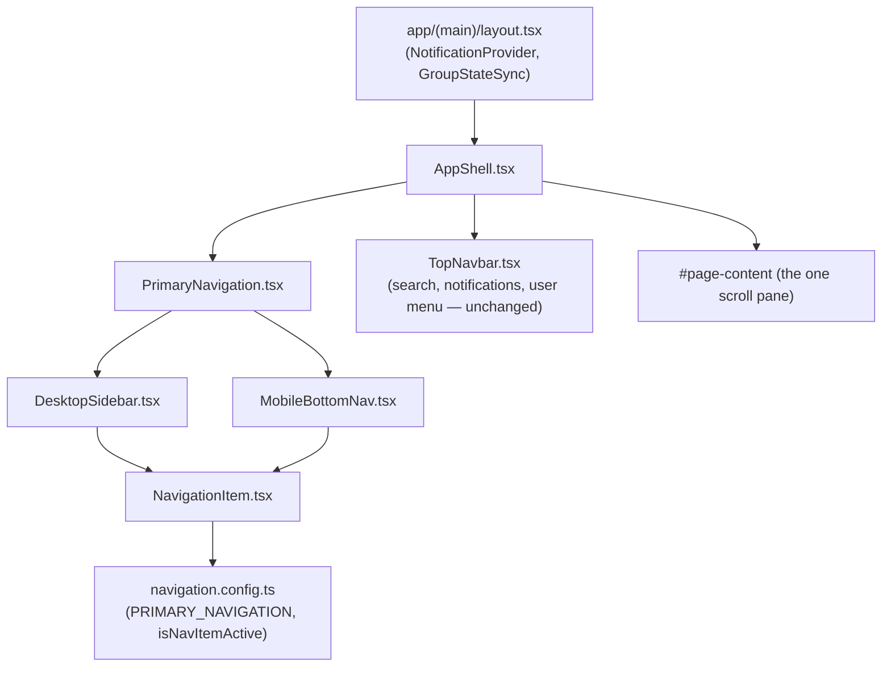

# Navigation Shell

How `AppShell` and the primary navigation (`frontend/src/components/layout/`) work, and why they're built this way. This is Phase 01 of the frontend's move away from a full solar-system navigation concept toward "one active planet at a time" — this phase covers only the app shell and primary navigation, not the Earth background or any page redesign.

## Scope

**In this phase:** the app shell, the primary navigation (desktop sidebar + mobile bottom nav), and the CSS/token organization behind them.

**Explicitly out of scope, untouched:** the 3D planet system (`components/space/PlanetController.tsx`, `PlanetModel.tsx`, `earthMaterials.ts`, `modelsRegistry.ts`), the global `SpaceBackground` (already pure CSS/SVG star layers, no Three.js — it was already "lightweight" so it needed no changes here), the universe transition system, and every page's own content/business logic.

## Component tree



`DesktopSidebar` and `MobileBottomNav` both render unconditionally on every page; which one is visible is decided purely by CSS `@media (max-width: 760px)` queries in their own CSS Modules. There is no client-side breakpoint detection — this avoids hydration mismatches and keeps the switch free of JavaScript cost.

## Shared navigation config

Both variants read the same five destinations from `PrimaryNavigation/navigation.config.ts`:

```ts
export const PRIMARY_NAVIGATION: NavigationItem[] = [
  { href: "/", label: "Home", icon: "home" },
  { href: "/groups", label: "Groups", icon: "groups" },
  { href: "/posts/new", label: "Create", icon: "plus", emphasis: true },
  { href: "/chat", label: "Messages", icon: "chat" },
  { href: "/profile", label: "Profile", icon: "user" },
];
```

`isNavItemActive(pathname, href)` is the same active-route match both variants use (exact match, or a prefix match for nested routes like `/groups/[groupId]`). `NavigationItem.tsx` renders the actual `<Link>` — one place owns the `aria-current`/label wiring instead of two.

`/posts` (the older posts listing, which today renders identical content to Home) intentionally isn't one of the five — it stays a working route, just not linked from primary nav. `Create` links straight to the existing `/posts/new` page rather than a new modal, since that page already works.

## Desktop / tablet: `DesktopSidebar`

A fixed left rail (`> 760px`) with circular icon nodes on a subtle connecting line. The line is a single decorative `<div aria-hidden="true">` positioned behind the icons with a closed-form CSS `calc()` (icon-center to icon-center), not measured in JavaScript, so it stays correct regardless of how many items there are. The active destination gets a filled/glowing node rather than a bright block — kept deliberately restrained per the project's dark-cosmos visual language.

The sidebar keeps its pre-existing manual collapse toggle (`sidebarContext.tsx` — `useSyncExternalStore` + `localStorage`, synced across tabs) and account/logout block, both carried over unchanged in behavior.

## Mobile: `MobileBottomNav`

A fixed bottom bar (`≤ 760px`) that fully replaces the sidebar at that width — mobile no longer gets an icon-only rail, it gets no rail at all. Five equal-width touch targets (≥44px), `env(safe-area-inset-bottom)` padding for notched devices (this required adding `viewportFit: "cover"` to `app/layout.tsx`'s `viewport` export, since `env()` resolves to `0px` without it), and a filled accent circle on "Create" for a touch of emphasis without becoming a floating action button.

`AppShell.module.css` reserves matching space at the bottom of `#page-content` (`padding-bottom: calc(var(--nav-bottom-height) + env(safe-area-inset-bottom))`) so scrolled content and the chat composer never render underneath the bar. The bar itself sits outside the scrollable pane, so it never introduces a second scrollbar.

## CSS organization

- **Tokens**: `frontend/src/app/globals.css`'s `:root` block. This project keeps one token block rather than a separate `tokens.css` — new nav tokens (`--nav-bottom-height`) were added there rather than starting a parallel file. Colors reuse the existing `--space-accent-violet` / `--space-accent-indigo` identity already used everywhere else in the app (buttons, badges, focus rings) rather than introducing a second accent hue.
- **Component styles**: CSS Modules next to each component (`DesktopSidebar.module.css`, `MobileBottomNav.module.css`), matching how the rest of `components/layout/` is already styled. Tailwind is installed in this project but isn't used anywhere in the layout/nav area — this phase follows that existing convention rather than mixing systems.

One cross-file detail worth knowing: `AppShell.tsx`'s outer `.shell` div carries `data-ready={isReady}` so the sidebar's slide-in transition can be suppressed before hydration settles. Because CSS Modules hash class names per file, a rule like `.shell:not(...) .sidebar` only works when both classes live in the same module — now that the sidebar's rules live in their own file, that rule is written as `[data-ready="false"] .sidebar` instead, a plain attribute selector that isn't scoped by the module system.

## Why not GSAP / Framer Motion here

Neither is installed in this project, and neither is needed for this phase — all nav interaction (hover, focus, active-state glow, the sidebar's slide toggle) is a plain CSS transition (150–300ms), and every transition respects `prefers-reduced-motion`. GSAP is already used elsewhere for the Home feed's orbital animation and is intentionally reserved for that kind of timeline-driven work; a persistent nav rail that must never delay a route change isn't it. If a future phase adds a shared active-route indicator that needs to animate smoothly between arbitrary positions, that's the point at which pulling in Motion/Framer Motion (if adopted) would be reconsidered — not before.

## Where future Earth/planet work attaches

The 3D planet system stays entirely page-local for now (Home's orbital feed, the `dev/planets` sandbox) and never mounts inside `AppShell` or `PrimaryNavigation`. When a future phase introduces a single active planet as a persistent background, the natural attachment point is inside `AppShell`, as a layer between `.shell` and `.mainArea` — sitting behind `PrimaryNavigation` the same way `SpaceBackground` already sits behind everything at the root layout today, so navigation continues to render as an unrelated, cheap overlay rather than being coupled to whatever the 3D layer is doing.
