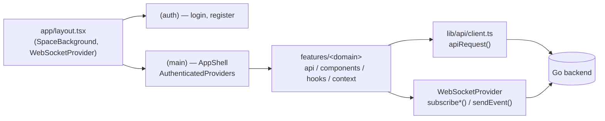

# Frontend

> Next.js, realtime client state, responsive UI, and the interactive space layer.

[← Back to project README](../README.md)

## Contents

- [Overview](#overview)
- [Technology Stack](#technology-stack)
- [Architecture](#architecture)
- [Route Map](#route-map)
- [REST API Client](#rest-api-client)
- [WebSocket Client](#websocket-client)
- [Authentication Flow](#authentication-flow)
- [Feature Modules](#feature-modules)
- [Space and 3D System](#space-and-3d-system)
- [Responsive Design](#responsive-design)
- [Styling and Theme Tokens](#styling-and-theme-tokens)
- [Environment and Runtime Configuration](#environment-and-runtime-configuration)
- [Development Commands](#development-commands)
- [Folder Structure](#folder-structure)
- [Adding a New Feature](#adding-a-new-feature)
- [Adding or Replacing a Planet Model](#adding-or-replacing-a-planet-model)
- [Related Documentation](#related-documentation)

## Overview

The frontend is a Next.js 16 App Router application in TypeScript. Routing is organized by route group
(`(auth)`, `(main)`, `(group-settings)`); almost everything else — API calls, components, hooks, and local state —
lives in one `features/<domain>/` folder per product area. There is no Redux/Zustand-style global store: state is
plain React state and context, plus a small `useSyncExternalStore`-based cache for Groups data that multiple
components need to share.

Working directory for every command in this guide is `frontend/` unless stated otherwise.

## Technology Stack

| Concern | Choice |
|---|---|
| Framework | Next.js 16, App Router |
| UI runtime | React 19 |
| Language | TypeScript 5.9, strict mode, target ES2017 |
| Styling | Tailwind CSS 4 (`@tailwindcss/postcss`) + CSS Modules colocated per component |
| 3D | Three.js, `@react-three/fiber`, `@react-three/drei` |
| Import alias | `@/*` → `./src/*` |

## Architecture



**App Router.** `app/` holds only routing: thin `page.tsx` files and nested `layout.tsx` files for shared chrome
and scoped CSS imports (a stylesheet imported in `app/groups/layout.tsx`, for instance, cannot leak into
`/login`). Server Components are the default; a file only gets `"use client"` when it actually needs state,
effects, or a browser API — and that directive marks a boundary in the *import graph*, not every component beneath
it, so a purely presentational child can still be a Server Component even when it's rendered from client code.

**Feature modules.** Each `features/<name>/` is self-contained — typically `api/`, `components/`, `hooks/`, and
sometimes `context/` or `types/` — so a feature can be understood, changed, or deleted as one unit instead of
hunting across type-based folders. Files inside a feature import each other with relative paths; `app/` reaches
into a feature only through the `@/features/<name>/...` alias.

**Providers.** `app/layout.tsx` mounts `SpaceBackground` and `WebSocketProvider` once, for every route including
the unauthenticated ones. The `(main)` layout wraps its content in `AuthenticatedProviders`
(`components/layout/AuthenticatedProviders.tsx`), which composes:

```text
AuthGuard                     — client-side session check; redirects to /login if unauthenticated
  └── NotificationProvider    — REST + WebSocket notification state, merged and monotonic
        └── ActionFeedbackProvider   — toast/feedback UI state
              └── SearchProvider     — shared search-bar state
                    ├── GroupStateSync         — headless: listens for group/invite/event WS events
                    ├── NotificationToastContainer
                    └── {children}
```

`AppShell` additionally wraps its content in `GroupsSearchProvider` and mounts `PlanetPreferenceProvider` /
`PlanetBackground` (see [Space and 3D System](#space-and-3d-system)).

## Route Map

| Route | Area | Purpose |
|---|---|---|
| `/login`, `/register` | `(auth)` | Multi-step auth, 3D planet stage |
| `/` | `(main)` | Home feed |
| `/profile`, `/profile/[username]` | `(main)` | Own profile / another user's profile |
| `/posts/new`, `/posts/[id]`, `/posts/[id]/edit` | `(main)` | Post composer, detail, edit |
| `/groups`, `/groups/create`, `/groups/[groupId]` | `(main)` | Directory, creation, group detail (overview/events/members/chat tabs) |
| `/groups/[groupId]/settings` | `(group-settings)` | Group settings, own layout/shell |
| `/chat` | `(main)` | Private conversations |
| `/notifications` | `(main)` | Notification center |
| `/settings` | `(main)` | Profile, Privacy & Security, Appearance, Session tabs |

Primary navigation (`components/layout/PrimaryNavigation/`) only links five of these — Home, Groups, Create,
Messages, Profile — as a floating desktop rail below `760px`-wide layouts that's fully replaced by a bottom bar;
both render unconditionally in the tree so switching between them never causes a hydration mismatch.

## REST API Client

Every feature's `api/<feature>.ts` sits on top of two shared files:

- **`lib/api.ts`** — origin helpers (`getApiBaseUrl`, `getApiUrl`, `getUploadsBaseUrl`, `getWebSocketUrl`). These
  currently resolve to the fixed `localhost:8080` backend rather than reading `NEXT_PUBLIC_BACKEND_ORIGIN` at
  runtime — see [Environment and Runtime Configuration](#environment-and-runtime-configuration).
- **`lib/api/client.ts`** — `apiRequest<T>(path, init)`: always sends `credentials: "include"` (so the session
  cookie rides along), sets `Content-Type: application/json` unless the body is `FormData` (multipart needs the
  browser to set its own boundary), and throws a typed `ApiError` (from `lib/api/errors.ts`) carrying the HTTP
  status on any non-`2xx` response or network failure.

The convention inside each `api/<feature>.ts` is a private, unexported `fetch...()` per endpoint plus an exported,
"assembled" function that adapts the backend's snake_case JSON into a clean camelCase frontend type — components
never see a raw API response shape directly.

## WebSocket Client

`providers/WebSocketProvider.tsx` opens exactly one connection (`getWebSocketUrl("/api/ws")`) at the application
root and is the only place a raw `WebSocket` is constructed. It reconnects automatically 1.5 seconds after any
close and queues outgoing events sent while disconnected, flushing them once the socket reopens.

Every feature reaches the socket through `useWebSocket()` rather than opening its own connection:

```text
isConnected, onlineUserIDs, typingStatus, errorMessage, inviteSearchResults,
lastNotification, lastEventResponseUpdate,
subscribeMessages(fn), subscribeReadReceipts(fn), subscribeGroupMessages(fn),
subscribeEventResponses(fn), subscribeFollowRemoved(fn), subscribeNotifications(fn),
sendEvent(type, payload)
```

Each `subscribe*` call registers a listener in a `Set` and returns an unsubscribe function — the standard shape for
a `useEffect` cleanup. `features/chat/hooks/useChat.ts`, `features/notifications/context/NotificationProvider.tsx`,
and `features/groups/components/GroupStateSync.tsx` are the clearest examples of this pattern in use.

## Authentication Flow

```text
AuthGuard (client component, wraps every (main) route)
   → calls getCurrentUser() → GET /api/users/me with credentials
   → no session → router.replace("/login?next=<original path>")
   → session found → renders children inside CurrentUserProvider(initialUser)

useCurrentUser() — read/patch the current user from anywhere inside AuthGuard
   throws if called outside it, by design
```

Login and registration themselves are plain REST calls through the same `apiRequest` client; there is no
client-side token handling because the session lives entirely in the `HttpOnly` cookie the browser sends
automatically.

## Feature Modules

| Module | Covers |
|---|---|
| `auth` | Login/registration forms, `AuthGuard`, `CurrentUserContext` |
| `profile` | Profile view/edit, avatar, privacy toggle |
| `posts` | Feed, composer, post detail/edit |
| `comments` | Comment list and composer |
| `interactions` | Likes |
| `groups` | Directory, creation, membership, invitations, join requests, `useGroupData`/`useGroupAction` shared cache |
| `group-chat` | Group conversation UI |
| `chat` | Private conversation list and thread |
| `notifications` | Notification provider, dropdown/inbox, toasts |
| `recommendations` | "Who to follow" and suggested groups |
| `search` | Universal search bar and state |
| `settings` | Profile, privacy/password, and appearance (planet picker) settings |

Groups is the largest module — group state (membership, pending invitations/join requests, events) is shared
across the directory, detail page, and chat tab through a small reactive cache (`useGroupData.ts`, built on
`useSyncExternalStore`) rather than being re-fetched independently by each component.

## Space and 3D System

The visual identity lives in `components/space/` and is intentionally decoupled from routing — see the
[root README's Space Experience section](../README.md#space-experience) for the product-level description. As a
developer, the composition to know is:

```text
SpaceBackground        — root layout, every page, SVG stars + CSS gradients, no WebGL
      │
AppShell (authenticated layout)
      └── PlanetPreferenceProvider    — owns selected planet + on/off + scroll-follow, in localStorage
            └── PlanetBackground      — unmounted entirely when the 3D toggle is off
                  └── one persistent <canvas>
                        └── PlanetSystem        — the selected body
                              ├── PlanetModel    — GLB renderer (clones cached GLTF, keeps authored materials)
                              └── Moon orbit     — Earth only
```

`modelsRegistry.ts` is the single source of truth for the eight selectable bodies (`earth`, `mercury`, `venus`,
`mars`, `jupiter`, `saturn`, `uranus`, `sun`) — GLB path, scale, spin speed, lighting, and an accent theme (see the
color table in the root README). Selecting a body writes its theme as CSS custom properties
(`--planet-accent`, `--planet-border`, `--planet-glow`, …), which is how one preference reskins buttons, links, and
focus rings app-wide, not just the 3D scene.

Two hooks worth knowing: `usePlanetViewport.ts` (responsive scale/position per viewport class) and
`useReducedMotion.ts` (in reduced-motion mode, every body settles immediately and the canvas switches to demand
rendering instead of a continuous animation loop). `PLANET_PREFERENCE_STORAGE_KEY` and
`PLANET_MODEL_ENABLED_STORAGE_KEY` are the `localStorage` keys that sync preferences across tabs.

Deeper reference: [`components/space/README.md`](src/components/space/README.md).

## Responsive Design

There's no client-side breakpoint detection — layout decisions are plain CSS (`@media (max-width: 760px)`), and
both the desktop and mobile navigation variants render unconditionally in the tree so switching between them never
produces a hydration mismatch. CSS Modules are colocated per component; shared design tokens live in one
`:root` block in `app/globals.css` rather than a separate tokens file. Tailwind is installed and used for
utility-heavy screens, but the navigation shell deliberately sticks to plain CSS Modules.

## Styling and Theme Tokens

`app/globals.css` defines two token families as CSS custom properties:

- **Space tokens** (`--space-bg-deep`, `--space-text-body`, `--space-border`, …) — the fixed dark palette used by
  the login/register pages and the app chrome.
- **Planet tokens** (`--planet-accent`, `--planet-accent-hover`, `--planet-border`, `--planet-glow`, …) — rewritten
  at runtime by `PlanetPreferenceProvider` whenever the selected body changes.

Route transitions use the browser View Transitions API (`::view-transition-old/new`), scoped so pages with very
different heights (Home vs. Settings, for example) don't visually squash during the swap.

## Environment and Runtime Configuration

| Variable | Read at | Effect today |
|---|---|---|
| `NEXT_PUBLIC_BACKEND_ORIGIN`, `NEXT_PUBLIC_BACKEND_WS_ORIGIN` | Docker build args (`compose.yaml`) | Currently unused by `lib/api.ts` at runtime — the client always targets `localhost:8080`. Native and Docker development both rely on that default. |
| `NEXT_IMAGE_UNOPTIMIZED` | Build | Disables `next/image` optimization in the container build |

`next.config.ts` allows `next/image` to load from `http://localhost:8080/uploads/**` (with
`dangerouslyAllowLocalIP: true`, since the backend is a local, non-public host in this setup).

## Development Commands

```bash
npm install
npm run dev                              # start on :3000
npm run lint
npx tsc --noEmit --incremental false
npm run build -- --webpack               # production build
npm run start                            # serve a production build
```

The backend must be running separately on `:8080` — see the [backend guide](../backend/README.md) or the
[root README's Getting Started](../README.md#getting-started).

## Folder Structure

```text
frontend/
├── src/
│   ├── app/                    # (auth), (main), (group-settings) route groups
│   ├── components/
│   │   ├── layout/              # AppShell, TopNavbar, PrimaryNavigation, AuthenticatedProviders
│   │   ├── space/                # SpaceBackground, PlanetBackground/System/Model, modelsRegistry
│   │   ├── feedback/             # ActionFeedbackProvider
│   │   └── transitions/          # PageTransition
│   ├── features/                 # one folder per domain — see Feature Modules
│   ├── providers/                # WebSocketProvider
│   └── lib/
│       ├── api.ts, api/          # origin helpers + fetch client
│       ├── websocket/            # shared WebSocket payload types
│       └── utils/
└── public/
    └── models/planets/           # 9 shipped GLB assets (8 planets + Moon)
```

## Adding a New Feature

1. Create `src/features/<name>/` with `api/`, `components/`, and `hooks/` (add `context/` or `types/` if the
   feature needs shared state or its own type definitions).
2. Add REST calls in `api/<name>.ts` on top of `apiRequest()`, adapting backend response shapes into a clean
   frontend type.
3. If the feature needs realtime data, subscribe through `useWebSocket()` rather than opening a new connection.
4. Add routes under the appropriate `app/` route group, keeping `page.tsx` thin and delegating to the feature's
   components.
5. Wire any new global state into `AuthenticatedProviders` only if it truly needs to be available app-wide.

## Adding or Replacing a Planet Model

1. Drop the optimized `.glb` into `public/models/planets/`.
2. Add or update its entry in `components/space/modelsRegistry.ts` — path, scale, position, spin speed, lighting,
   companion, and accent theme colors.
3. Keep new assets lossless (deduplicate/prune/weld/reorder) rather than reducing texture quality — see the root
   README's [Space Experience](../README.md#space-experience) section for why.
4. `PlanetModel.tsx` clones cached GLTF scenes, so a new body doesn't need special-cased rendering code unless it
   needs the kind of authored-material handling Earth and Saturn already get.

## Related Documentation

- [Space/3D rendering system](src/components/space/README.md)
- [Root README](../README.md) — product overview, features, and the Docker/Makefile quickstart
- [Backend guide](../backend/README.md) — the API this app talks to
